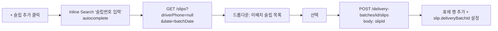

# Wireframes — Notification Slice B

본 문서는 4개 신규 화면의 ASCII / mermaid wireframe 입니다. FE agent 는 본 spec 의 layout / 텍스트 / 컬럼 너비를 정확히 인용하여 구현합니다.

---

## 1. LinkDispatchListPage (`/sales/link-dispatch`)

### 1.1 화면 구조 (관리자 데스크톱 1280×800 가정)

```
┌─────────────────────────────────────────────────────────────────────────────┐
│  AppHeader  │  업무 화면 > 링크발송                              [홍지수 ▾] │  ← 56px (Slice A 동적 화면명)
├─────────────────────────────────────────────────────────────────────────────┤
│ Sidebar     │  ┌─────────────────────────────────────────────────────────┐  │
│             │  │ 링크발송                                                │  │  ← page-title 24px
│ 판매조회    │  │                                                         │  │
│ 구매조회    │  │ ┌──────────┐ ┌─────────────────┐ [날짜 자동 그룹]       │  │  ← 상단 컨트롤 바
│ 재고이동    │  │ │ 2026/05/05│ │ 미발송만 ▾      │                       │  │     (DateField + filter + 액션 버튼)
│ ▶링크발송   │  │ └──────────┘ └─────────────────┘                       │  │
│             │  │                                                         │  │
│             │  │ ┌─────────────────────────────────────────────────────┐ │  │
│             │  │ │ 배송일      │ 기사명│ 기사 연락처   │ 슬립│링크│SMS │ │  │  ← thead 44px
│             │  │ ├─────────────┼───────┼──────────────┼─────┼────┼────┤ │  │
│             │  │ │ 2026/05/05  │ 김기사│ 010-XXXX-1234│ 3건 │[복사]│☑ 14:32 │ │  ← row 40px (sent 배경 #F0F9FF)
│             │  │ │             │       │              │     │     │ [재발송]│ │
│             │  │ ├─────────────┼───────┼──────────────┼─────┼────┼────┤ │  │
│             │  │ │ 2026/05/05  │ 박기사│ 010-XXXX-5678│ 1건 │[복사]│☐ [SMS 발송] │ │  ← unsent 배경 #FFF
│             │  │ ├─────────────┼───────┼──────────────┼─────┼────┼────┤ │  │
│             │  │ │ 2026/05/06  │ 이기사│ 010-XXXX-9012│ 5건 │[복사]│☐ [SMS 발송] │ │
│             │  │ └─────────────────────────────────────────────────────┘ │  │
│             │  │                                                         │  │
│             │  │ 총 3건 (발송 1 / 미발송 2)                              │  │  ← footer meta 12px
│             │  └─────────────────────────────────────────────────────────┘  │
└─────────────────────────────────────────────────────────────────────────────┘
```

### 1.2 컬럼 너비 (총 1024px 가정 — sidebar 제외 본문)

| # | 컬럼 | 너비 | align | 정렬 |
| - | --- | --- | --- | --- |
| 1 | 배송일 | 140px | left | DESC default |
| 2 | 기사명 | 120px | left | — |
| 3 | 기사 연락처 | 180px | left, monospace | — |
| 4 | 슬립 수 | 80px | right, tabular-nums | DESC sortable |
| 5 | 링크 | 80px | center | — (CopyButton) |
| 6 | SMS 발송완료 | 220px | center | — (BatchStatusCell) |
| filler | (남는 공간) | flex | — | — |

### 1.3 인터랙션

```mermaid
flowchart TD
    A[페이지 로드] --> B[GET /delivery-batches?date=오늘]
    B --> C{배치 존재?}
    C -->|N| D[빈 표 + '슬립 발급 후 [날짜 자동 그룹] 클릭']
    C -->|Y| E[표 렌더 — 발송완료 행 sent-bg]
    E --> F[행 클릭]
    F --> G[BatchDetailModal 오픈]
    E --> H[SMS 발송 버튼 클릭]
    H --> I[POST /delivery-batches/id/send-sms]
    I --> J{200 OK?}
    J -->|Y| K[셀 갱신 ☑ + smsSentAt + 토스트 'SMS 발송 완료']
    J -->|N| L[토스트 'SMS 발송 실패: smsLastError']
    E --> M[복사 버튼 클릭]
    M --> N[clipboard.writeText 'sign.samhan-air.com/d/token']
    N --> O[토스트 '복사됨']
    E --> P[재발송 링크 클릭]
    P --> Q[Confirm Dialog '재발송하시겠습니까?']
    Q -->|예| I
```

---

## 2. BatchDetailModal (행 클릭)

### 2.1 화면 구조 (모달 max-width 720px / max-height 80vh — 기존 modal 토큰 재사용)

```
┌─────────────────────────────────────────────────────────────────┐
│  배치 상세 — 김기사 (010-XXXX-1234) — 2026/05/05      [×]       │  ← 모달 헤더 (font-modal-title 18px)
├─────────────────────────────────────────────────────────────────┤
│                                                                 │
│  배송일       2026/05/05 (목)                                   │
│  기사명       김기사                                            │
│  기사 연락처  010-XXXX-1234                                     │
│  배치 토큰    sign.samhan-air.com/d/aB3kL...   [복사]           │  ← CopyButton
│  토큰 만료    2026/05/06 23:59 (D-1)                            │
│  SMS 발송     ☑ 2026/05/05 14:32  [재발송]                      │
│                                                                 │
│  ─────────────────────────────────────────────────────────────  │
│                                                                 │
│  슬립 N건 (3)                                  [+ 슬립 추가]    │  ← section-header
│  ┌─────────────────────────────────────────────────────────┐    │
│  │ # │ 슬립번호       │ 거래처      │ 합계금액   │       │ │    │
│  ├───┼────────────────┼─────────────┼───────────┼───────┤ │    │
│  │ 1 │ 2026/05/05-1   │ 한국전력    │ 1,250,000 │[제거]  │ │    │
│  │ 2 │ 2026/05/05-3   │ 삼성전자    │   850,000 │[제거]  │ │    │
│  │ 3 │ 2026/05/05-7   │ LG화학      │   430,000 │[제거]  │ │    │
│  └─────────────────────────────────────────────────────────┘    │
│                                                                 │
├─────────────────────────────────────────────────────────────────┤
│                                                  [닫기]          │  ← 모달 푸터
└─────────────────────────────────────────────────────────────────┘
```

### 2.2 [+ 슬립 추가] 인터랙션



### 2.3 [제거] 인터랙션

DELETE `/delivery-batches/{id}/slips/{slipId}` → confirm dialog "이 슬립을 다른 배치로 옮기시겠습니까? 슬립의 배치 매핑이 해제됩니다." → 확인 시 행 삭제.

---

## 3. SlipFormPage / SlipDetailPage — driver 필드 추가

### 3.1 헤더 영역 변경 (DRAFT / SAVED 단계 만 편집)

```
┌─────────────────────────────────────────────────────────────────────┐
│ 출고전표 [작성중]                                  [임시저장] [저장] │
├─────────────────────────────────────────────────────────────────────┤
│  거래처     [한국전력            ▾]                                 │
│  배송지     [서울시 강남구 테헤란로 ...                          ]   │
│  연락처     [02-3456-7890                                        ]   │
│  특이사항   [                                                    ]   │
│                                                                     │
│  ─── 운송 정보 (신규) ─────────────────────────────────────────────  │  ← 섹션 구분선 (--space-section 32px)
│  기사명         [김기사            ]                                │  ← 일반 input (max 50)
│  기사 연락처    [010-1234-5678     ]   ← 자동 하이픈 PhoneInput     │
│                                                                     │
│  ─── 라인 ───────────────────────────────────────────────────────── │
│  ... (기존 LineRow 10-col grid)                                     │
└─────────────────────────────────────────────────────────────────────┘
```

### 3.2 SlipDetailPage (read-only — SAVED 이후)

```
운송 정보
  기사명         김기사
  기사 연락처    010-1234-5678
  배치             [링크발송 화면 보기 →]   ← deliveryBatchId 가 있으면 링크 표시
```

### 3.3 DispatchView 인쇄 — "용달기사" 결재란 자동 채움

기존 1×5 결재란 layout (Slice A `print-spec.md` §3) 의 5번째 셀 또는 Slice A 의 용달기사 서명 박스 안에 driverName 자동 표시.

```
┌──────────┬──────────┬──────────┬──────────┬──────────┐
│ 담당부서  │ 담당자    │ 출고인    │ 검수인    │ 용달기사  │  ← 5mm 라벨
├──────────┼──────────┼──────────┼──────────┼──────────┤
│ 영업1팀   │ 홍지수    │ 오병승    │ 김기철    │ 김기사    │  ← 17mm 값 (driverName 자동)
│           │           │ 14:32     │ 16:45     │ (서명 X)  │     서명 PNG 는 Slice C
└──────────┴──────────┴──────────┴──────────┴──────────┘
```

기존 Slice A 의 `--print-approval-w: 38mm × --print-approval-h: 22mm` 토큰 그대로 재사용. **CSS 변경 없음** — Slice B 는 셀 안에 텍스트 자동 주입 만.

---

## 4. 공개 모바일 페이지 (`sign.samhan-air.com/d/<token>`)

### 4.1 화면 구조 (375×667 iPhone SE 기준)

```
┌─────────────────────────────────┐
│ ▒▒▒▒ 삼한물류 ▒▒▒▒              │  ← 상단 brand bar (40px, --action-brand 배경)
├─────────────────────────────────┤
│                                 │
│  ┌───────────────────────────┐  │
│  │ 오늘 배송                 │  │  ← 카드 헤더 (font-card-title 16px)
│  │ 김기사 — 3건              │  │     (driverName + slip count)
│  │ 2026/05/05 (목)           │  │
│  └───────────────────────────┘  │
│                                 │
│  슬립 3건                       │  ← section label
│                                 │
│  ┌───────────────────────────┐  │
│  │ 한국전력                  │  │  ← 슬립 카드 1
│  │ 서울시 강남구 테헤란로... │  │
│  │ 슬립번호: 2026/05/05-1    │  │
│  │ 합계: 1,250,000 원        │  │
│  │              [상세보기 →] │  │  ← Slice C 서명 페이지로 이동
│  └───────────────────────────┘  │
│                                 │
│  ┌───────────────────────────┐  │
│  │ 삼성전자                  │  │  ← 슬립 카드 2
│  │ 수원시 영통구 매탄동...   │  │
│  │ 슬립번호: 2026/05/05-3    │  │
│  │ 합계: 850,000 원          │  │
│  │              [상세보기 →] │  │
│  └───────────────────────────┘  │
│                                 │
│  ┌───────────────────────────┐  │
│  │ LG화학                    │  │  ← 슬립 카드 3
│  │ 여수시 ...                │  │
│  │ 슬립번호: 2026/05/05-7    │  │
│  │ 합계: 430,000 원          │  │
│  │              [상세보기 →] │  │
│  └───────────────────────────┘  │
│                                 │
│  ───────────────────────────    │  ← divider
│  토큰 만료: 2026/05/06 23:59    │  ← 푸터 안내 (12px tertiary)
│  문의: 02-XXXX-XXXX             │
│                                 │
└─────────────────────────────────┘
```

### 4.2 만료 토큰 (410 GONE) 화면

```
┌─────────────────────────────────┐
│ ▒▒▒▒ 삼한물류 ▒▒▒▒              │
├─────────────────────────────────┤
│                                 │
│         ⓘ                       │  ← info icon (48px, --ink-tertiary)
│                                 │
│      링크가 만료되었습니다.      │  ← 18px medium
│                                 │
│   배송일이 지나 더 이상         │
│   접근할 수 없습니다.           │
│                                 │
│   문의가 필요한 경우            │
│   관리자에게 연락해 주세요.     │
│                                 │
│   ┌─────────────────────────┐   │
│   │  📞 02-XXXX-XXXX        │   │  ← tap-to-call (`tel:` link)
│   └─────────────────────────┘   │
│                                 │
└─────────────────────────────────┘
```

### 4.3 인터랙션 (Slice B read-only — Slice C 활성)

```mermaid
flowchart TD
    A[기사: SMS 링크 클릭] --> B[GET /public/batches/token]
    B --> C{토큰 유효?}
    C -->|만료| D[410 GONE 화면]
    C -->|유효| E[배치 헤더 + 슬립 카드 N건 렌더]
    E --> F[슬립 카드 [상세보기] 클릭]
    F --> G[GET /public/batches/token/slips/slipId]
    G --> H[(Slice C) 서명 캡처 페이지]
    H --> I[(Slice C) [인수자에게 공유] Web Share API]
```

---

## 5. 토스트 / 알림 위치

기존 `<Toast>` 컴포넌트 (디자인 시스템 17 컴포넌트 중 1) 재사용:

| 트리거 | 메시지 | 타입 | 시간 |
| --- | --- | --- | --- |
| CopyButton 클릭 성공 | 복사됨 | success | 1500ms |
| CopyButton 클릭 실패 | 복사 실패 — 다시 시도해주세요 | danger | 3000ms |
| SMS 발송 성공 | SMS 발송 완료 | success | 2000ms |
| SMS 발송 실패 | SMS 발송 실패: {error} | danger | 5000ms |
| 자동 그룹 성공 | N건 그룹화 완료 | success | 2000ms |
| 자동 그룹 결과 0건 | 그룹화할 슬립이 없습니다 | info | 2000ms |
| 슬립 추가 성공 | 슬립이 추가되었습니다 | success | 1500ms |
| 슬립 제거 성공 | 슬립이 제거되었습니다 | info | 1500ms |
| 토큰 재발급 성공 | 새 링크가 발급되었습니다 | success | 2000ms |

---

## 6. 반응형 동작 (LinkDispatchListPage 만)

| viewport | 동작 |
| --- | --- |
| ≥ 1024px | 6 컬럼 표 그대로 |
| 768~1023px | 컬럼 5 (기사 연락처 hide → 행 클릭 모달 안에 표시) |
| < 768px | 본 화면은 데스크톱 only — 모바일은 sidebar collapse 후 horizontal scroll 허용 |

> 본 화면은 관리자 PC 사용 가정 — 모바일 최적화는 `mobile-spec.md` 의 공개 페이지 만 적용.
