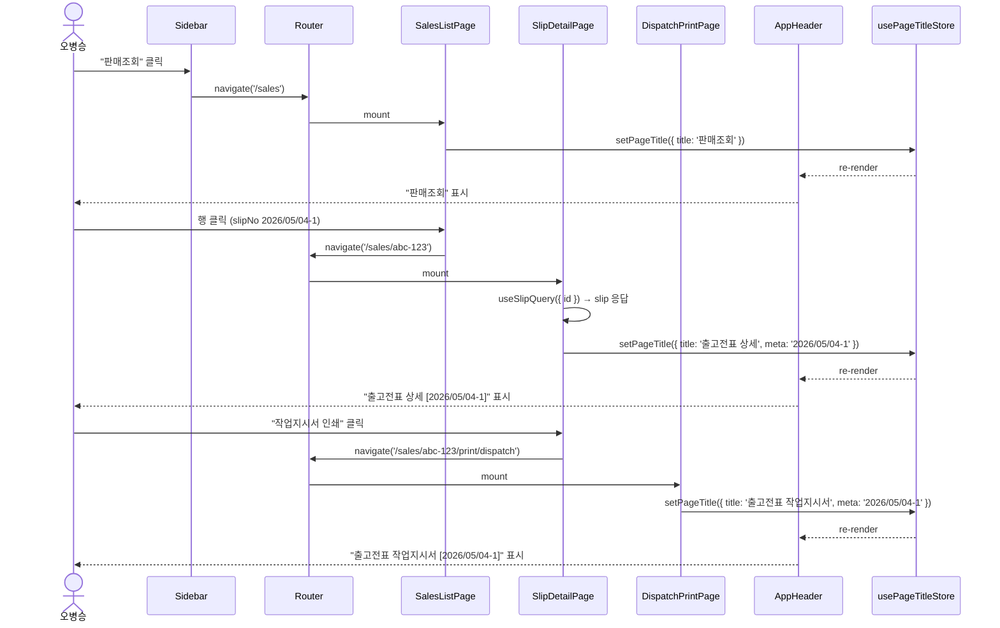
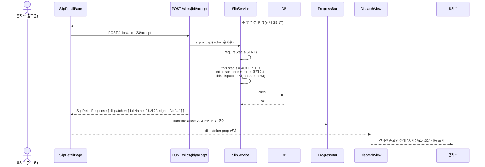
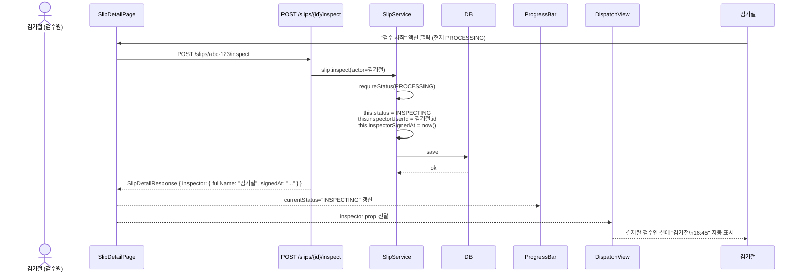
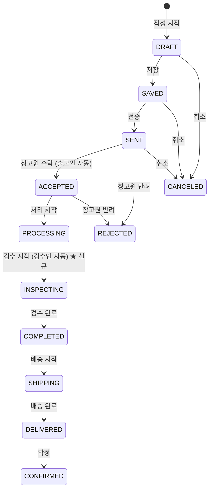

# UX Flow — Slice A

본 문서는 Slice A 의 사용자 시나리오 / interaction flow / 키보드 동작을 정의합니다.

---

## 1. 헤더 화면명 동적 갱신 흐름 (사용자 피드백 #2)

### 1.1 시나리오

오병승 (MANAGER) 이 데스크톱 앱에서 다음 흐름을 진행:



### 1.2 race condition 처리

라우트 전환 도중 새 페이지가 mount 되기 전 짧은 순간 (1 frame) 빈 title 발생 가능.
→ AppHeader 가 빈 title 인 경우 `"업무 화면"` fallback 표시 (기존 동작 호환).

### 1.3 cleanup

각 페이지 unmount 시 `useEffect` cleanup 으로 `setPageTitle({ title: '', meta: undefined })` 호출.
다음 페이지가 즉시 새 title set → 깜빡임 최소화.

### 1.4 인쇄 화면 (`/print/...`) 동작

인쇄 화면에서도 헤더 갱신 (예: "출고전표 작업지시서 [2026/05/04-1]").
실제 인쇄 시 `@media print` 가 헤더 숨김 (`.no-print { display: none !important; }` 적용 — 1차 슬라이스 spec 계승).

---

## 2. 출고인/검수인 자동 기입 흐름 (사용자 피드백 #9)

### 2.1 ACCEPTED 트랜지션 (출고인 자동)



### 2.2 INSPECTING 트랜지션 (검수인 자동) — 신규 단계



### 2.3 결재란 셀 visual 갱신

ACCEPTED 도달 전:
```
┌──────────┐
│ 출고인    │
├──────────┤
│ (빈 값)   │
└──────────┘
```

ACCEPTED 도달 후:
```
┌──────────┐
│ 출고인    │
├──────────┤
│ 홍지수    │
│ 14:32    │
└──────────┘
```

INSPECTING 도달 후:
```
┌──────────┐  ┌──────────┐
│ 출고인    │  │ 검수인    │
├──────────┤  ├──────────┤
│ 홍지수    │  │ 김기철    │
│ 14:32    │  │ 16:45    │
└──────────┘  └──────────┘
```

### 2.4 사용자 이름 lookup 전략

**Option A (선택)** — BE 가 응답에 `fullName` 포함 (user-service lookup 후 SlipDetailResponse 에 직접 embed)
- 장점: FE 단순, 1회 호출
- 단점: BE 가 user-service 호출 의존성 추가

**Option B** — FE 가 user list 별도 fetch + zustand cache + slip.dispatcherUserId 로 join
- 장점: BE 의존성 X
- 단점: FE 복잡도 ↑

> Designer 권장: **Option A**. BE 가 `dispatcher: { userId, fullName, signedAt }` 객체 전체를 응답에 포함. FE 는 단순 표시만.

### 2.5 미도달 단계의 출고인/검수인

- ACCEPTED 미도달 시: `dispatcher` undefined → 결재란 출고인 셀 빈 값
- INSPECTING 미도달 시: `inspector` undefined → 결재란 검수인 셀 빈 값
- 인쇄 시점에도 동일 (예: SAVED 상태에서 작업지시서 인쇄 시 출고인/검수인 모두 빈 값)

### 2.6 자동 기입 후 사용자 수정 가능 여부

**Slice A 결정**: 자동 기입 후 사용자 수정 X (audit trail 유지). 잘못 수락한 경우 BE 의 reject + re-accept 흐름으로 처리.
(Slice B 에서 모바일 서명 도입 시 별도 검토)

---

## 3. INSPECTING 신규 단계 사용자 시나리오

### 3.1 전체 흐름



### 3.2 새 시나리오 (검수원 김기철)

```
1. 창고원 홍지수가 PROCESSING (처리 시작) → 출고 작업 진행
2. 출고 완료 후 검수원 김기철에게 알림 (Slice C — Slice A 에서는 화면 새로고침)
3. 김기철이 SlipDetailPage 진입 → ProgressBar 가 "처리" 단계 ● 표시 + "검수" 단계 현재 ○
4. 김기철이 "검수 시작" 액션 클릭 → API POST /slips/{id}/inspect
5. ProgressBar 갱신 — "검수" 단계 현재 ●
6. 검수 작업 진행 (라인 수량 / 모델 / 외관 확인)
7. 검수 완료 후 "완료 처리" 액션 클릭 → API POST /slips/{id}/complete
8. ProgressBar 갱신 — "검수" 단계 done ● + "완료" 단계 현재 ●
9. 작업지시서 인쇄 시 결재란에 출고인 홍지수 + 검수인 김기철 모두 자동 표시
```

### 3.3 INSPECTING 단계 권한

| Role          | 검수 시작 (POST /inspect) | 검수 완료 (POST /complete) |
| ------------- | ------------------------- | -------------------------- |
| MASTER        | O                         | O                          |
| MANAGER       | O                         | O                          |
| WAREHOUSE     | O                         | O                          |
| INSPECTOR     | O                         | O                          |
| SALES         | X (검수 권한 X)           | X                          |
| ACCOUNTANT    | X                         | X                          |
| DRIVER        | X                         | X                          |
| ENGINEER      | X                         | X                          |

> 권한 매트릭스 결정은 BE 팀 Plan 단계에서 확정. Designer 권장: 위 표.

### 3.4 PROCESSING 와 INSPECTING 의 의미 차이

- **PROCESSING (처리중)**: 창고원이 출고품을 실제로 picking + 포장 진행
- **INSPECTING (검수중)**: 검수원이 picking 결과 확인 + 모델/수량/외관 검증

→ 출고인 (PROCESSING 시작자) 과 검수인 (INSPECTING 시작자) 은 **다른 사람** 이 일반적 (4-eye 검증). 단, 작은 사업장은 동일 사용자가 양 역할 수행 가능 (BE 정책 X).

---

## 4. 키보드 단축키 (1차 슬라이스 계승 + Slice A 추가)

### 4.1 기존 단축키 (1차 — `<LineRow>`)

- `Cmd+↑/↓` — 행 이동 (drag 대안)
- `Cmd+Backspace` — 선택 행 삭제
- `Space` — 체크박스 toggle (행 포커스 시)

### 4.2 Slice A 추가 — `<LineRow>` 규격 컬럼

- `Tab` — 모델명 → 품목명 → **규격** → 수량 → 단가 순서로 포커스 이동
- `Shift+Tab` — 역방향 포커스
- 규격 input 에서 `Enter` — 다음 라인 모델명 input 으로 포커스 이동 (1차 슬라이스 모델명 동작과 동일)

### 4.3 Slice A 추가 — `<ProgressBar>`

- `Tab` — 단계 노드 순서대로 포커스 (각 노드 `tabindex="0"`)
- 포커스된 노드 + `Enter` 또는 `Space` — `onStepClick(status)` 콜백 호출 (history 모달 등)

### 4.4 Slice A 추가 — `<AppHeader>`

별도 단축키 없음 (정보 표시만).

---

## 5. micro-interaction 디테일

### 5.1 ProgressBar — 단계 변경 시 애니메이션

```css
.progress-step .node {
  transition:
    background-color 200ms ease-out,
    border-color 200ms ease-out;
}

.progress-line {
  transition: background-color 200ms ease-out;
}
```

API 응답 후 status 변경 → 노드 색상 + 연결선 색상이 200ms 부드럽게 전환.

### 5.2 ProgressBar — 현재 단계 pulse (선택적)

```css
@keyframes progress-current-pulse {
  0%, 100% { box-shadow: 0 0 0 0 rgba(30, 64, 175, 0.4); }
  50%      { box-shadow: 0 0 0 4px rgba(30, 64, 175, 0); }
}

.progress-step.current .node {
  animation: progress-current-pulse 2s ease-in-out infinite;
}
```

> Designer 결정: pulse 적용. ERP 사용자가 현재 단계를 즉시 인지하도록.

### 5.3 AppHeader — 화면명 전환 (선택적)

라우트 변경 시 화면명 fade-in (선택적, 100ms):
```css
.app-header h2 {
  transition: opacity 100ms ease-out;
}
```

> Designer 결정: 적용 X (오히려 깜빡임 인지 — 즉시 갱신이 더 깔끔).

### 5.4 결재란 출고인/검수인 — 자동 채움 시 깜빡임 (선택적)

API 응답 후 출고인/검수인 셀 채워질 때 짧은 highlight (200ms 노란 배경 → 흰 배경).

```css
@keyframes role-cell-flash {
  0%   { background: #FEF3C7; }  /* var(--state-warning-bg) */
  100% { background: transparent; }
}

.dispatch-role-value.just-filled {
  animation: role-cell-flash 600ms ease-out;
}
```

> Designer 결정: 화면 모드 (SlipDetailPage 안 미니 결재란) 만 적용. 인쇄 모드 (DispatchView) 는 적용 X.

---

## 6. 에러 / 빈 상태

### 6.1 ProgressBar — slip 데이터 로딩 중

```
┌──────────────────────────────────────────────┐
│ 전표 진행 단계                                  │
│                                                │
│  ░░░░░░░░░░░░░░░░░░░░░░░░░░░  (skeleton)    │
└──────────────────────────────────────────────┘
```

skeleton 표시: 10개 회색 원 + 회색 라벨 placeholder.

### 6.2 결재란 — dispatcher/inspector 응답 누락 (BE 에러)

빈 셀 표시 (시각적 무변화). 콘솔 warn 만.

### 6.3 화면명 meta — slipNo 로딩 중

```
출고전표 상세 ...
```

slipNo 응답 전: 화면명만 표시 + meta 자리에 `...` placeholder (선택적).

> Designer 결정: 적용 X. slipNo 미수령 시 meta 자리 빈 값 (깜빡임 회피).

---

## 7. 후속 슬라이스 (Slice B/C) 의 UX 변경 미리보기

### 7.1 Slice B — 모바일 서명

- 결재란 5칸 + 작업지시서 라인 표 그대로 유지
- **변경**: 용달기사/인수자 서명 박스 안에 모바일에서 그린 서명 PNG 자동 삽입
- **변경**: 서명 박스 안 placeholder "(서명 대기 — Slice C)" → "(모바일 서명 완료 / 미완료)" 동적 텍스트

### 7.2 Slice C — 카톡 링크 + 알림

- ACCEPTED → 출고인 (홍지수) 에게 카톡 deeplink 발송 (`https://app.samhan-air.com/sign/<token>`)
- INSPECTING → 검수인 (김기철) 에게 카톡 deeplink 발송
- DELIVERED → 거래처 + 사내 영업원에게 e-Sign 첨부 PDF 발송
- 모든 상태 변경 시 사내 메신저 알림 (in-house messenger)

본 Slice A 의 디자인 spec 은 Slice B/C 의 변경에도 호환 (결재란 1×5 / 서명 박스 80×35 / 본문 14pt 그대로).
