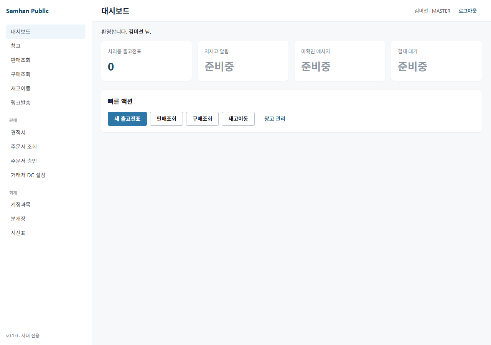

# 02. 메인 화면 살펴보기

> **대상 독자**: 로그인을 완료한 모든 직원
> **소요 시간**: 약 5분
> **사전 준비**: [01. 로그인하기](01-로그인.md) 완료

---

## 이 매뉴얼에서 배울 내용

- 로그인 후 메인 화면의 전체 구성
- 사이드바 메뉴 사용법
- 상단 헤더의 기능 (사용자명, 알림, 로그아웃)
- 본인의 역할(권한)에 따라 어떤 메뉴가 표시되는지

---

## 1. 메인 화면 전체 구성

로그인에 성공하면 아래와 같은 메인 화면이 표시됩니다.

화면은 크게 **3개 영역**으로 구성됩니다.

| 영역 | 위치 | 역할 |
| --- | --- | --- |
| ① 사이드바 | 화면 왼쪽 | 업무별 메뉴 (영업/창고/회계 등) |
| ② 헤더 | 화면 상단 | 사용자명, 알림, 로그아웃 |
| ③ 메인 영역 | 화면 가운데 | 대시보드, 빠른 등록, 작업 화면 |

---

## 2. 사이드바 메뉴

화면 왼쪽의 세로 메뉴가 **사이드바**입니다. 본인의 역할(권한)에 따라 표시되는 메뉴가 달라집니다.

### 2-1. 기본 메뉴 구성 (MASTER 기준)

| 번호 | 메뉴명 | 설명 |
| --- | --- | --- |
| 1 | 대시보드 | 오늘의 매출/입출고/주문 요약 |
| 2 | 영업 | 거래처/슬립/견적/주문 관리 |
| 3 | 창고 | 입고/출고/재고/실사 |
| 4 | 회계 | 분개/보고서/세금계산서 |
| 5 | 모바일 | 기사 배차/전자서명 |
| 6 | arologis | 카카오톡 배차/기사 배정 |
| 7 | 관리 | 직원/권한/시스템 설정 (MASTER 전용) |

> 사이드바의 메뉴 항목을 클릭하면 해당 화면으로 이동합니다. 메뉴 옆 ▶ 표시는 하위 메뉴가 있다는 뜻입니다.

### 2-2. 사이드바 접기/펼치기

화면이 좁을 때는 사이드바 상단의 **≡ (햄버거)** 아이콘을 클릭하여 사이드바를 접을 수 있습니다. 다시 펼치려면 동일한 아이콘을 한 번 더 클릭합니다.

---

## 3. 상단 헤더

화면 가장 위쪽 가로 영역이 **헤더**입니다.

### 3-1. 좌측 — 회사 로고

회사 로고를 클릭하면 어떤 화면에 있든 메인 대시보드로 즉시 이동합니다.

### 3-2. 우측 — 사용자 정보 영역

| 항목 | 설명 |
| --- | --- |
| **부서명** | 본인 소속 부서 (예: "영업1팀") |
| **사용자명** | 본인 이름 (예: "김미선") |
| **🔔 알림** | 미확인 알림 수 (빨간색 숫자 배지) |
| **▼ 드롭다운** | 사용자명 클릭 시 메뉴 표시 |

### 3-3. 사용자명 드롭다운 메뉴

본인 이름을 클릭하면 아래 메뉴가 표시됩니다.

- **내 프로필** — 본인 정보 조회/수정
- **비밀번호 변경** — 비밀번호 재설정
- **로그아웃** — 시스템에서 나가기

### 3-4. 알림 (🔔)

벨 아이콘을 클릭하면 본인에게 온 알림 목록이 표시됩니다.

- 신규 주문 알림
- 출고 완료 알림
- 결재 요청 알림
- 시스템 공지

> 알림은 읽으면 자동으로 표시가 사라집니다. 중요한 알림은 별표(★)를 눌러 보관할 수 있습니다.

---

## 4. 메인 영역 (대시보드)

화면 가운데 가장 넓은 영역이 **메인 영역**입니다. 로그인 직후에는 **대시보드**가 표시됩니다.

대시보드에 표시되는 정보 (역할별 다름):

- **오늘의 매출 요약** (영업/회계)
- **오늘의 입출고 건수** (창고)
- **미처리 주문** (영업)
- **결재 대기** (관리자)
- **빠른 등록 버튼** — 자주 쓰는 작업 바로가기

---

## 5. 역할별 화면 차이

본인의 역할(권한)에 따라 사이드바에 보이는 메뉴가 다릅니다. 보이지 않는 메뉴는 권한이 없는 것이며, 필요시 IT 관리자에게 권한 추가를 요청하세요.

| 역할 | 대시보드 | 영업 | 창고 | 회계 | 모바일 | arologis | 관리 |
| --- | :---: | :---: | :---: | :---: | :---: | :---: | :---: |
| **MASTER** (시스템 관리자) | ✅ | ✅ | ✅ | ✅ | ✅ | ✅ | ✅ |
| **MANAGER** (부서 관리자) | ✅ | ✅ | ✅ | ✅ | ✅ | ✅ | △ |
| **SALES** (영업 직원) | △ | ✅ | ❌ | ❌ | ✅ | ❌ | ❌ |
| **WAREHOUSE** (창고 직원) | △ | ❌ | ✅ | ❌ | ❌ | ❌ | ❌ |
| **ACCOUNTANT** (회계 직원) | △ | ❌ | ❌ | ✅ | ❌ | ❌ | ❌ |
| **DISPATCH** (배차 담당) | △ | ❌ | ❌ | ❌ | ✅ | ✅ | ❌ |
| **DRIVER** (배송 기사) | ❌ | ❌ | ❌ | ❌ | ✅ | ❌ | ❌ |

> **표 기호 안내**
> - ✅ : 모든 기능 사용 가능
> - △ : 일부 기능만 사용 가능 (예: 본인 데이터만 조회)
> - ❌ : 메뉴 자체가 표시되지 않음

### 역할별 사용 흐름 예시

**영업 직원 (SALES)**
1. 로그인 → 대시보드에서 본인 매출 확인
2. 영업 → 거래처 등록
3. 영업 → 견적서 작성
4. 모바일에서 현장 서명 받기

**창고 직원 (WAREHOUSE)**
1. 로그인 → 창고 → 입고 등록
2. 창고 → 재고 조회
3. 창고 → 출고 처리

**회계 직원 (ACCOUNTANT)**
1. 로그인 → 회계 → 분개 입력
2. 회계 → 세금계산서 발행
3. 회계 → 월말 보고서 출력

---

## 6. 화면 이동 팁

| 작업 | 방법 |
| --- | --- |
| 메인 대시보드로 즉시 이동 | 좌측 상단 회사 로고 클릭 |
| 직전 화면으로 이동 | 브라우저 ← 버튼 또는 화면 좌상단 [뒤로] |
| 새 탭에서 화면 열기 | 메뉴 항목을 **Ctrl+클릭** |
| 화면 새로고침 | F5 키 또는 브라우저 새로고침 버튼 |

> **주의**: 작성 중인 데이터가 있을 때 새로고침(F5)하면 입력 내용이 사라질 수 있습니다. 반드시 [저장] 버튼을 누른 뒤에 새로고침하세요.

---

## FAQ

**Q1. 사이드바에 분명히 있어야 할 메뉴가 없습니다.**
A. 본인의 역할(권한)에 해당 메뉴가 포함되지 않은 것입니다. IT 관리자에게 권한 추가를 요청하세요.

**Q2. 부서명이 잘못 표시됩니다.**
A. 인사 담당자에게 부서 정보 수정을 요청하세요.

**Q3. 알림이 너무 많이 와서 불편합니다.**
A. 사용자명 → 내 프로필 → 알림 설정 에서 알림 종류를 선택할 수 있습니다.

**Q4. 화면이 너무 작거나 글자가 작게 보입니다.**
A. 브라우저 확대 단축키(**Ctrl + +**)로 확대하거나, 모니터의 디스플레이 배율을 조정하세요.

**Q5. 다크 모드가 있나요?**
A. 현재는 라이트 모드만 지원합니다. 추후 업데이트 예정입니다.

---

## 다음 단계

메인 화면 사용법을 익혔다면 본인의 업무에 해당하는 매뉴얼로 이동하세요.

- [03. 역할별 화면 차이](03-역할별-권한.md) *(예정 — 더 자세한 권한 설명)*
- [영업 — 거래처 등록](../01-영업/01-거래처-등록.md) *(예정)*
- [창고 — 입고 처리](../02-창고/01-입고.md) *(예정)*
- [회계 — 분개 입력](../03-회계/01-분개-입력.md) *(예정)*
