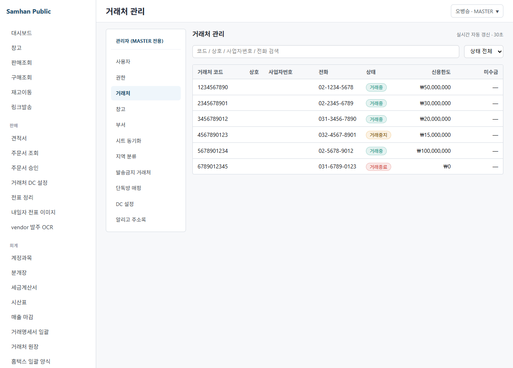
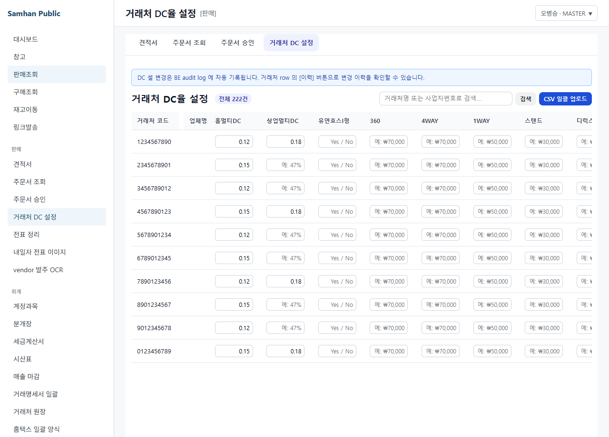

# 01. 거래처 등록

> **Stage 안내**: Stage 2 ⚠️ — Phase 12 step-6 본 PR 에서 7-section 패턴으로 재작성. UI 부재(P0-6) 우회 안내 포함.

---

## 1. 구현 상태

| 항목 | 상태 | 비고 |
| --- | --- | --- |
| Backend (partner-service) | ✅ 운영 | `PartnerAdminController` POST/GET/PUT/DELETE |
| 27 필드 entity | ✅ 운영 | 사업자 / 담당자 / 신용 / 단가 |
| 4 탭 등록 UI (desktop) | ⛔ 미구현 (P0-6) | Phase 11 후 출시 예정 |
| 거래처 list 화면 | ✅ 운영 | 단순 list (4 탭 dialog 미포함) |
| 단가/할인 정책 | ⏳ 부분 | 거래처별 단가 backend 만 |

거래처(고객/공급사)를 (주)삼한공조시스템 시스템에 등록하는 절차를 안내합니다. 현재 desktop 등록 UI 가 미구현 상태이므로, IT 관리자 우회 절차를 함께 안내합니다.

---

## 2. 대상 독자

- 신규 거래처를 시스템에 추가해야 하는 영업 직원 (SALES)
- 영업 부장 (MANAGER) 으로서 거래처 등록 승인을 담당하는 직원
- IT 관리자 (MASTER) 로서 거래처 master data 를 관리하는 인원

---

## 3. 학습 내용

- 거래처 등록 시 필요한 27 필드 정보
- 4 탭 (기본 / 사업자 / 담당자 / 신용) 입력 흐름
- 현재 UI 부재 우회 절차 (IT 관리자 직접 등록 / Excel 일괄)
- 등록 후 거래처 코드 발급 흐름

---

## 4. 본문

### 4-1. 거래처 메뉴 진입

좌측 사이드바에서 **[영업]** > **[거래처]** 클릭. 거래처 list 화면이 표시됩니다.

### 4-2. 거래처 등록 정보 27 필드

거래처는 다음 4 탭 27 필드로 구성됩니다.

#### 탭 1 — 기본 정보 (8 필드)

| 필드 | 필수 | 설명 |
| --- | :-: | --- |
| 거래처명 | ✅ | (주)삼한공조시스템 양식 (전체 상호) |
| 거래처 약칭 | — | 화면 표시용 짧은 이름 |
| 거래처 유형 | ✅ | 고객 / 공급사 / 양쪽 |
| 거래 시작일 | ✅ | YYYY-MM-DD |
| 거래 분류 | — | A/B/C 등급 |
| 메모 | — | 자유 입력 |
| 사용 여부 | ✅ | 활성 / 비활성 |
| 상위 거래처 | — | 그룹사 연결 |

#### 탭 2 — 사업자 정보 (6 필드)

| 필드 | 필수 | 설명 |
| --- | :-: | --- |
| 사업자등록번호 | ✅ | 10자리 (000-00-00000) |
| 대표자명 | ✅ | 대표자 본명 |
| 업태 | ✅ | 제조업 / 도소매 등 |
| 종목 | ✅ | 공조시스템 / 냉난방 등 |
| 주소 | ✅ | 우편번호 + 주소 + 상세 |
| 세금계산서 이메일 | — | 자동 발송용 |

#### 탭 3 — 담당자 정보 (7 필드, 다중 등록 가능)

| 필드 | 필수 | 설명 |
| --- | :-: | --- |
| 담당자명 | ✅ | |
| 직책 | — | 과장 / 부장 등 |
| 휴대전화 | ✅ | 010-0000-0000 |
| 이메일 | — | |
| 부서 | — | |
| 주 담당자 여부 | ✅ | 다중 등록 시 1명만 |
| 메모 | — | |

#### 탭 4 — 신용 / 단가 정보 (6 필드)

| 필드 | 필수 | 설명 |
| --- | :-: | --- |
| 신용한도 | — | 원화 |
| 미수금 한도 | — | 원화 |
| 결제 조건 | ✅ | 현금 / 30일 / 60일 / 익월말 |
| 단가 등급 | ✅ | A/B/C/D (할인율 자동) |
| 거래처별 특별 단가 | — | 품목별 별도 단가 |
| 신용 평가 | — | 우량 / 보통 / 주의 / 위험 |

### 4-3. 현재 UI 부재 — 우회 절차

desktop 등록 UI 미구현 (P0-6) 상태이므로, 다음 우회 절차로 등록합니다.

#### 우회 1 — IT 관리자에게 신청 (권장)

1. 거래처 등록 신청서 (사내 양식) 작성
2. 27 필드 모두 기입 + 사업자등록증 사본 첨부
3. IT 관리자 / MASTER 에게 이메일 또는 사내 메신저 전달
4. IT 관리자가 backend API 직접 호출하여 등록
5. 등록 완료 후 거래처 코드 회신 (예: `P-2026-0123`)

#### 우회 2 — Excel 일괄 등록 (대량 등록 시)

1. IT 관리자에게 Excel 양식 요청
2. Excel 양식에 27 필드 채워서 회신
3. IT 관리자가 backend bulk import API 로 일괄 등록

### 4-4. 등록 후 확인

등록 완료 후 거래처 list 화면에서 새로 등록된 거래처가 보이는지 확인합니다. 자세한 조회 방법은 [02. 거래처 조회](02-거래처-조회.md) 참조.

### 4-5. Stage 4 실시간 협업

거래처 list / 상세 화면에는 [수정 횟수 chip](../08-실시간-협업/03-수정-횟수-카운트.md), [audit overlay](../08-실시간-협업/02-수정-이력-보기.md) 가 표시됩니다. 다른 직원이 거래처 정보를 수정하면 1초 이내 본인 화면에 자동 반영됩니다 ([실시간 동기화](../08-실시간-협업/01-실시간-동기화.md)).

---

## 5. 화면 미리보기

### 5-1. 거래처 list

### 5-2. 거래처 등록 폼 (4 탭)

### 5-3. 거래처 검색

### 5-4. 거래처 상세

### 5-5. 거래처 단가 / 할인 정책

---

## 6. FAQ

**Q1. 신규 거래처 등록까지 며칠 걸리나요?**
A. IT 관리자 우회 등록 시 영업일 기준 1일 이내 처리됩니다. 사업자등록증 사본을 함께 제출하면 빠릅니다.

**Q2. 사업자등록번호가 중복되면 어떻게 되나요?**
A. 동일 사업자등록번호는 등록되지 않습니다. 기존 거래처 코드를 사용하거나, 그룹사인 경우 상위 거래처로 연결하세요.

**Q3. 한 거래처에 담당자를 여러 명 등록할 수 있나요?**
A. 네. 탭 3 에서 다중 등록 가능합니다. 다만 주 담당자는 1명만 지정해야 합니다.

**Q4. 거래처별 단가는 어떻게 적용되나요?**
A. 단가 등급(A/B/C/D)에 따라 표준 단가에서 자동 할인이 적용됩니다. 특정 품목만 별도 단가를 적용하려면 탭 4 의 "거래처별 특별 단가" 에 등록하세요.

**Q5. 거래 중단된 거래처는 삭제하나요?**
A. 삭제 대신 "사용 여부" 를 비활성으로 변경하세요. Soft Delete 정책상 과거 거래 기록 보존을 위해 물리 삭제는 금지됩니다.

**Q6. UI 가 언제 나오나요?**
A. P0-6 슬라이스로 Phase 11 진입 후 출시 예정입니다.

---

## 7. 관련 매뉴얼

- [02. 거래처 조회](02-거래처-조회.md)
- [03. 슬립 발행](03-슬립-발행.md)
- [05. 거래처 주문](05-거래처-주문.md)
- [00-시작하기 / 03. 역할별 권한](../00-시작하기/03-역할별-권한.md)
- [08-실시간-협업 / 00. 개요](../08-실시간-협업/00-실시간-협업-개요.md)
