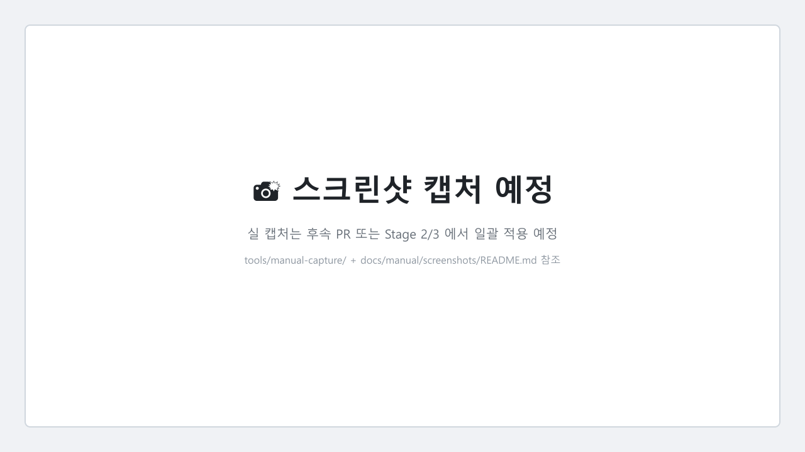

# 01-영업 / 01. 거래처 등록 (Stage 2)

> ⚠️ **구현 상태** — ⏳ Backend ✅ (PR #100 partner-service entity + 27 필드 + `PartnerAdminController` POST/GET/PUT/DELETE 완성) / **Frontend ❌ desktop UI 부재 (P0-6)**
>
> 미구현 부분: **P0-6** (`docs/manual/inventory/missing-features-catalog.md` §1 P0-6 참조 — 4 탭 UI 약 30 필드)
>
> **현 시점 대처** — IT 관리자 또는 개발팀에 의뢰하여 backend API (`POST /admin/partners`) 또는 DB 직접 INSERT 로 임시 등록. 정식 데스크탑 UI 는 P0-6 fix PR (예상 1~2주) 머지 후 본 매뉴얼 §1~§5 절차대로 사용 가능.

---

## 대상 독자

- 영업팀(SALES), 영업 관리자(MANAGER)
- 신규 거래처를 시스템에 등록해야 하는 모든 직원
- 사전 준비: [01. 로그인](../00-시작하기/01-로그인.md) / [02. 메인 화면](../00-시작하기/02-메인-화면.md) 완료

---

## 이 매뉴얼에서 배울 내용

1. 거래처 등록 화면 진입 경로 (사이드바 → 영업 → 거래처)
2. 4 탭 구조 (기본 / 거래처정보 / 여신단가 / 부가정보 — 이카운트 표준)
3. 신규 등록 입력 항목 27 필드
4. 저장 시 거래처코드 자동 생성 규칙 (`P-2026-NNNN`)
5. 등록 후 검색·수정·삭제(soft-delete) 흐름
6. 현재 UI 부재 시 임시 우회 방법 (IT 관리자 의뢰 절차)

---

## 1. 화면 진입

### 1-1. 사이드바 → 영업 → 거래처

좌측 사이드바에서 **[영업]** 메뉴 → 하위 **[거래처]** 클릭.



> ⚠️ **현재 placeholder** — desktop 라우트 `/sales/partners` 자체가 미구현 (P0-6). UI fix 시점에 위 캡처가 생성됩니다. 이카운트 reference: `docs/migration/ecount-reference/20260509_091522.png`.

### 1-2. 거래처 목록 화면

거래처 목록이 표시되며, 우상단 **[+ 신규 등록]** 버튼을 클릭합니다.


---

## 2. 4 탭 구조 개요 (이카운트 표준)

거래처 등록 다이얼로그는 **4개 탭**으로 구성되며, 모든 탭의 필드를 확인 후 마지막에 [저장] 버튼을 클릭합니다.

| 탭 | 주요 입력 | 백엔드 필드 위치 |
| --- | --- | --- |
| ① **기본** | 거래처코드 / 상호 / 대표자 / 업태 / 종목 / 전화 / Fax / Email / 검색창내용 / 담당자 / 주소1·2 / 거래처계층그룹 / 적요 / 특이사항 | `Partner` entity 본체 |
| ② **거래처정보** | 사업자등록번호 / 비사업자 구분 / 세무신고거래처 / 종사업장번호 / 모바일 / 업종별구분(일반/관세사) / 통화 / 파일관리 / 거래처그룹1·2 / 홈페이지 / 출하대상거래처 / 거래유형(영업/구매) | V2 migration 필드 |
| ③ **여신/단가** | 담당자 / 수금/지급예정일(4 옵션) / 채권번호관리 / 채무번호관리 / 여신한도 / 출고조정률 / 입고조정률 / 영업단가그룹 / 구매단가그룹 / 여신기간 | `PartnerCreditService` |
| ④ **부가정보** | 거래처코드 / 순번 / E-mail 2 / 특이사항 / 주소2 / 등록일자 / 은행 / 숫자형추가항목 1·2·3 | `partner_extra_attrs` (예정) |

> 이카운트 reference 캡처: `091522.png` (탭1) / `091540.png` (탭2) / `091551.png` (탭3) / `091604.png` (탭4).

---

## 3. 단계별 사용법

### Step 1 — 탭 ①: 기본 정보 입력


| 필드 | 입력 예 | 필수 | 비고 |
| --- | --- | :---: | --- |
| 거래처코드 | (자동 생성) | — | 저장 시 `P-2026-0001` 형식 자동 부여 |
| 상호 | `(주)데모상사` | ✅ | 25자 이내 권장 |
| 대표자 | `김미선` | ✅ | 사업자등록증 기재 그대로 |
| 업태 | `도소매` | — | 사업자등록증 업태란 |
| 종목 | `공조설비 부품` | — | 사업자등록증 종목란 |
| 전화 | `02-1234-5678` | — | 한국 형식 자동 포맷 (P1-7 예정) |
| Fax | `02-1234-5679` | — | |
| Email | `contact@demo.co.kr` | — | 형식 검증 |
| 검색창내용 | `데모, 강남, HVAC` | — | 한글 검색 키워드 (V2 컬럼) |
| 담당자 | `박영업` | — | 거래처측 담당자 |
| 주소1 | `서울 강남구 테헤란로 1` | ✅ | 도로명 주소 (P1-7 검색 예정) |
| 주소2 | `데모빌딩 5층` | — | 상세 주소 |
| 적요 | (자유 입력) | — | 거래처 특이 메모 |

> ⚠️ **UUID 노출 금지** — `partnerId` (UUID) 는 화면 어디에도 표시되지 않습니다. 사용자에게 보이는 식별자는 `거래처코드` (`P-2026-NNNN`) 와 `상호` 만 사용합니다 (메모리 가드 `feedback_uuid_no_user_visibility.md`).

> 📌 **slip 발행 시 자동 snapshot (Phase 10 step-14, PR-G1)** — 본 탭의 **전화 / 주소1 / 대표자** 3 필드는 슬립 발행 시점에 자동으로 슬립 헤더로 snapshot 됩니다 (slip-service `customer_tel` / `customer_addr` / `customer_rep` 컬럼). 거래처 마스터 정보가 **나중에 변경**되어도 과거 슬립은 발행 시점 값을 그대로 보존합니다 (감사·분쟁 추적성). 자세한 안내: [02-창고/02. 출고 처리 §2-8](../02-창고/02-출고-처리.md) / [02-창고/01. 입고 처리 §2-7](../02-창고/01-입고-처리.md).

### Step 2 — 탭 ②: 거래처정보 입력


| 필드 | 입력 예 | 필수 | 비고 |
| --- | --- | :---: | --- |
| 사업자등록번호 | `123-45-67890` | ✅ | 자동 포맷 + 체크섬 검증 (P1-7) |
| 비사업자 구분 | (체크박스 — 내국인/외국인) | — | 일반 사업자는 미체크 |
| 세무신고거래처 | (체크박스) | — | 부가세 신고 대상 여부 |
| 종사업장번호 | `0001` | — | 사업장이 여러개일 때 |
| 모바일 | `010-1234-5678` | — | 거래처 담당자 휴대폰 |
| 업종별구분 | `일반` / `관세사` | — | 드롭다운 |
| 통화 | `KRW` | — | KRW / USD / JPY |
| 거래처그룹1 | `VIP` | — | 분류용 (P0-6 와 함께 추가 예정) |
| 거래처그룹2 | `남부` | — | 지역 분류 |
| 홈페이지 | `https://demo.co.kr` | — | |
| 거래유형 | `영업` / `구매` / `영업+구매` | ✅ | 거래 방향 |

### Step 3 — 탭 ③: 여신/단가 입력


| 필드 | 입력 예 | 필수 | 비고 |
| --- | --- | :---: | --- |
| 수금예정일 | `매월 25일` | — | 4 옵션 (말일/15일/25일/계약일) |
| 지급예정일 | `매월 말일` | — | 동일 |
| 여신한도 | `10,000,000` | — | 원화 표기 (₩) |
| 여신기간 | `60일` | — | 초과 시 슬립 발행 차단 (P2 — 자동 차단 미구현) |
| 출고조정률 | `0%` | — | 단가 가산/감산 |
| 입고조정률 | `0%` | — | |
| 영업단가그룹 | `STANDARD` | — | (P2-4 정식 단가그룹은 미구현) |
| 구매단가그룹 | `STANDARD` | — | |

> ⚠️ **여신 한도 자동 차단 미구현** (P2) — 현재 한도 초과 시에도 슬립 발행이 가능합니다. 운영자가 [거래처 조회](02-거래처-조회.md) §매출/매입 내역에서 수동 확인 필요.

> 📌 **slip 발행 시 자동 snapshot (Phase 10 step-14, PR-G1)** — 본 탭의 **수금예정일 / 지급예정일 / (결제 조건 정책)** 은 슬립 발행 시점에 자동으로 슬립 헤더 `payment_due` / `collect_term` 컬럼으로 채워집니다. 영업 직원이 슬립별 예외가 필요한 경우 슬립 발행 화면에서 직접 수정 (DRAFT/SAVED 단계). 자세한 안내: [02-창고/02. 출고 처리 §2-8-4](../02-창고/02-출고-처리.md).

### Step 4 — 탭 ④: 부가정보 입력


| 필드 | 입력 예 | 필수 | 비고 |
| --- | --- | :---: | --- |
| E-mail 2 | `accounting@demo.co.kr` | — | 회계 담당 별도 메일 |
| 등록일자 | (자동 — 오늘) | — | |
| 은행 | `우리은행 1002-123-456789` | — | 입금 계좌 (지급 거래처) |
| 숫자형추가항목 1~3 | (자유) | — | 사용자 정의 컬럼 (현재 backend 미구현) |

### Step 5 — 저장


1. 모든 탭 확인 후 우하단 **[저장]** 버튼 클릭.
2. 저장 성공 시 토스트 메시지 표시: `거래처 P-2026-0001 (주)데모상사 가 등록되었습니다.`
3. 거래처 목록 화면으로 자동 이동.

#### 거래처코드 자동 생성 규칙

| 구성 | 예 | 설명 |
| --- | --- | --- |
| `P` | `P` | Partner 고정 |
| `-` | `-` | 구분자 |
| `YYYY` | `2026` | 등록 연도 |
| `-` | `-` | 구분자 |
| `NNNN` | `0001` | 해당 연도 순번 (4자리, zero-pad) |

> 백엔드 `Partner.partnerCode` 는 unique 제약. 동시 등록 시 race condition 은 `INTEGRATION` 단계에서 retry 처리됩니다.

---

## 4. 현재 UI 부재 시 임시 우회 (구현 예정 안내)

> 본 절은 **P0-6 desktop UI fix PR 머지 전** 까지 한정 적용되는 임시 절차입니다.

### 4-1. IT 관리자 / 개발팀 의뢰 (권장)

1. 영업 직원 → 등록할 거래처 정보를 사내 메신저 / 이메일로 IT 관리자에게 전달
2. 필수 항목: 상호 / 사업자등록번호 / 대표자 / 주소 / 담당자 전화 / Email / 거래유형
3. IT 관리자가 backend API 또는 DB 로 등록 후 `거래처코드` 회신

### 4-2. Backend API 직접 호출 (개발팀 한정)

```http
POST /admin/partners
Authorization: Bearer <MASTER 또는 MANAGER JWT>
Content-Type: application/json

{
  "businessName": "(주)데모상사",
  "representative": "김미선",
  "businessNumber": "123-45-67890",
  "address1": "서울 강남구 테헤란로 1",
  "address2": "데모빌딩 5층",
  "contactPerson": "박영업",
  "contactPhone": "010-1234-5678",
  "email": "contact@demo.co.kr",
  "tradeType": "SALES",
  "creditLimit": 10000000,
  "creditPeriodDays": 60
}
```

**응답 예** —
```json
{
  "partnerCode": "P-2026-0001",
  "createdAt": "2026-05-09T10:00:00+09:00"
}
```

> 4 탭 중 탭1 + 탭2 + 탭3 일부 (여신한도/기간) 만 backend 가 받습니다. 탭4 부가정보 컬럼은 P0-6 와 함께 backend 도 추가 예정.

### 4-3. DB 직접 INSERT (DBA / 최후 수단)

```sql
INSERT INTO partners (
  partner_id, partner_code, business_name, representative,
  business_number, address1, contact_person, contact_phone,
  trade_type, credit_limit, credit_period_days,
  created_at, created_by, updated_at, updated_by, deleted
) VALUES (
  gen_random_uuid(), 'P-2026-0001', '(주)데모상사', '김미선',
  '123-45-67890', '서울 강남구 테헤란로 1', '박영업', '010-1234-5678',
  'SALES', 10000000, 60,
  NOW(), 'IT-ADMIN', NOW(), 'IT-ADMIN', false
);
```

> ⚠️ DB 직접 INSERT 는 BaseEntity 7 audit 필드 (`created_at` / `created_by` / `updated_at` / `updated_by` / `version` / `deleted` / `deleted_at`) 를 모두 채워야 합니다 (메모리 가드 `project_build_conventions.md`). 누락 시 차후 JPA 조회에서 NPE 발생 가능.

---

## 5. 등록 후 확인

등록 완료 후 [거래처 조회](02-거래처-조회.md) 매뉴얼의 검색 절차로 본인이 등록한 거래처가 정상 조회되는지 확인합니다.

---

## 6. FAQ + 트러블슈팅

| 증상 | 원인 | 해결 |
| --- | --- | --- |
| 사이드바에 [영업] → [거래처] 메뉴가 없음 | desktop UI 미구현 (P0-6) | 본 매뉴얼 §4 임시 우회 절차 사용. UI fix 후 재시도 |
| 신규 등록 버튼 클릭 시 빈 화면 | 동일 (라우트 미구현) | 동일 |
| `거래처코드 중복` 에러 | 동시 등록 race | 1~2초 후 재시도 |
| `사업자등록번호 형식 오류` | 자동 포맷 미구현 (P1-7) | `123-45-67890` 형식으로 수동 입력 |
| `여신한도 초과` 에러 | (현재 미구현 — Phase 11 후 예정) | 무시 가능 |
| 저장 후 목록에 표시 안됨 | F5 새로고침 필요 (예정 — auto-refresh 추가) | F5 |
| 한글 깨짐 | 브라우저 인코딩 / 글꼴 문제 | Edge / Chrome 최신 버전 + Noto Sans KR |

---

## 7. 관련 매뉴얼

- 다음 단계: [02. 거래처 조회](02-거래처-조회.md)
- 슬립 발행 시 거래처 선택: [03. 슬립 발행](03-슬립-발행.md)
- 권한 정보: [03. 역할별 권한](../00-시작하기/03-역할별-권한.md)
- 누락 catalog: `docs/manual/inventory/missing-features-catalog.md` §1 P0-6
- 이카운트 reference: `docs/migration/ecount-reference/20260509_091522.png` (탭1) ~ `091604.png` (탭4)
