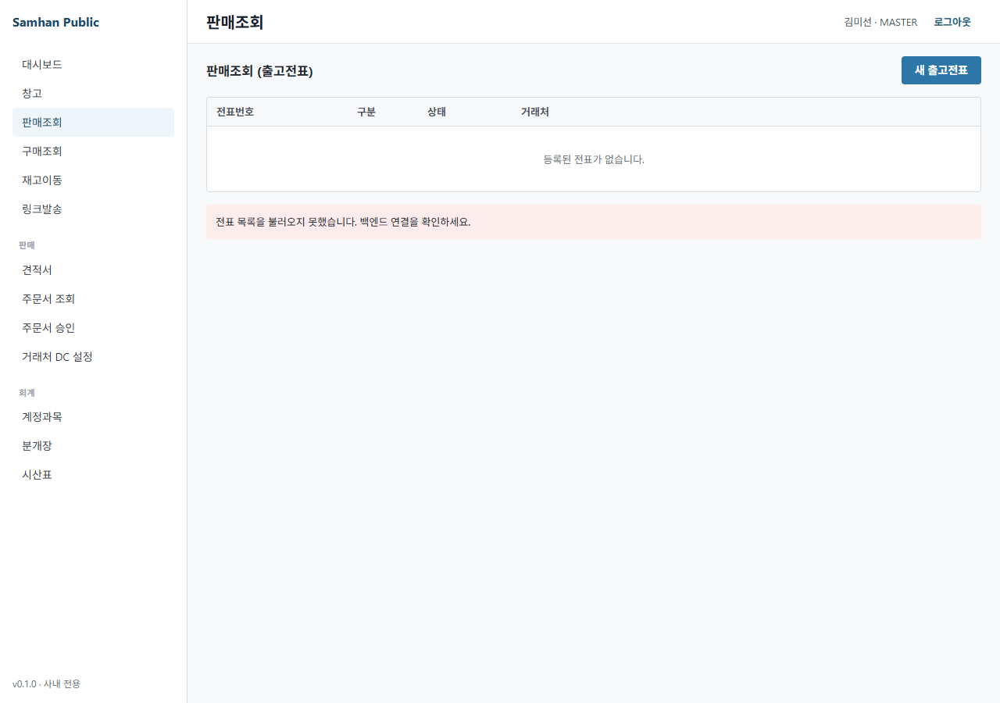

# 01-영업 / 03. 슬립(전표) 발행 (Stage 2)

> ⚠️ **구현 상태** — ✅ Backend (slip-service `/slips/**` + 11 status workflow + 자동 분개 + 모바일 서명) / ⏳ Frontend (legacy v4 webview 임베드 일부 + 인쇄 양식 진행중 — P0-4)
>
> 미구현 부분: P0-4 (세금계산서 인쇄 양식 / 견적서 인쇄), P1-6 (복합 필터 / Excel export), 반품(Return) / 부분 출고 / 묶음 발행 (slip-service §7.4)

---

## 대상 독자

- 영업팀(SALES) — 슬립 신규 발행 / 헤더·라인 입력 / 발송
- 창고팀(WAREHOUSE / INVENTORY) — 슬립 접수 / 처리 / 검수 / 출하
- 회계팀(ACCOUNTANT) — 슬립 정산 (CONFIRMED) + 자동 분개 확인
- 부서장(MANAGER) / MASTER — 전 단계
- 사전 준비: [01. 거래처 등록](01-거래처-등록.md) 완료, 품목 시드 100건 (`PRODUCT_SEED_TEST_DATA=true`) 적재

---

## 이 매뉴얼에서 배울 내용

1. 슬립 발행 화면 진입 (사이드바 → 영업 → 슬립 → 신규)
2. 슬립 유형 선택 (출고 / 입고 / 반품)
3. 헤더 입력 (거래처 / 출하창고 / 일자 / 담당자 / 배송주소 / 인수자번호 / 입금예정일 / 할인율)
4. 라인 입력 (품목코드 / 수량 / 단가 / 공급가액 / 부가세 / 적요)
5. **11 status workflow** 단계별 흐름
6. 거절(REJECTED) / 취소(CANCELLED) 처리
7. 모바일 서명 batch 발송

---

## 1. 화면 진입

### 1-1. 사이드바 → 영업 → 슬립

좌측 사이드바 [영업] → [슬립] 클릭 → 슬립 목록 화면.


### 1-2. 신규 슬립 발행

목록 화면 우상단 **[+ 신규 슬립]** 버튼 클릭 → 신규 슬립 입력 화면.



> 이카운트 reference: `docs/migration/ecount-reference/20260509_091636.png` (판매입력 화면).

---

## 2. 슬립 유형 선택

| 유형 | 영문 | 용도 | 영향 |
| --- | --- | --- | --- |
| **출고** | OUTBOUND (기본) | 거래처 판매 | 재고 차감 + 매출 분개 |
| **입고** | INBOUND | 매입 (구매) | 재고 증가 + 매입 분개 |
| **반품** | RETURN | 출고 반품 / 입고 반품 | ❌ **미구현** (slip-service §7.4) |

> ⚠️ **반품 미구현** — V1 schema 에 RETURN status 만 정의되어 있고 endpoint 자체가 없습니다. 우회: 음수 수량 라인 + 적요 `[반품]` 표시 (Phase 11 후 정식 구현 예정).

---

## 3. 헤더 입력


| 필드 | 입력 예 | 필수 | 비고 |
| --- | --- | :---: | --- |
| 슬립번호 | (자동 — 저장 시 생성) | — | `S-2026-NNNNN` 형식 |
| 거래처 | `P-2026-0001 (주)데모상사` | ✅ | 자동완성 (이름/코드) |
| 출하창고 | `HQ-001 본사 창고` | ✅ | 시드: HQ-001 / VH-001 |
| 일자 | `2026-05-09` | ✅ | 기본값 = 오늘 |
| 담당자 | (자동 — 본인) | — | JWT `X-User-Id` 매핑 |
| 배송주소 | (거래처 주소 자동 채움) | — | 수정 가능 |
| 인수자번호 | `010-1234-5678` | — | 모바일 서명 SMS 수신처 |
| 입금예정일 | `2026-06-30` | — | 거래처 수금예정일 자동 적용 |
| 할인율 | `0%` | — | 슬립 전체 할인 (라인별 별도) |

> ⚠️ **UUID 노출 금지** — 사용자 화면에는 `슬립번호` (`S-2026-NNNNN`) / `거래처코드` (`P-2026-0001`) / `상호` 만 표시. 내부 `slipId` (UUID) 는 절대 노출 금지 (메모리 가드 `feedback_uuid_no_user_visibility.md`).

---

## 4. 라인 입력


라인 추가 버튼 [+ 라인 추가] 클릭 → 라인 row 가 추가됩니다.

| 컬럼 | 입력 | 비고 |
| --- | --- | --- |
| 품목코드 | `P-2026-0001` (5자리 productCode) | 자동완성 (모델명 검색) |
| 품목명 | (자동 채움) | 읽기 전용 |
| 규격 | (자동 채움) | 읽기 전용 |
| 단위 | `EA` (자동) | |
| 수량 | `10` | 정수 |
| 단가 | `100,000` | 통화 자동 포맷. 거래처 단가그룹 자동 적용 (P2-4 미구현 — 현재 standard 단가만) |
| 공급가액 | `1,000,000` (자동 — `수량 × 단가`) | 읽기 전용 |
| 부가세 | `100,000` (자동 — 10%) | 0% / 면세 / 영세 옵션 |
| 합계 | `1,100,000` (자동) | 읽기 전용 |
| 적요 | (자유) | 라인별 메모 |

라인은 [+ 라인 추가] 로 무제한 추가 가능. 삭제는 row 우측 [🗑] 버튼.

---

## 5. 저장 → 발송 → 11 status workflow

슬립은 **11 단계 status** 를 거쳐 처리됩니다. 각 단계는 endpoint 호출로 전이합니다.

### 5-1. 11 status 흐름 도표

```
  [영업]                 [창고]                              [회계]
DRAFT ─save→ SAVED ─send→ SENT ─accept→ ACCEPTED
                                            │
                                            ↓ process
                                      PROCESSING
                                            │
                                            ↓ inspect
                                      INSPECTING
                                            │
                                            ↓ complete
                                      COMPLETED
                                            │
                                            ↓ ship
                                       SHIPPING
                                            │
                                            ↓ deliver
                                      DELIVERED ─confirm→ CONFIRMED (+ 자동 분개)

   (보조)
   * REJECTED — MANAGER 가 거절 (사유 입력)
   * CANCELLED — DRAFT/SAVED/SENT 단계에서 SALES 가 취소
```

### 5-2. 단계별 책임자 + endpoint

| # | 단계 | endpoint | 책임 ROLE | 의미 |
| :-: | --- | --- | --- | --- |
| 0 | DRAFT | `POST /slips` | SALES/MANAGER/MASTER | 신규 (저장 안 한 임시) |
| 1 | SAVED | `POST /slips/{id}/save` | SALES/MANAGER/MASTER | 저장 완료 (초안 확정) |
| 2 | SENT | `POST /slips/{id}/send` | SALES/MANAGER/MASTER | 창고로 발송 (재고 예약) |
| 3 | ACCEPTED | `POST /slips/{id}/accept` | WAREHOUSE/INVENTORY/MANAGER/MASTER | 창고 접수 |
| 4 | PROCESSING | `POST /slips/{id}/process` | WAREHOUSE/INVENTORY/MANAGER/MASTER | 출고 작업 시작 |
| 5 | INSPECTING | `POST /slips/{id}/inspect` | WAREHOUSE/INVENTORY/MANAGER/MASTER | 검수 |
| 6 | COMPLETED | `POST /slips/{id}/complete` | WAREHOUSE/INVENTORY/MANAGER/MASTER | 검수 완료 |
| 7 | SHIPPING | `POST /slips/{id}/ship` | WAREHOUSE/INVENTORY/MANAGER/MASTER | 출하 (트럭 적재) |
| 8 | DELIVERED | `POST /slips/{id}/deliver` | WAREHOUSE/INVENTORY/MANAGER/MASTER | 배송 완료 (서명 수신) |
| 9 | CONFIRMED | `POST /slips/{id}/confirm` | ACCOUNTANT/MANAGER/MASTER | **정산 + 자동 분개** |
| ✕ | REJECTED | `POST /slips/{id}/reject` | MANAGER/MASTER | 거절 (사유 필수) |
| ✕ | CANCELLED | `POST /slips/{id}/cancel` | SALES/MANAGER/MASTER | 취소 (DRAFT/SAVED/SENT 만) |

> ⚠️ 본 매뉴얼은 영업 시점 (Step 0~2) 만 다룹니다. 창고 단계는 [02-창고/02. 출고 처리](../02-창고/02-출고-처리.md), 회계 정산은 Stage 3 회계 매뉴얼 참조.

### 5-3. Step 0 — 저장 (DRAFT)

화면 우하단 **[저장]** 버튼 클릭. 슬립이 DRAFT 상태로 저장되며 슬립번호 (`S-2026-NNNNN`) 가 부여됩니다.


### 5-4. Step 1 → 2 — 발송 (SAVED → SENT)

상세 화면 우상단 **[저장 확정]** → **[발송]** 버튼 순서로 클릭.

| 버튼 | 호출 endpoint | 결과 |
| --- | --- | --- |
| [저장 확정] | `POST /slips/{id}/save` | DRAFT → SAVED |
| [발송] | `POST /slips/{id}/send` | SAVED → SENT (창고 알림 + 재고 예약) |

> 발송 시 `inventory-service` 의 `POST /inventory/reserve` 가 자동 호출되어 라인별 수량이 **예약** 됩니다. 재고 부족 시 409 CONFLICT 응답 (라인 단위 표시).

---

## 6. 모바일 서명 batch 발송 (DeliveryBatch)

여러 슬립을 기사 1명에게 묶어 한 번에 SMS 발송 + 모바일 서명을 받을 수 있습니다.

### 6-1. 자동 grouping

`POST /delivery-batches/auto-group` — 같은 `driverPhone` 의 슬립을 자동으로 묶어 batch 생성.

### 6-2. SMS 발송

`POST /delivery-batches/{id}/send-sms` — batch 의 share token URL 을 SMS 로 기사에게 전송.

### 6-3. 모바일 서명

기사가 SMS 링크 클릭 → 모바일 화면에서 슬립 list + 서명 → 자동으로 DELIVERED 상태로 전이.

> 자세한 내용은 Stage 3 [04-모바일/02. 전자 서명](../04-모바일/02-전자-서명.md) (예정) 참조.

---

## 7. 슬립 인쇄

### 7-1. 출고전표 인쇄

상세 화면 우상단 **[🖨 출고전표]** 버튼 → A4 인쇄 미리보기.


> ✅ 구현됨 — `clients/desktop/src/renderer/print/DispatchView.tsx`. 메모리 가드 `feedback_print_design_iteration.md` (3~5회 iteration 의무).

### 7-2. 거래명세서 인쇄

⏳ **부분 구현** — `print/InvoiceView.tsx` legacy v4 일부. P0-4 fix PR 후 정식 사용 가능.

### 7-3. 세금계산서 인쇄

❌ **미구현 (P0-4)** — 양식 자체 부재. 한국 국세청 e-Tax 연계 필요.

---

## 8. 거절 / 취소

### 8-1. 거절 (REJECTED)

MANAGER 가 슬립 상세 → **[거절]** 버튼 → 사유 입력 → `POST /slips/{id}/reject` 호출.

거절된 슬립은 영업 직원이 [재발행] 버튼으로 복제 후 수정하여 재발송 가능.

### 8-2. 취소 (CANCELLED)

영업 직원이 직접 → **[취소]** 버튼. **단, DRAFT / SAVED / SENT 단계에서만 가능**. ACCEPTED 이후는 MANAGER 거절만 가능.

> 자세한 결재 흐름: [04. 슬립 결재 라인](04-슬립-결재-라인.md)

---

## 9. FAQ + 트러블슈팅

| 증상 | 원인 | 해결 |
| --- | --- | --- |
| 거래처 자동완성 결과 없음 | partner-service 시드 미적재 | `PARTNER_SEED_TEST_DATA=true` 또는 거래처 등록 |
| 품목 자동완성 결과 없음 | product-service 시드 미적재 | `PRODUCT_SEED_TEST_DATA=true` 또는 품목 등록 |
| `재고 부족` 409 에러 | 발송 시 `/inventory/reserve` 실패 | 재고 입고 후 재시도 (Stage 2 [02-창고/01. 입고](../02-창고/01-입고-처리.md)) |
| 발송 후 창고가 못 봄 | 창고 ROLE 권한 미부여 | MANAGER 에게 ROLE 추가 요청 |
| 슬립 상세에서 단계 버튼이 안 보임 | 본인 ROLE 권한 부족 (button-level RBAC) | 5-2 표 참조 |
| `이미 처리된 슬립입니다` 에러 | 동일 단계 중복 호출 | F5 → 현재 status 재확인 |
| 모바일 서명 SMS 가 안 옴 | `AligoSmsGateway` 미설정 (P1-1) | 임시 — 화면에서 share token URL 복사 후 카카오톡 전송 |
| 자동 분개가 안 만들어짐 | accounting-service 비활성 / Eureka 미등록 | 개발팀 문의 |
| 인쇄 시 한글 깨짐 | 폰트 미설치 | Noto Sans KR 시스템 설치 |

---

## 10. 관련 매뉴얼

- 이전 단계: [02. 거래처 조회](02-거래처-조회.md)
- 다음 단계: [04. 슬립 결재 라인](04-슬립-결재-라인.md)
- 창고 처리: [02-창고/02. 출고 처리](../02-창고/02-출고-처리.md)
- 거래처 주문 자동 변환: [05. 거래처 주문](05-거래처-주문.md)
- 권한 정보: [03. 역할별 권한](../00-시작하기/03-역할별-권한.md)
- 누락 catalog: `docs/manual/inventory/missing-features-catalog.md` §1 P0-4 (인쇄)
- 이카운트 reference: `docs/migration/ecount-reference/20260509_091636.png` (판매입력)
