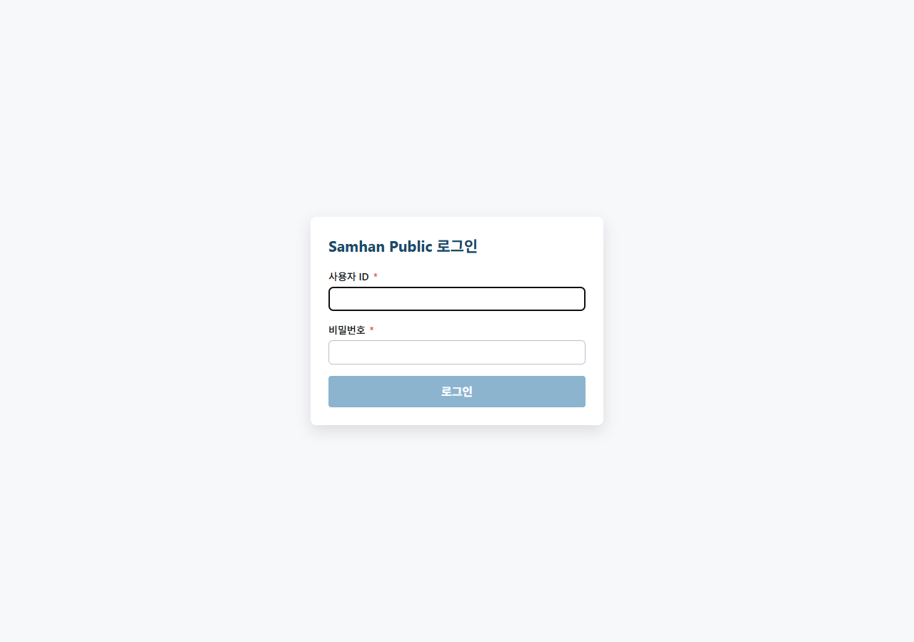

# 01-영업 / 05. 거래처 주문 (Stage 2)

> ⚠️ **구현 상태** — ✅ Backend (partner-order-service `/api/v1/partner-orders/**` + draft → confirm → slip 자동 발행 + idempotency) / ⏳ Frontend (거래처 측 PWA 라우트 일부 + idempotency-key UI 미노출 — 장기 backlog P1-4)
>
> 미구현 부분: P0-6 (거래처 등록 4 탭 — 거래처 자가 등록 시 의존), P1-4 (영업직원 native 앱 / 모바일 주문서), 장바구니 / 즐겨찾기 / 결제 PG (partner-order-service §11.4)

---

## 대상 독자

- 거래처(PARTNER) — 발주자 입장에서 주문서 작성
- 영업팀(SALES) — 거래처 주문 → 슬립 변환 결과 확인
- 영업 관리자(MANAGER) / MASTER — 주문 → 슬립 자동 발행 모니터링
- 회계팀(ACCOUNTANT) — confirm 후 매출 분개 확인
- 사전 준비: 거래처 등록 ([01. 거래처 등록](01-거래처-등록.md)) + 거래처 계정 (`partner-auth-service`) 발급

---

## 이 매뉴얼에서 배울 내용

1. 거래처 주문 생명주기 (draft → confirm → slip 자동 발행)
2. **idempotency-key** 동작 원리 (중복 주문 방지)
3. 영업 직원 시점에서 거래처 주문 → 슬립 변환 결과 확인
4. PartnerOrder → Slip 변환 자동 흐름 + 재시도(retry) 정책
5. confirm 후 취소 불가 / 슬립 cancel 우회

---

## 1. 거래처 주문 생명주기

```
[거래처]                              [SamhanLogis 시스템]               [영업 / 회계]
PARTNER 로그인 ─────────→ POST /api/v1/partner-orders/drafts
                              │
                              ↓
                          DRAFT 저장
                              │
PARTNER 라인 추가 ─────→ POST /api/v1/partner-orders/{draftId}/lines
                              │
                              ↓
PARTNER [주문 확정] ───→ POST /api/v1/partner-orders/{draftId}/confirm
                              │ (idempotency-key header)
                              ↓
                       CONFIRMED + Slip 자동 발행 ──→ slip-service `/api/v1/slips/from-partner-order`
                              │                              │
                              ↓                              ↓
                       PUBLISHED                       Slip DRAFT 생성
                              │                              │
                              ↓                              ↓
                                                    영업 직원이 슬립 list 에서 확인
                                                    → 발송 / 처리 ([03. 슬립 발행](03-슬립-발행.md))
```

### 1-1. PartnerOrder 상태값

| 상태 | 의미 |
| --- | --- |
| **DRAFT** | 거래처가 작성중 |
| **CONFIRMED** | 거래처가 주문 확정 (slip 변환 대기) |
| **CONFIRMED + PENDING_RETRY** | slip 변환 시도중 / 일시 실패 (retry 큐) |
| **CONFIRMED + PUBLISHED** | slip 발행 완료 (`from-partner-order` 응답 OK) |
| **CANCELLED** | 거래처가 draft 단계에서 취소 |

> CONFIRMED 이후 거래처 측 취소는 불가. 슬립 cancel ([04. 슬립 결재](04-슬립-결재-라인.md) §4) 로 우회.

---

## 2. 거래처 시점 화면

### 2-1. 진입

거래처가 `https://order.samhan-air.com` (Phase 11 후 정식 도메인) 접속 → partner-auth 로그인 → 주문서 화면.



> ⚠️ 거래처 주문서 PWA 는 별도 client (`clients/partner-order-app/`) 에 위치. 본 매뉴얼은 영업 직원 시점이 메인이며, 거래처 시점 상세는 [04-모바일/03. 영업 앱](../04-모바일/03-영업-앱.md) (Stage 3 예정) 에서 다룹니다.

### 2-2. 거래처가 보는 화면 흐름

1. 제품 카탈로그 검색 → 라인 추가 → DRAFT 자동 저장
2. 수량 / 단가 확인 → [주문 확정] 클릭
3. **idempotency-key** 가 자동 생성되어 헤더에 포함 (중복 클릭 방지)
4. 확정 즉시 토스트: `주문이 접수되었습니다. 슬립번호 S-2026-NNNNN 가 부여될 예정입니다.`

---

## 3. 영업 직원 시점 — 변환 결과 확인

### 3-1. 슬립 list 에서 거래처 주문 출처 슬립 조회

[03. 슬립 발행](03-슬립-발행.md) 의 슬립 목록 화면 → 필터에 **출처: 거래처 주문** 선택.


또는 backend API `GET /api/v1/slips/by-source?source=PARTNER_ORDER` 직접 호출.

### 3-2. 슬립 처리

거래처 주문에서 변환된 슬립은 자동으로 DRAFT 상태입니다. 영업 직원이:

1. 라인 / 단가 확인
2. [저장 확정] → SAVED
3. [발송] → SENT (창고로 전달)

이후 단계는 일반 슬립과 동일 ([04. 슬립 결재 라인](04-슬립-결재-라인.md)).

---

## 4. idempotency-key 동작

### 4-1. 왜 필요한가?

거래처가 [주문 확정] 버튼을 네트워크 지연 등으로 여러 번 클릭하면 중복 주문이 발생할 수 있습니다. idempotency-key 는 **동일 key 의 두 번째 요청을 첫 번째 응답으로 즉시 반환**하여 중복을 차단합니다.

### 4-2. 흐름

```
거래처 client → POST /confirm
              → Header: Idempotency-Key: <UUID>
              → Body: { lines: [...] }

partner-order-service:
  1. Idempotency-Key 가 DB 에 존재하는가?
     - YES: 이전 응답을 그대로 반환 (200 OK + 첫 번째 결과)
     - NO: 진행
  2. 정상 처리 → CONFIRMED + Slip 발행 시도
  3. Idempotency-Key + 응답 fingerprint 저장 (V8/V9 audit)
  4. 응답 반환
```

> 자세한 audit 정책: slip-service §7.2 "idempotency (V8/V9 audit + fingerprint)".

### 4-3. 영업 시점에서 확인

거래처가 같은 주문을 두 번 누른 경우 슬립은 **1건만 발행**됩니다. 두 번째 응답은 첫 번째와 동일 슬립번호를 회신.

**중복 우려 발생 시 backend audit 조회** —
```http
GET /api/v1/partner-orders/history?partnerCode=P-2026-0001&from=2026-05-09
```
응답에 idempotency-key 별 hit count 가 포함됩니다.

---

## 5. retry 정책 (CONFIRMED + PENDING_RETRY)

거래처가 confirm 했으나 slip-service 호출이 일시 실패 (Eureka discovery 지연 / DB lock 등) 한 경우:

1. PartnerOrder = `CONFIRMED + PENDING_RETRY` 상태로 큐 적재
2. 백엔드 scheduler 가 5초 간격으로 재시도 (최대 10분)
3. 성공 시 `PUBLISHED`, 10분 초과 시 운영팀 알림

영업 직원 시점에서 `PENDING_RETRY` 상태 주문이 5분 이상 지속되면 **개발팀에 문의** (보통 Eureka / DB 이슈).

---

## 6. confirm 후 변경 / 취소

### 6-1. 거래처 측 취소 — 불가

거래처는 confirm 이후 직접 취소 불가. 영업 직원에게 전화/메일로 요청.

### 6-2. 영업 직원 우회 — 슬립 cancel

- 거래처 주문에서 발행된 슬립이 `DRAFT / SAVED / SENT` 단계인 경우 → 슬립 [취소] (CANCELLED)
- 그 이후 단계 → MANAGER 거절 (REJECTED)

자세한 절차: [04. 슬립 결재 라인](04-슬립-결재-라인.md) §3, §4.

---

## 7. FAQ + 트러블슈팅

| 증상 | 원인 | 해결 |
| --- | --- | --- |
| 거래처가 주문 확정 했는데 영업 슬립 목록에 없음 | PENDING_RETRY 진행중 | 5분 대기 → 그래도 없으면 개발팀 |
| 같은 주문이 슬립 list 에 2건 표시 | idempotency-key 누락 (구버전 client) | 거래처 client 업데이트 요청 |
| 거래처가 주문 취소를 요청 | confirm 이후 거래처 측 cancel 불가 | 슬립 cancel/reject 으로 우회 |
| 거래처 카탈로그에 제품이 안 보임 | bootstrap cache 미갱신 | `GET /api/v1/partner-orders/bootstrap` 재호출 → 그래도 없으면 개발팀 |
| 단가가 이상함 (거래처 단가가 아닌 standard) | 거래처 단가그룹 미설정 (P2-4) | 거래처 등록 4 탭 ③ 여신/단가 → 영업단가그룹 설정 (P0-6 fix 후) |
| `403 Forbidden` (거래처) | partner-auth 만료 (90일) | 거래처에 비밀번호 재발급 안내 (`partner-auth-service` §10.2) |
| Slip 발행 실패 (재고 부족) | 재고 < 주문 수량 | 거래처에 부분 출고 안내 후 입고 처리 (현재 부분 출고 미구현 — slip-service §7.4) |
| `409 Conflict idempotency` | 동일 key 다른 body 로 재호출 | 거래처 client 의 key 생성 로직 점검 |

---

## 8. 관련 매뉴얼

- 이전 단계: [04. 슬립 결재 라인](04-슬립-결재-라인.md)
- 다음 단계 (창고): [02-창고/01. 입고 처리](../02-창고/01-입고-처리.md)
- 슬립 발행 일반: [03. 슬립 발행](03-슬립-발행.md)
- 거래처 자가 등록: [01. 거래처 등록](01-거래처-등록.md) §4 임시 우회
- 거래처 모바일 (PWA): [04-모바일/03. 영업 앱](../04-모바일/03-영업-앱.md) *(Stage 3 예정)*
- 권한 정보: [03. 역할별 권한](../00-시작하기/03-역할별-권한.md)
- 누락 catalog: `docs/manual/inventory/missing-features-catalog.md` §2 P1-4 (영업 native 앱)
