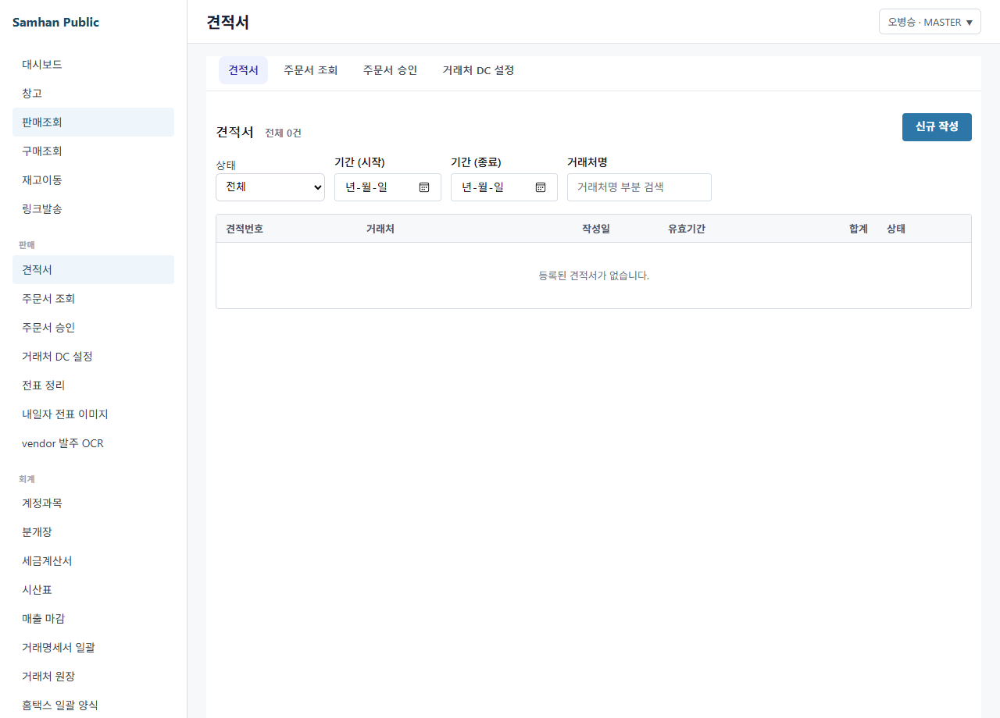
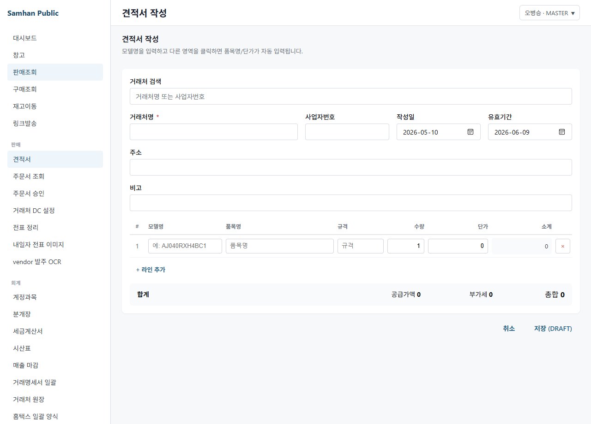
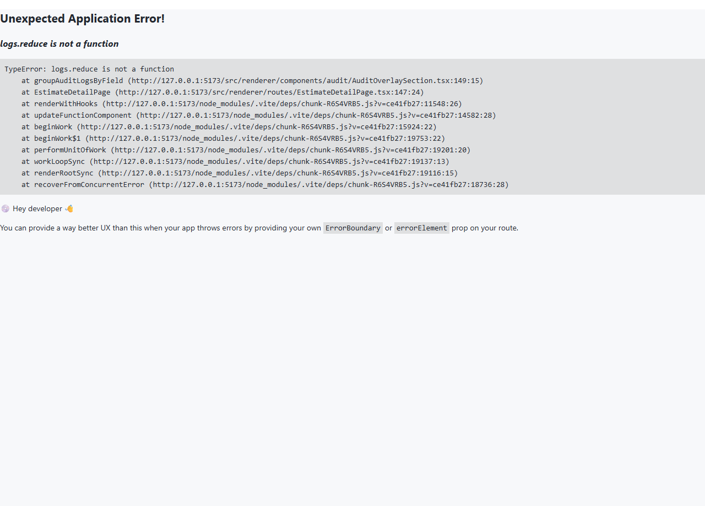
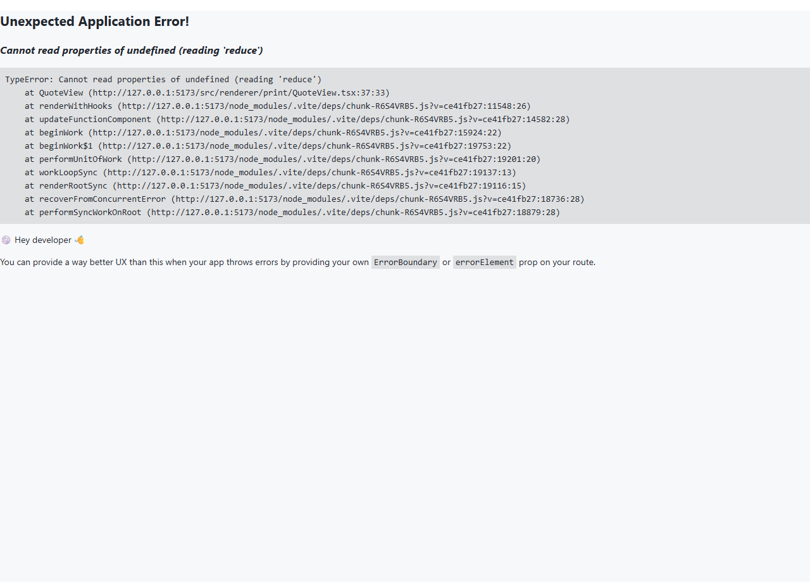

# 06. 견적서 작성 및 발송

> **Stage 안내**: Stage 3 placeholder ⚠️ — Phase 12 step-6 본 PR 에서 7-section 패턴으로 재작성. 정식 신규 견적 view 는 P2-1 PR 머지 후 교체 예정.

---

## 1. 구현 상태

| 항목 | 상태 | 비고 |
| --- | --- | --- |
| Backend (slip-service 견적 status) | ⏳ 부분 | 일부 status flag |
| 정식 견적 view (desktop) | ⛔ 미구현 (P2-1) | Phase 11 후 |
| Legacy v4 estimate-app | ✅ 운영 | Node.js + Express + EJS |
| Excel 양식 우회 | ✅ 운영 | 사내 표준 양식 |
| 견적 → 슬립 자동 변환 | ⛔ 미구현 | 장기 backlog |
| 인쇄 양식 (견적서) | ⛔ 미구현 (P0-4) | DS PrintPreview 컴포넌트만 |

견적서는 거래 성사 전 거래처에 단가/수량을 제안하는 단계입니다. 정식 desktop view 는 미구현 상태이므로, legacy v4 또는 Excel 우회를 사용합니다.

---

## 2. 대상 독자

- 거래처에 견적을 발송하는 영업 직원 (SALES)
- 견적 단가를 검토하는 영업 부장 (MANAGER)

---

## 3. 학습 내용

- 정식 견적 기능이 미구현임을 인지
- Legacy v4 estimate-app 접속 방법
- Excel 양식 우회 작성 방법
- 견적 → 슬립 수동 변환 절차

---

## 4. 본문

### 4-1. 정식 견적 view 미구현 안내

(주)삼한공조시스템 Samhan Public 의 정식 견적 view 는 P2-1 슬라이스로 Phase 11 후 출시 예정입니다. 현재 화면에는 견적 메뉴가 없거나 Coming Soon 표시됩니다.

DS 컴포넌트 `clients/desktop/src/renderer/components/PrintPreview.tsx` 만 존재하며, 실 라우트는 미연결.

### 4-2. 우회 1 — Legacy v4 estimate-app

기존 v4 시절 Node.js + Express + EJS 로 작성된 estimate-app 이 별도 운영 중입니다.

1. 브라우저에서 legacy 견적 URL 접속 (IT 관리자 안내)
2. 거래처 / 품목 / 수량 / 단가 입력
3. EJS 양식으로 PDF 생성
4. 거래처에 이메일 발송

> Legacy v4 는 인증 분리 / 데이터 마이그레이션 미완 상태. Phase 11 후 정식 마이그레이션 예정.

### 4-3. 우회 2 — Excel 양식

Legacy 접근이 어려운 경우 사내 Excel 표준 양식 사용.

1. 사내 공유 폴더 또는 IT 관리자에게 Excel 양식 요청
2. 거래처명 / 품목 / 수량 / 단가 / 합계 / 부가세 입력
3. 회사 로고 / (주)삼한공조시스템 / 사업자번호 자동 표시
4. PDF 변환 후 이메일 발송

### 4-4. 견적 → 슬립 변환

견적이 수주로 확정되면 영업 직원이 슬립을 수동 등록합니다.

1. [03. 슬립 발행](03-슬립-발행.md) 절차 참조
2. 슬립 비고에 "견적번호 ESTI-2026-0001 기반" 등 기록
3. 견적 PDF 를 사내 공유 폴더에 보관

자동 변환은 미구현. 장기 backlog.

### 4-5. Phase 11 후 정식 본문 교체

P2-1 PR 머지 시 본 docs 는 정식 견적 view 본문으로 교체됩니다. 갱신 시점은 README STATUS 표 참조.

---

## 5. 화면 미리보기

### 5-1. 견적 list (기존 mock UI)

### 5-2. 견적 폼

### 5-3. 견적 상세

### 5-4. 견적 인쇄

---

## 6. FAQ

**Q1. 견적서 양식이 회사마다 다른데?**
A. Excel 양식에 회사 로고 / 사업자번호 / 인장 사진 등 자유 추가 가능. 표준 양식은 사내 공유 폴더 참조.

**Q2. 견적 후 단가 변경 시?**
A. 견적은 buyer 측 참고용. 실제 슬립 발행 시 단가 자유 변경. 단, 영업 부장 결재 단계에서 검토 필요.

**Q3. 견적 history 조회 가능한가요?**
A. Legacy v4 내부 list 또는 사내 공유 폴더. Phase 11 후 정식 출시 시 통합.

**Q4. 거래처가 PDF 받으면 회신 양식은?**
A. PDF 또는 이메일 회신. 영업 직원이 회신 확인 후 슬립 등록.

**Q5. 견적 인쇄도 가능한가요?**
A. P0-4 미구현. Excel 직접 인쇄 우회.

---

## 7. 관련 매뉴얼

- [01. 거래처 등록](01-거래처-등록.md)
- [03. 슬립 발행](03-슬립-발행.md)
- [05. 거래처 주문](05-거래처-주문.md)
- [06-트러블슈팅 / 03. 인쇄 안 됨](../06-트러블슈팅/03-인쇄-안됨.md)
