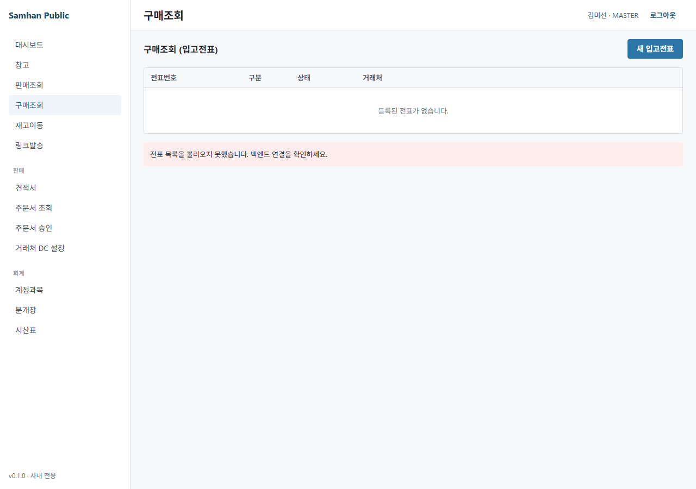

# 02-창고 / 01. 입고 처리 (Stage 2)

> ⚠️ **구현 상태** — ✅ Backend (inventory-service `/inventory/lots/inbound` + slip-service INBOUND 유형 + **PR-G1: 12 신규 컬럼 + 자체 발행 일원화**) / ⏳ Frontend (legacy v4 webview + 일부 desktop 라우트 — 정식 입고 dialog 는 P0-7 품목 등록과 함께 예정)
>
> 미구현 부분: P0-7 (품목 등록 7 탭 — 입고 시 신규 품목 등록 의존), P2-1 (창고원 모바일 앱 — 핸드폰 검수)
>
> **PR-G1 변경 (Phase 10 step-14)** — 이전에는 입고 시 모든 부가 정보 (거래처 전화/주소/대표자 등) 가 **메모 1000자** 안에 결합되어 검색·인쇄 활용이 어려웠습니다. PR-G1 머지 후 별도 12 컬럼으로 분리되어 슬립 발행 시점에 snapshot 보존 + 검색 / 인쇄 / 보고서 활용 가능. **이카운트 외부 호출 폐기** — 이카운트 BulkDatas 양식 호환을 위한 외부 API 호출은 모두 제거되고 Samhan Public 자체 발행 (slip-service `POST /api/v1/slip-publish/from-{estimate,partner-order}`) 으로 일원화. 자세한 컬럼 안내는 §2-7 참조.

---

## 대상 독자

- 창고팀(WAREHOUSE / INVENTORY) — 입고 작업 수행
- 영업 관리자(MANAGER) / MASTER — 입고 모니터링
- 사전 준비: [01-영업/01. 거래처 등록](../01-영업/01-거래처-등록.md) (매입 거래처) + 품목 시드 100건 (`PRODUCT_SEED_TEST_DATA=true`)

---

## 이 매뉴얼에서 배울 내용

1. 입고 슬립 (INBOUND) 처리 단계
2. 직접 입고 (lot 등록 — 슬립 없이) 절차
3. 재고 자동 증가 (`Stock.add`) 동작
4. Lot 추적 (FIFO 우선) 개념
5. 입고 시 품목이 없을 때 임시 등록 절차

---

## 1. 화면 진입

### 1-1. 사이드바 → 창고 → 입고

좌측 사이드바 [창고] → [입고] 클릭.


> 이카운트 reference: `docs/migration/ecount-reference/20260509_091652.png` (구매입력 화면).

### 1-2. 입고 방식 2가지

| 방식 | 설명 | 사용 시점 |
| --- | --- | --- |
| **① 슬립 기반 입고** (권장) | 영업이 INBOUND 슬립 발행 → 창고 접수 → 처리 → 입고 완료 | 매입 발주 / 일반 입고 |
| **② 직접 lot 등록** | 슬립 없이 lot inbound endpoint 직접 호출 | 초기 재고 적재 / 조정 |

---

## 2. 슬립 기반 입고 처리

### 2-1. INBOUND 슬립 접수

영업팀이 발행한 INBOUND 슬립이 SENT 상태로 창고 목록에 표시됩니다.



| 컬럼 | 표시 |
| --- | --- |
| 슬립번호 | `S-2026-NNNNN` |
| 거래처 | (매입처) |
| 입고창고 | `HQ-001` / `VH-001` |
| 라인 수 | (예) `5건` |
| 발송일 | `2026-05-09` |
| status | `SENT` |

### 2-2. Step 1 — 접수 (SENT → ACCEPTED)

대상 슬립 클릭 → 상세 → **[접수]** 버튼 → `POST /slips/{id}/accept`.

> 권한: WAREHOUSE / INVENTORY / MANAGER / MASTER.

### 2-3. Step 2 — 처리 (ACCEPTED → PROCESSING)

물품이 도착하면 [처리] → `POST /slips/{id}/process`.

### 2-4. Step 3 — 검수 (PROCESSING → INSPECTING)

라인별 수량 / 품목 대조 후 [검수] → `POST /slips/{id}/inspect`.

> 검수 시 수량 불일치는 라인 적요에 메모 (예: `발주 100, 실수령 95 — 5개 불량 반품 처리`).

### 2-5. Step 4 — 완료 (INSPECTING → COMPLETED) + **재고 자동 증가**

[완료] → `POST /slips/{id}/complete`.

이 시점에 inventory-service 의 `Stock.add` 메서드가 자동 호출되어 **재고가 즉시 증가**합니다.

```
[변경 전]                [Stock.add 호출]              [변경 후]
HQ-001 + Samsung HVAC      slip line 100EA       HQ-001 + Samsung HVAC
balance: 50EA           ─────────────────────→   balance: 150EA
```

### 2-6. INBOUND 슬립의 SHIPPING / DELIVERED / CONFIRMED 단계는?

INBOUND (입고) 슬립은 일반적으로 COMPLETED 에서 멈춥니다 (출하/배송 단계 불필요). 회계 정산 (CONFIRMED) 은 회계 직원이 [03-회계/01. 분개 입력](../03-회계/01-분개-입력.md) 에서 매입 분개로 처리.

> ⚠️ **현재 INBOUND 의 자동 분개는 미구현** — slip-service §7.2 의 자동 분개는 OUTBOUND 의 SLIP_ISSUE 만 지원. 매입 분개는 회계 직원이 수동 입력. (Phase 11 후 정식 자동화 예정)

---

## 2-7. 신규 입력 항목 (Phase 10 step-14, PR-G1)

본 슬라이스에서 입고 슬립에도 출고와 동일한 12 신규 컬럼이 적용됩니다. 입고 시점 운영 활용은 다음과 같습니다.

### 2-7-1. IO_TYPE / TIME_DATE — 입출고 구분 + 정확한 입고 시각

| 컬럼 | 입고 시 값 | 운영 의미 |
| --- | --- | --- |
| `IO_TYPE` | `11` (입고) | 이카운트 BulkDatas 양식 호환 코드 — 자체 발행에서도 동일 코드 보존 (이전 ERP 양식 reference 호환) |
| `TIME_DATE` | `LocalDateTime` (분 단위) | `slip_date` (날짜) 외 별도 입고 처리 시각 — 동일 일자 다중 입고의 처리 순서 추적 / FIFO lot 차감 정확도 향상 |

> **이전 vs 변경** — 이전에는 입고 시각이 `slip_date` (날짜) + `accepted_at` / `completed_at` (라이프사이클 timestamp) 만으로 추정되었습니다. 변경 후 `TIME_DATE` 컬럼으로 분단위 정확도 보존 → lot 단가 정렬 / FIFO 재고 가치 평가 향상.

### 2-7-2. 거래처 snapshot 3 컬럼 (PR-G1 핵심)

| 컬럼 | 입력 시점 | 자동/수동 |
| --- | --- | --- |
| `customer_tel` | 슬립 발행 시점 거래처 전화 | 자동 snapshot (partner-service 거래처 전화 복사) |
| `customer_addr` | 슬립 발행 시점 거래처 주소 | 자동 snapshot (partner-service 거래처 주소 복사) |
| `customer_rep` | 슬립 발행 시점 거래처 대표자명 | 자동 snapshot |

> **snapshot 의미** — 거래처 마스터의 전화/주소/대표자가 **나중에 변경되어도** 본 슬립은 발행 시점 값을 그대로 보존합니다. 매입 발주 시 vendor 정보 변경에도 과거 입고 이력의 추적성 보장.

### 2-7-3. 배송지 / 검수지 / 수령자 (입고 시 활용)

| 컬럼 | 입고 시 운영 |
| --- | --- |
| `shipping_addr` | vendor 가 출하한 주소 (vendor 창고 주소가 거래처 주소와 다를 때 — 예: vendor 본사 주소 vs 출하 창고) |
| `inspection_addr` | 우리 측 검수 위치 (HQ-001 본사 검수 vs VH-001 가산 검수 분리 운영 시) |
| `receiver_phone` | 우리 측 검수자 전화 (vendor 출하 직원이 도착 안내 시 연락처) |

### 2-7-4. 결제 정보 4 컬럼

| 컬럼 | 입고 시 의미 |
| --- | --- |
| `payment_due` | 우리 측 매입 대금 지급 예정일 (`MM-DD` 형식, 예: `06-30`) |
| `discount_info` | vendor 가 제공한 DC (할인) 적용 내역 — 예: `홈쇼핑 5% DC 적용` |
| `collect_term` | 결제 조건 — 예: `30일 어음`, `현금 즉시`, `월말 마감 익월 30일` |
| `agree_term` | 약정 조건 — 예: `반품 30일 보장`, `불량 무상 교환` |

### 2-7-5. 입력 절차 (PR-G1 후)

1. **영업이 입고 슬립 발행 시** (`POST /api/v1/slip-publish/from-partner-order`) — 12 컬럼 자동 채움 (거래처 snapshot 3 + 결제 4 + 배송 3 + IO_TYPE/TIME_DATE 2)
2. **창고 접수 시** — 창고 화면에서 12 컬럼 read-only 표시 (입고 처리 절차에 영향 없음, 정보 활용만)
3. **검수 시** — `shipping_addr` (vendor 출하지) 와 실 도착지 대조 / `customer_rep` (vendor 대표자) 와 vendor 직원 신분 대조

> **이전 운영 방식과의 호환** — 기존 INBOUND 슬립 (V12 이전) 은 12 컬럼 모두 `NULL`. 정상 동작 (legacy 호환). 신규 슬립부터 자동 채움.

---

## 3. 직접 lot 등록 (슬립 없이)

초기 재고 적재 / 조정 / 재고 실사 후 추가 등의 경우 슬립 없이 lot 직접 등록 가능.

### 3-1. UI (예정 — P0-7 품목 등록과 함께)

⏳ desktop UI 미구현. 임시로 backend API 직접 호출.

### 3-2. Backend API

```http
POST /inventory/lots/inbound
Authorization: Bearer <MASTER/MANAGER/WAREHOUSE/INVENTORY JWT>
Content-Type: application/json

{
  "warehouseCode": "HQ-001",
  "productCode": "P-2026-0001",
  "quantity": 100,
  "unitCost": 95000,
  "lotNo": "LOT-2026-05-09-001",
  "memo": "초기 재고 적재"
}
```

응답: `Stock.add` 결과 (`Lot` ID + 갱신 후 balance).

> Lot 추적 — FIFO 우선 (가장 오래된 lot 부터 차감). V5 migration 이후 lot 별 unitCost 기록 → 재고 가치 평가 (P0 미구현 — inventory-service §6.4).

---

## 4. 입고 시 품목이 없을 때

신규 매입 품목이 시스템에 없는 경우, 입고 전 품목 등록 필요.

### 4-1. 정식 절차 (P0-7 fix 후)

[01-영업/01. 거래처 등록](../01-영업/01-거래처-등록.md) 의 거래처 등록과 유사하게 [품목] → [+ 신규 등록] (7 탭) → 저장 → 입고 슬립 작성.

### 4-2. 현재 임시 우회 (P0-7 미구현)

1. IT 관리자에게 품목 정보 의뢰
   - 모델명 / 규격 / 단위 / 카테고리 / 표준 단가
2. IT 관리자가 backend API (`POST /api/v1/products/admin/sync`) 또는 Google Sheets sync 로 등록
3. 등록 후 `productCode` (5자리, 예: `P-2026-0001`) 회신
4. 입고 슬립에 해당 productCode 입력

---

## 5. 입고 후 확인

### 5-1. 재고 즉시 반영

[03. 재고 조회](03-재고-조회.md) → 해당 창고 + 품목 검색 → 증가된 balance 확인.

### 5-2. 이동 history

`GET /inventory/movements?productCode=P-2026-0001&warehouseCode=HQ-001` 또는 [03. 재고 조회](03-재고-조회.md) 의 history 탭에서 INBOUND 이동 기록 확인.

---

## 6. FAQ + 트러블슈팅

| 증상 | 원인 | 해결 |
| --- | --- | --- |
| 입고 슬립이 목록에 없음 | 영업이 SENT 까지 안 함 (DRAFT/SAVED) | 영업에 발송 요청 |
| [접수] 버튼이 안 보임 | WAREHOUSE/INVENTORY ROLE 미보유 | MANAGER 에게 ROLE 추가 요청 |
| [완료] 후에도 재고가 안 늘어남 | inventory-service 비활성 / Eureka 미등록 | IT 관리자 문의 |
| `lot 중복` 에러 | 동일 lotNo 두 번 등록 | lotNo 변경 (`LOT-2026-05-09-002`) |
| 검수 시 수량 불일치 | 발주 100, 수령 95 등 | 라인 적요에 기록 + 차이는 매입 거절(REJECTED) 또는 추가 입고 슬립 |
| 신규 품목인데 등록할 곳이 없음 | P0-7 미구현 | 본 매뉴얼 §4-2 임시 우회 (IT 관리자 의뢰) |
| 입고 단가 변동 | lot 별 unitCost 기록 안됨 (legacy lot) | 신규 입고는 자동 기록 (V5 migration 후) |
| 핸드폰으로 입고 검수 가능? | 창고원 모바일 앱 미구현 (P2-1) | 데스크탑 사용. Phase 11 후 검토 |
| 거래처 전화/주소가 바뀌었는데 과거 입고가 변경됨? | snapshot 미적용 (V12 이전 슬립) | PR-G1 후 신규 슬립은 발행 시점 보존. 과거 슬립은 NULL 표시 |
| 이카운트 양식 export 가능? | 외부 API 호출 폐기 | Samhan Public 자체 발행으로 일원화. `IO_TYPE=11` / `TIME_DATE` 컬럼은 자체 보고서에서 활용 |

---

## 7. 관련 매뉴얼

- 다음 단계: [02. 출고 처리](02-출고-처리.md)
- 재고 확인: [03. 재고 조회](03-재고-조회.md)
- 슬립 발행 (영업 시점): [01-영업/03. 슬립 발행](../01-영업/03-슬립-발행.md)
- 슬립 결재 라인: [01-영업/04. 슬립 결재 라인](../01-영업/04-슬립-결재-라인.md)
- 권한 정보: [03. 역할별 권한](../00-시작하기/03-역할별-권한.md)
- 누락 catalog: `docs/manual/inventory/missing-features-catalog.md` §1 P0-7
- 이카운트 reference (Phase 10 step-14 PR-G1 폐기 전 호환 양식): `docs/migration/ecount-reference/20260509_091652.png` (구매입력)
- PR-G1 dev-report: `docs/dev-reports/integration-phase-10-step-14-slip-ecount-schema.md`
