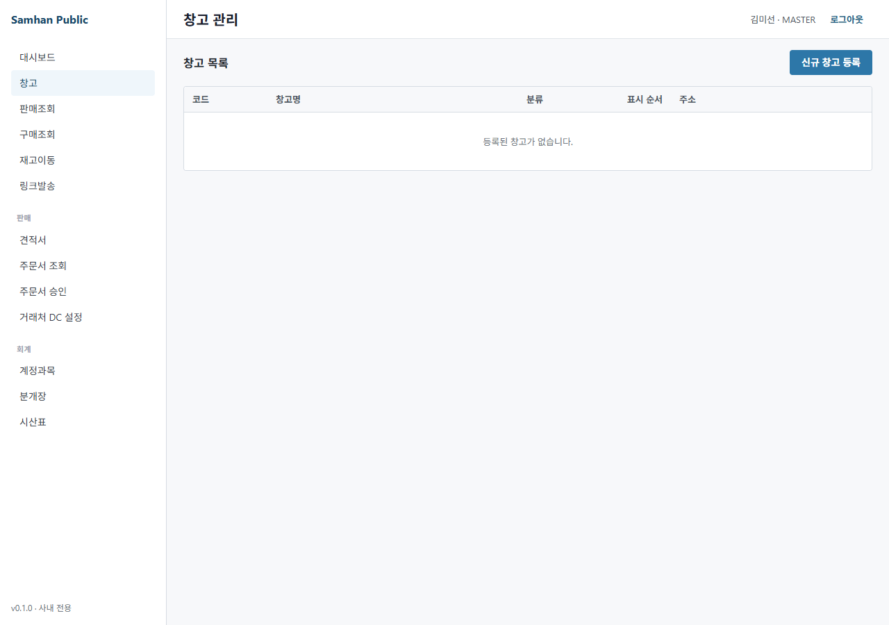

# 02-창고 / 03. 재고 조회 (Stage 2)

> ⚠️ **구현 상태** — ✅ Backend (inventory-service `/inventory/balances` + `/inventory/lots` + `/inventory/movements` + `/inventory/transfers` / 시드 200 row + 창고 2개) / ⏳ Frontend (목록 화면 위주, 차트 / 안전재고 알림 미구현 — P1-3)
>
> 미구현 부분: P1-3 (안전재고 알림), 재고 가치 평가 (FIFO/이동평균), 유통기한 (FEFO), Bin/Location (inventory-service §6.4)

---

## 대상 독자

- 창고팀(WAREHOUSE / INVENTORY) — 재고 일상 조회
- 영업팀(SALES) — 출고 가능 수량 확인 (단, `SALES` ROLE 은 `/inventory/balances` 권한 제외 — MANAGER 경유)
- 회계팀(ACCOUNTANT) — 월말 재고 평가 (P0 — 미구현)
- 사전 준비: 시드 데이터 적재 (`INVENTORY_SEED_TEST_DATA=true` → 100 product × 2 warehouse = 200 row)

---

## 이 매뉴얼에서 배울 내용

1. 창고 별 재고 조회 (HQ-001 / VH-001)
2. 제품별 재고 조회 (Samsung HVAC 100 모델)
3. 재고 차감 / 증가 history (`/inventory/movements`)
4. Lot 단위 조회 (`/inventory/lots`)
5. 창고 이동 (transfer) 8 status workflow
6. 재고 조정 (실사 결과 반영)

---

## 1. 화면 진입

### 1-1. 사이드바 → 창고 → 재고

좌측 사이드바 [창고] → [재고] 클릭. 재고 balance 목록 표시 (200 row 시드).



> 이카운트 reference: `docs/migration/ecount-reference/20260509_091707.png` (창고이동 화면).

---

## 2. 재고 list 화면

### 2-1. 표시 컬럼

| 컬럼 | 설명 | 비고 |
| --- | --- | --- |
| 창고 | `HQ-001 본사 창고` / `VH-001 지사 창고` | 시드: 2개 |
| 품목코드 | `P-2026-0001` (5자리) | |
| 품목명 | (예) `Samsung HVAC AVNS-070EHA` | |
| 규격 | (예) `070, 7kW, 단상 220V` | |
| 단위 | `EA` | |
| balance (보유) | `150` | 실제 보유 수량 |
| reserved (예약) | `100` | 슬립 SENT/ACCEPTED 단계 예약량 |
| **available (가용)** | `50` | 출고 가능량 (= balance − reserved) |
| safetyStock (안전재고) | `30` | 미달 시 알림 (P1-3 — 미구현) |
| 마지막 이동일 | `2026-05-09` | |

### 2-2. 검색 / 필터

| 검색 | 입력 예 | 매칭 |
| --- | --- | --- |
| 창고 | `HQ-001` | 정확 (드롭다운) |
| 품목코드 | `P-2026-0001` | 정확 |
| 품목명 (부분) | `AVNS` | LIKE |
| 부족 재고만 (available < safetyStock) | (체크박스) | (P1-3 — 미구현, 임시 정렬로 우회) |

---

## 3. 창고 별 조회

### 3-1. 창고 list

`GET /inventory/warehouses` — 시드 2개:

| 창고코드 | 창고명 | 위치 |
| --- | --- | --- |
| `HQ-001` | 본사 창고 | 서울 본사 |
| `VH-001` | 지사 창고 | 부산 지사 |

### 3-2. 특정 창고만 조회

UI 검색에 창고 선택 → 해당 창고 row 만 표시. 또는:
```http
GET /inventory/balances?warehouseCode=HQ-001
```

---

## 4. 제품별 조회 (전 창고)

특정 productCode 의 모든 창고 balance 조회.

```http
GET /inventory/balances?productCode=P-2026-0001
```

응답:
```json
[
  { "warehouseCode": "HQ-001", "balance": 150, "reserved": 100, "available": 50 },
  { "warehouseCode": "VH-001", "balance": 80, "reserved": 0, "available": 80 }
]
```

> 같은 제품을 두 창고 모두에서 보유 시 — 출고 시 우선순위는 영업 시점에 명시 (출하창고 필드).

---

## 5. Lot 조회 (FIFO 단위)

`GET /inventory/lots?warehouseCode=HQ-001&productCode=P-2026-0001`.

응답: lot 단위 list (입고 일자 / 수량 / 단가 / lotNo).

| lotNo | 입고일 | 수량 | unitCost | 잔량 |
| --- | --- | --- | --- | --- |
| `LOT-2026-04-01-001` | 2026-04-01 | 100 | 95,000 | 0 (소진) |
| `LOT-2026-04-15-002` | 2026-04-15 | 100 | 96,000 | 50 |
| `LOT-2026-05-09-001` | 2026-05-09 | 100 | 97,000 | 100 |

> FIFO — 출고 시 가장 오래된 lot 부터 차감. 위 표에서 100EA 차감 시 `LOT-04-15` 의 50EA + `LOT-05-09` 의 50EA 가 차감됩니다.

---

## 6. 이동 history (movements)

`GET /inventory/movements?productCode=P-2026-0001&warehouseCode=HQ-001&from=2026-05-01&to=2026-05-09`.

| 시간 | 종류 | 슬립번호 / 사유 | 변동량 | 변경 후 balance |
| --- | --- | --- | --- | --- |
| 2026-05-09 14:30 | INBOUND | `S-2026-00050` (입고 슬립) | +100 | 150 |
| 2026-05-09 16:00 | RESERVE | `S-2026-00051` (출고 예약) | (예약 +100) | 150 (예약 100) |
| 2026-05-09 18:00 | DEDUCT | `S-2026-00051` (출고 완료) | -100 | 50 |

종류 enum:
- **INBOUND** — 입고 (Stock.add)
- **RESERVE** — 예약 (slip ACCEPTED)
- **RELEASE** — 예약 해제 (slip CANCELLED)
- **DEDUCT** — 출고 차감 (slip COMPLETED)
- **TRANSFER_OUT / TRANSFER_IN** — 창고 이동
- **ADJUST** — 재고 조정 (실사)

---

## 7. 창고 이동 (Transfer) 8 status

서로 다른 창고 간 재고 이동. 8 status workflow.

### 7-1. 흐름

```
DRAFT ─── approve ───→ APPROVED ─── ship ───→ SHIPPED ─── receive ───→ RECEIVED ─── confirm ───→ CONFIRMED
                          │                                                                          ↑
                          └─ reject ──→ REJECTED                                                     │
                          └─ cancel ──→ CANCELLED                                                    │
                                                                                                     │
                                                                              (terminal — 양 창고 balance 확정)
```

### 7-2. UI 진입 (예정)

사이드바 [창고] → [창고이동] → list. (현재 일부 라우트 `/inventory/transfers` 만 활성)

### 7-3. Backend endpoint

| endpoint | 설명 | ROLE |
| --- | --- | --- |
| `POST /inventory/transfers` | DRAFT 신규 | MASTER/MANAGER/WAREHOUSE/INVENTORY |
| `POST /inventory/transfers/{id}/approve` | DRAFT → APPROVED | MASTER/MANAGER/INVENTORY |
| `POST /inventory/transfers/{id}/reject` | DRAFT → REJECTED | MASTER/MANAGER/INVENTORY |
| `POST /inventory/transfers/{id}/ship` | APPROVED → SHIPPED | MASTER/MANAGER/WAREHOUSE/INVENTORY |
| `POST /inventory/transfers/{id}/receive` | SHIPPED → RECEIVED | MASTER/MANAGER/WAREHOUSE/INVENTORY |
| `POST /inventory/transfers/{id}/confirm` | RECEIVED → CONFIRMED | MASTER/MANAGER/INVENTORY |
| `POST /inventory/transfers/{id}/cancel` | 임의 → CANCELLED | MASTER/MANAGER/INVENTORY |

---

## 8. 재고 조정 (Adjust)

실사 후 차이 반영. 일반적으로 실사 시트 작성 → MANAGER 승인 → adjust endpoint 호출.

### 8-1. UI 진입 (예정 — P0 미구현)

> ⚠️ **재고 실사 화면 미구현** (inventory-service §6.4). 현재는 backend API 만 호출 가능.

### 8-2. Backend endpoint

```http
POST /inventory/adjust
Authorization: Bearer <MASTER/MANAGER/INVENTORY JWT>
Content-Type: application/json

{
  "warehouseCode": "HQ-001",
  "productCode": "P-2026-0001",
  "deltaQuantity": -5,
  "reason": "2026-04 실사 차이 (전산 100, 실수 95)",
  "approverEmpCode": "EMP-2026-0001"
}
```

응답: 변경 후 balance + ADJUST movement 기록.

> ⚠️ **반드시 사유 + 승인자 기록** — 음수 조정 (감소) 은 횡령 위험이 있어 audit trail 필수. MASTER 만 사후 조회/취소 가능.

---

## 9. 차트 / 알림 (P1 — 미구현)

- 안전재고 미달 알림 (P1-3) — 현재 표시만, 알림 트리거 없음
- 주간 / 월간 입출고 추이 차트 (P1-3 — 미구현)
- 저재고 대시보드 카드 (placeholder — DashboardPage 의 "준비중" 카드)

---

## 10. FAQ + 트러블슈팅

| 증상 | 원인 | 해결 |
| --- | --- | --- |
| 재고 list 가 비어 있음 | 시드 미적재 | `INVENTORY_SEED_TEST_DATA=true` 후 재시작. IT 관리자 문의 |
| `available` 이 음수 | reserve > balance (drift) | 개발팀 문의 (race condition 의심) |
| 입고 했는데 balance 변동 없음 | INBOUND 슬립이 COMPLETED 까지 안 감 | 슬립 status 재확인 (INSPECTING/PROCESSING) |
| 출고 후에도 reserved 남아 있음 | DEDUCT 시 release 누락 (drift) | 개발팀 문의 |
| 안전재고 알림이 안 옴 | P1-3 미구현 | 임시: 정렬로 부족 재고 확인 |
| 다른 창고로 이동 후 balance drift | transfer CONFIRMED 까지 안 감 | transfer status 재확인 |
| Lot 별 단가가 0 | legacy lot (V5 migration 이전) | 신규 입고는 자동 기록 |
| 핸드폰으로 재고 검수 가능? | P2-1 창고원 모바일 미구현 | 데스크탑만 |
| 부산 지사 (VH-001) balance 가 0 만 표시 | 지사에 입고 적재 안됨 | 지사 입고 또는 본사→지사 transfer |
| Excel export 가 필요함 | P1-6 미구현 | 개발팀에 SQL 의뢰 |

---

## 11. 관련 매뉴얼

- 이전 단계: [02. 출고 처리](02-출고-처리.md)
- 입고: [01. 입고 처리](01-입고-처리.md)
- 슬립 발행: [01-영업/03. 슬립 발행](../01-영업/03-슬립-발행.md)
- 권한 정보: [03. 역할별 권한](../00-시작하기/03-역할별-권한.md)
- 누락 catalog: `docs/manual/inventory/missing-features-catalog.md` §2 P1-3 (대시보드/알림), §3 P2-1 (창고원 모바일)
- 이카운트 reference: `docs/migration/ecount-reference/20260509_091707.png` (창고이동)
