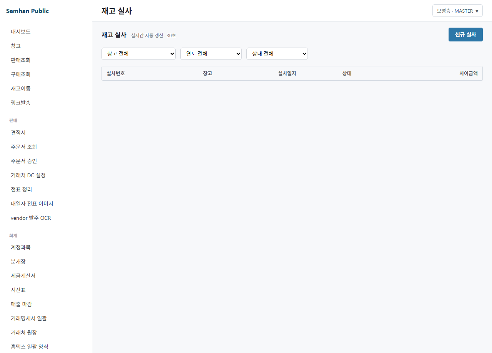
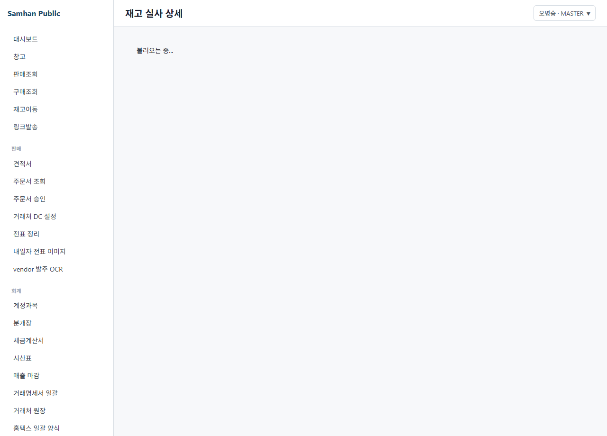

# 05. 재고 실사 (Stage 3 placeholder)

> **Stage 안내**: Stage 3 placeholder ⚠️ — Phase 12 step-6 본 PR 에서 7-section 패턴으로 재작성. P2-6 미구현. Phase 11+3개월 후 정식 본문 교체 예정.

---

## 1. 구현 상태

| 항목 | 상태 | 비고 |
| --- | --- | --- |
| Frontend / Backend | ⛔ 미구현 (P2-6) | 한국 회계 표준 의무 |
| 한국 일반기업회계기준 의무 | ⚠️ 의무 | 연 1회 이상 |
| IT 관리자 수기 보정 | ✅ 권장 | backend API 직접 호출 |
| 종이 양식 우회 | ✅ 운영 | 사내 양식 |

재고 실사는 한국 일반기업회계기준 상 연 1회 이상 의무이며, 시스템 재고와 실제 재고를 비교 보정하는 절차입니다. 정식 화면이 미구현 상태입니다.

---

## 2. 대상 독자

- 연말 / 분기 실사를 진행하는 재고 관리자 (INVENTORY)
- 실사 결과를 회계에 반영하는 회계 직원 (ACCOUNTANT)
- 외부 감사 (VIEWER)

---

## 3. 학습 내용

- 한국 일반기업회계기준 재고 실사 의무 인지
- 종이 양식 + IT 관리자 우회 절차
- 실사 차이 발생 시 회계 처리 (재고자산평가손)
- Phase 11+3개월 후 정식 화면 출시 일정

---

## 4. 본문

### 4-1. 한국 일반기업회계기준 의무

(주)삼한공조시스템과 같은 일반 법인은 한국 일반기업회계기준에 따라 연 1회 이상 재고 실사를 의무 시행해야 합니다.

- 실사 시점: 결산일 (12/31) 또는 분기말
- 실사 방법: 전수 조사 또는 표본 조사
- 차이 회계 처리: 재고자산평가손익 분개

### 4-2. 우회 — 종이 양식 + IT 관리자

#### 단계 1 — 실사 list 출력

1. IT 관리자에게 실사 list 양식 요청 (Excel 또는 PDF)
2. 창고별 / 품목별 / lot 별 시스템 재고 출력

#### 단계 2 — 실 재고 카운트

1. 창고 직원이 종이 양식 들고 직접 카운트
2. 차이 발생 항목 표시

#### 단계 3 — 차이 입력

1. 차이 양식을 IT 관리자에게 전달
2. backend API 로 재고 보정 (movement type: 실사조정)
3. inventory-service 자동 분개 발행

### 4-3. 차이 회계 처리

| 차이 유형 | 분개 |
| --- | --- |
| 시스템 > 실 재고 | (차) 재고자산평가손 / (대) 재고자산 |
| 시스템 < 실 재고 | (차) 재고자산 / (대) 재고자산평가이익 |

자세한 분개 절차는 [03-회계 / 01. 분개 입력](../03-회계/01-분개-입력.md) 참조.

### 4-4. Phase 11+3개월 후 정식 본문 교체

P2-6 PR 머지 시 본 placeholder 는 정식 본문으로 교체됩니다. 정식 화면 제공 예정 기능.

- 모바일 바코드 스캔
- 차이 자동 보정 + 분개 자동 발행
- 외부 감사용 PDF 보고서

---

## 5. 화면 미리보기

> 정식 실사 UI 미구현. 우회 종이 양식 사용. 본 항목 캡처는 mock 화면 참고.

### 5-1. 재고 실사 list (mock)

### 5-2. 재고 실사 폼 (mock)

### 5-3. 재고 실사 상세 (mock)

---

## 6. FAQ

**Q1. 실사를 안 하면 어떻게 되나요?**
A. 외부 감사 시 한국 일반기업회계기준 위반으로 지적될 수 있습니다. 연 1회 이상 의무.

**Q2. 표본 조사로 충분한가요?**
A. 회사 규모에 따라 다릅니다. 외주 회계 / 외부 감사와 협의 권장.

**Q3. 차이 발생 시 책임은?**
A. 단순 카운트 오류는 보정 처리. 도난 / 손망실 등 의심 시 영업 부장 / 대표 보고 후 별도 분개.

**Q4. 정식 화면은 언제?**
A. P2-6 슬라이스로 Phase 11+3개월 후 출시 예정.

**Q5. 모바일 바코드 스캔 가능한가요?**
A. 정식 화면 출시 시 제공 예정. 현재는 종이 양식.

---

## 7. 관련 매뉴얼

- [03. 재고 조회](03-재고-조회.md)
- [04. 매출 마감](04-매출-마감.md)
- [03-회계 / 01. 분개 입력](../03-회계/01-분개-입력.md)
- [03-회계 / 04. 월말 마감](../03-회계/04-월말-마감.md)
- [07-부록 / 02. 용어집](../07-부록/02-용어집.md)
