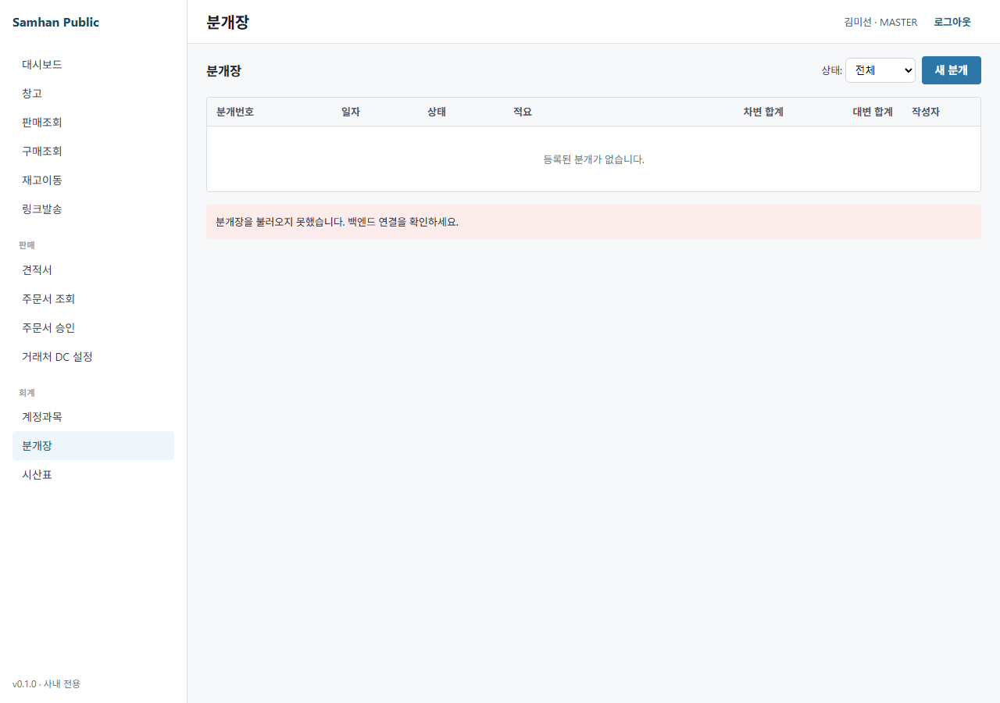

# 03-회계 / 01. 분개(전표) 입력 (Stage 3)

> ⚠️ **구현 상태** — ✅ Backend (`accounting-service` `JournalController` 5 endpoint + `JournalSeeder` 50건 + 3 status 라이프사이클 + 한국 일반기업회계기준 표준 계정과목 코드) / ⏳ Frontend (분개장 desktop UI 부재 — `clients/desktop` `routes/index.tsx` 27 라우트 중 `/accounting/journals` **❌**)
>
> 미구현 부분: 분개장 desktop UI 자체 (catalog `missing-features-catalog.md` §1 P0-1 #14 — `/accounting/journals` 목록만 ⏳, 입력 화면 ❌). 자동 분개는 슬립 CONFIRMED 시 SLIP_ISSUE 패턴으로 backend 자동 생성됩니다 (UI 없이도 정상 동작).
>
> **현 시점 대처** — UI 부재 시 (1) backend API `POST /accounting/journals` 직접 호출 (ACCOUNTANT/MASTER JWT) 또는 (2) 슬립 CONFIRMED 시 자동 분개로 우회. 정식 desktop 입력 화면은 P0-1 fix PR (분개장 + 17 보고서) 머지 후 본 매뉴얼 §1~§5 절차대로 사용 가능.

---

## 대상 독자

- 회계팀(ACCOUNTANT) — 일상 분개 입력 / 게시 / 역분개
- MASTER — 전 권한
- MANAGER 는 본 화면 권한 **없음** (Q9 결정 — `JournalController` `@PreAuthorize("hasAnyRole('ACCOUNTANT','MASTER')")`)
- 사전 준비: [00-시작하기/01. 로그인](../00-시작하기/01-로그인.md) 후 ACCOUNTANT ROLE 보유 확인

---

## 이 매뉴얼에서 배울 내용

1. 분개장 화면 진입 (사이드바 → 회계 → 분개장)
2. 신규 분개 입력 (헤더 + 차변·대변 line)
3. 한국 일반기업회계기준 표준 계정과목 코드 활용
4. 복식부기 invariant (sum debit == sum credit) 검증
5. 3 status 라이프사이클 (DRAFT → POSTED → REVERSED)
6. 슬립 CONFIRMED 시 자동 분개 (110/401/220 자동 생성) 확인
7. 역분개 (REVERSED) 처리

---

## 1. 화면 진입

### 1-1. 사이드바 → 회계 → 분개장

좌측 사이드바 [회계] → [분개장] 클릭 → 분개 목록 화면.


> ⚠️ **현재 placeholder** — desktop 라우트 `/accounting/journals` 자체가 미구현 (P0-1 #14). UI fix 시점에 위 캡처가 생성됩니다. 이카운트 reference: `docs/migration/ecount-reference/20260509_091847.png` (회계 17 보고서 카테고리 — 장부 §분개장).

### 1-2. 신규 분개 입력

목록 화면 우상단 **[+ 신규 분개]** 버튼 클릭 → 신규 분개 입력 화면.


---

## 2. 단계별 사용법

### Step 1 — 헤더 입력


| 필드 | 입력 예 | 필수 | 비고 |
| --- | --- | :---: | --- |
| 분개번호 | (자동 — 저장 시 생성) | — | `J-2026-NNNNN` 형식 (`JournalNumberSequence`) |
| 분개일자 | `2026-05-09` | ✅ | 기본값 = 오늘 |
| 적요 | `5월 사무실 통신비` | ✅ | 분개 헤더 설명 (한글 자유 입력) |
| 출처 유형 | `MANUAL` (기본) | — | MANUAL / SLIP / CLOSING (자동) — 수동 입력 시 MANUAL 고정 |
| 출처 참조 | (없음) | — | SLIP 자동 분개일 때만 슬립 ID 자동 채움 |

> ⚠️ **UUID 노출 금지** — 사용자 화면에는 `분개번호` (`J-2026-NNNNN`) 만 표시. 내부 `journalId` (UUID) 는 절대 노출 금지 (메모리 가드 `feedback_uuid_no_user_visibility.md`).

### Step 2 — 차변·대변 line 입력



라인 추가 버튼 [+ 라인 추가] 클릭 → 라인 row 가 추가됩니다. **최소 1개 차변 + 1개 대변** 필수.

| 컬럼 | 입력 예 | 비고 |
| --- | --- | --- |
| 순번 | `1` | 자동 부여 (1부터) |
| 계정과목코드 | `814` | 자동완성 (코드 또는 한글명) |
| 계정과목명 | `통신비` (자동) | 읽기 전용 |
| 차변 (debit) | `300,000` | 통화 자동 포맷 |
| 대변 (credit) | `0` | 차변/대변은 **XOR** (둘 중 하나만 양수) |
| 거래처 | `P-2026-0001 (주)데모상사` | 선택 (외상매출금/매입금 라인은 권장) |
| 적요 | `5월 사무실 KT 인터넷` | 라인별 메모 (자유) |

> ⚠️ **차변/대변 XOR 강제** — DB CHECK 제약 `ck_journal_lines_amount_xor` 가 차변>0 AND 대변=0 또는 차변=0 AND 대변>0 만 허용. 둘 다 양수이거나 둘 다 0 인 라인은 저장 거부.

라인은 [+ 라인 추가] 로 무제한 추가 가능. 삭제는 row 우측 [🗑] 버튼 (DRAFT 단계에서만).

### Step 3 — 한국 표준 계정과목 (자주 사용)

분개 입력 시 자동완성으로 호출되는 주요 계정과목 (한국 일반기업회계기준 V1 시드, `project_korean_accounting.md` 메모리 가드):

| 코드 | 계정과목 | 분류 | 용도 예 |
| :-: | --- | --- | --- |
| **102** | 보통예금 | 자산 | 입출금 (회수 / SGA 지급) |
| **110** | 외상매출금 | 자산 | 슬립 CONFIRMED 시 자동 차변 |
| **142** | 건물 | 자산 | 감가상각 대상 자산 |
| **220** | 부가세예수금 | 부채 | 매출 부가세 10% 자동 대변 |
| **401** | 상품매출 | 매출 | 슬립 공급가액 자동 대변 |
| **801** | 급여 | 판관비 | SGA 급여 지급 |
| **814** | 통신비 | 판관비 | SGA 통신비 |
| **818** | 감가상각비 | 판관비 | 월말 감가상각 조정 |

> 전체 계정과목은 `GET /accounting/accounts` (계정과목 트리) 또는 자동완성 조회. 상위 카테고리 (100/200/300/400/500/800/900) 는 **통제 계정** 으로 직접 분개 입력 불가 — leaf 계정만 허용.

### Step 4 — 복식부기 invariant 검증


화면 하단에 차변 합계 / 대변 합계 / 차이가 실시간 표시됩니다.

| 항목 | 표시 |
| --- | --- |
| 차변 합계 | `300,000` |
| 대변 합계 | `300,000` |
| 차이 | `0` ✅ |

**저장 / 게시 가능 조건** — 차변 합계 == 대변 합계 (0 차이). 불일치 시 [게시] 버튼이 비활성화되며 한국어 에러 메시지가 표시됩니다.

### Step 5 — 저장 (DRAFT)

화면 우하단 **[저장]** 버튼 클릭. 분개가 DRAFT 상태로 저장되며 분개번호 (`J-2026-NNNNN`) 가 부여됩니다.


DRAFT 상태에서는 라인 추가/제거/수정이 자유롭게 가능하며, **시산표 집계에서는 제외** 됩니다.

### Step 6 — 게시 (POSTED)

검토 완료 후 우상단 **[게시]** 버튼 클릭 → `POST /accounting/journals/{id}/post` 호출.

| 버튼 | 호출 endpoint | 결과 |
| --- | --- | --- |
| [게시] | `POST /accounting/journals/{id}/post` | DRAFT → POSTED (시산표 집계 포함) |

게시 후에는 라인 직접 수정 불가. 정정이 필요하면 §3-3 역분개 절차 사용.

---

## 3. 3 status 라이프사이클

분개는 **3 단계 status** 를 거칩니다 (`JournalStatus` 도메인).

### 3-1. 흐름 도표

```
   [회계 입력]              [회계 게시]              [회계 정정]
DRAFT ─save→ DRAFT ─post→ POSTED ─reverse→ REVERSED (+ 신규 역분개 자동 POSTED)
```

### 3-2. 단계별 endpoint + 책임

| # | 단계 | endpoint | 책임 ROLE | 의미 |
| :-: | --- | --- | --- | --- |
| 0 | DRAFT | `POST /accounting/journals` | ACCOUNTANT/MASTER | 작성 중 (라인 수정 가능, 시산표 미포함) |
| 1 | POSTED | `POST /accounting/journals/{id}/post` | ACCOUNTANT/MASTER | 게시 완료 (시산표 포함, 직접 수정 불가) |
| 2 | REVERSED | `POST /accounting/journals/{id}/reverse` | ACCOUNTANT/MASTER | 역분개 처리 (차/대 swap 신규 분개 자동 POSTED) |

> ⚠️ **MANAGER 는 권한 없음** — 슬립 결재와 달리 분개는 회계 전문 영역으로, MANAGER 는 분개 입력/게시/역분개 모두 권한 없음 (`@PreAuthorize` 매트릭스).

### 3-3. 역분개 (REVERSED) — 정정 절차

게시(POSTED) 후 잘못 입력한 분개를 정정하려면:

1. 분개 목록에서 정정 대상 분개 클릭 → 상세 화면
2. 우상단 **[역분개]** 버튼 클릭 → `POST /accounting/journals/{id}/reverse` 호출
3. 시스템이 차변/대변을 swap 한 **신규 분개** 를 자동 생성 + POSTED 처리
4. 원본 분개 status → REVERSED
5. 시산표상 두 분개의 효과는 상쇄 (net = 0)
6. 정상 분개를 신규로 다시 입력

> 역분개는 **회계 audit 표준** — 원본 데이터 삭제 금지, 보정 entry 만 추가 (메모리 가드 `project_build_conventions.md` Soft Delete).

---

## 4. 슬립 CONFIRMED 시 자동 분개

영업이 슬립을 CONFIRMED 단계로 전이하면 (`POST /slips/{id}/confirm`), `accounting-service` 가 자동으로 SLIP_ISSUE 패턴 분개를 생성합니다.

### 4-1. 자동 분개 패턴 (SLIP_ISSUE)

슬립 1건 (공급가액 1,000,000원, 부가세 100,000원, 합계 1,100,000원) 정산 시:

| # | 계정과목 | 차변 | 대변 | 거래처 | 적요 |
| :-: | --- | ---: | ---: | --- | --- |
| 1 | 110 외상매출금 | 1,100,000 | 0 | P-2026-0001 | 외상매출금 (부가세포함) |
| 2 | 401 상품매출 | 0 | 1,000,000 | P-2026-0001 | 상품매출 (공급가액) |
| 3 | 220 부가세예수금 | 0 | 100,000 | P-2026-0001 | 부가세예수금 (10%) |

| 합계 | **1,100,000** | **1,100,000** | | ✅ 일치 |

### 4-2. 자동 분개 확인

분개 목록 → 출처 유형 필터 = `SLIP` 선택 → 슬립 자동 생성 분개 조회.

각 분개의 **출처 참조 (sourceRefId)** 가 슬립 UUID 와 일치하므로, 분개 → 슬립 역추적 가능 (단, UUID 는 사용자 화면 표시 X — `슬립번호` 로 표시).

> ✅ **자동 분개는 UI 부재와 무관하게 동작** — 영업 슬립 CONFIRMED → accounting-service 자동 호출 → DB 에 분개 row 생성. UI 부재 시에도 시산표 / 회계 보고서 에는 자동 반영됩니다.

### 4-3. 자동 분개가 안 생성되는 경우

| 증상 | 원인 | 해결 |
| --- | --- | --- |
| 슬립 CONFIRMED 후 분개 목록에 없음 | accounting-service 가 다운 / Eureka 미등록 | 개발팀에 service health 확인 의뢰 |
| 분개는 있으나 합계 mismatch | 슬립 라인 수정 후 재정산 (이중 호출) | 역분개 후 신규 분개 |
| `통제 계정 분개 거부` 에러 | 시드 미적재로 leaf 계정 부재 | `ChartOfAccountSeeder` 재실행 |

---

## 5. 분개 조회 / 검색

### 5-1. 페이지 조회

화면 상단 검색 영역에서 `from` / `to` 일자 + status 필터로 조회.

| 필터 | 입력 | 비고 |
| --- | --- | --- |
| 시작일자 | `2026-01-01` | ✅ 필수 |
| 종료일자 | `2026-05-09` | ✅ 필수 (inclusive) |
| 상태 | `DRAFT` / `POSTED` / `REVERSED` / 전체 | 선택 |

`GET /accounting/journals?from=2026-01-01&to=2026-05-09&status=POSTED&page=0&size=20` 호출.

### 5-2. 단건 조회

목록의 row 클릭 → 분개 상세 (라인 포함) 화면. `GET /accounting/journals/{id}`.

---

## 6. FAQ + 트러블슈팅

| 증상 | 원인 | 해결 |
| --- | --- | --- |
| 사이드바에 [회계] → [분개장] 메뉴가 없음 | desktop UI 미구현 (P0-1 #14) | UI fix PR 후 재시도. 임시 — backend API 직접 호출 |
| `복식부기 invariant 위반` 에러 | 차변 합계 ≠ 대변 합계 | 라인별 금액 재확인 후 일치시킴 |
| `차변/대변 XOR 위반` 에러 | 한 라인에 차변/대변 둘 다 양수 또는 둘 다 0 | 라인을 두 개로 분리하거나 0 입력 |
| `통제 계정 분개 거부` 에러 | 상위 카테고리 (100/200 등) 직접 입력 | leaf 계정 (110/220 등) 으로 변경 |
| `accountCode 미존재` (404) | 시드 미적재 | `app.accounting.seed-test-data=true` + 재기동 |
| 게시 버튼 비활성화 | 차변/대변 합계 mismatch | 차이 = 0 만족 후 [게시] 클릭 |
| `DRAFT 가 아닙니다` (409) | 이미 POSTED 분개를 다시 게시 시도 | 역분개 후 신규 분개 작성 |
| 자동 분개가 만들어지지 않음 | accounting-service 비활성 / Eureka 미등록 | 개발팀 문의 |
| 시산표에 분개가 안 보임 | DRAFT 상태이거나 출처가 다른 회계 기간 | POSTED 로 게시 + 기간 확인 |
| MANAGER 가 분개 화면 접근 불가 | 권한 정책 (Q9) — ACCOUNTANT/MASTER 만 | 본인 ROLE 확인. 필요 시 MASTER 에게 ROLE 변경 요청 |

---

## 7. 관련 매뉴얼

- 다음 단계: [02. 재무 보고서](02-보고서.md)
- 자동 분개 출처: [01-영업/03. 슬립 발행](../01-영업/03-슬립-발행.md) §5 (CONFIRMED 단계)
- 권한 정보: [00-시작하기/03. 역할별 권한](../00-시작하기/03-역할별-권한.md)
- 누락 catalog: `docs/manual/inventory/missing-features-catalog.md` §1 P0-1 #14 (분개장 UI)
- 한국 회계 표준: 메모리 가드 `project_korean_accounting.md` (계정과목 코드 100/200/300/400/500/800/900)
- 이카운트 reference: `docs/migration/ecount-reference/20260509_091847.png` (장부 §분개장)
