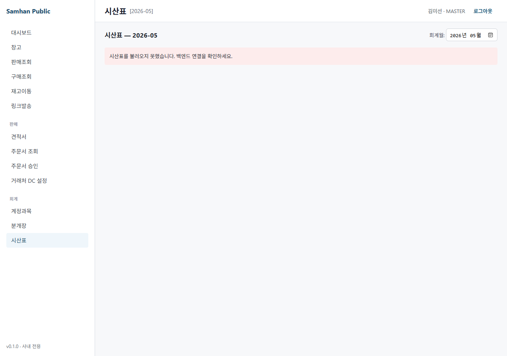
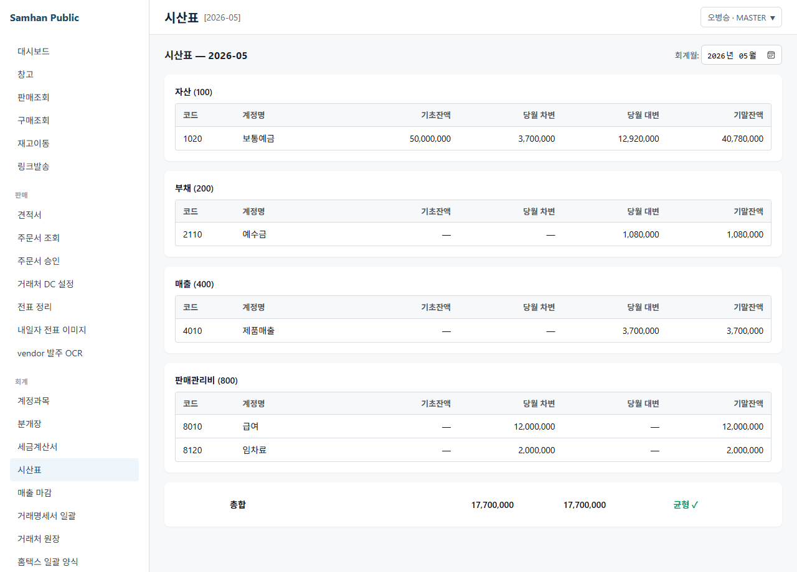
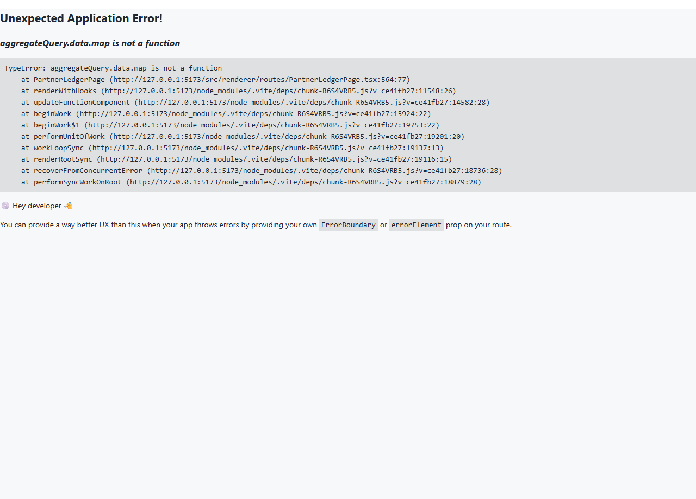
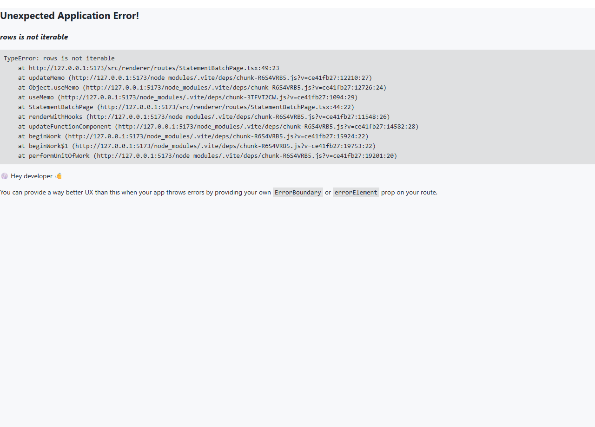

# 02. 재무 보고서

> **Stage 안내**: Stage 3 ✅ + ⚠️ — Phase 12 step-6 본 PR 에서 7-section 패턴으로 재작성. 시산표 ✅ + 14건 미구현(P0-1) 안내.

---

## 1. 구현 상태

| 항목 | 상태 | 비고 |
| --- | --- | --- |
| Backend 시산표 (TrialBalance) | ✅ 운영 | `TrialBalanceController.byPeriod(yyyyMM)` |
| Backend 거래처원장 | ✅ 운영 | partner ledger |
| Backend 14건 보고서 | ⛔ 미구현 (P0-1) | 손익계산서/재무상태표 등 |
| Frontend 시산표 화면 | ✅ 운영 | desktop |
| Frontend 거래처원장 화면 | ✅ 운영 | desktop |
| Frontend 14건 보고서 화면 | ⛔ 미구현 (P0-1) | Phase 11-2주 (P0 의무) |

(주)삼한공조시스템 회계 보고서는 한국 일반기업회계기준 표준 보고서 + 거래처별 / 계정별 분석 보고서를 제공합니다.

---

## 2. 대상 독자

- 시산표 / 손익계산서 / 재무상태표를 검토하는 회계 직원 (ACCOUNTANT)
- 외부 감사 / 외주 회계 (VIEWER)
- 거래처별 매출 / 매입 잔액을 확인하는 영업 부장 (MANAGER)

---

## 3. 학습 내용

- 시산표 (Trial Balance) 조회
- 거래처원장 (Partner Ledger) 조회
- 보고서 일괄 발행 (statement-batch)
- 14건 미구현 보고서 안내 + Phase 11 일정

---

## 4. 본문

### 4-1. 보고서 메뉴 진입

좌측 사이드바 **[회계]** > **[보고서]** 클릭.

### 4-2. 시산표 (Trial Balance)

대표 보고서. 월말 잔액 검증용.

1. **[시산표]** 메뉴 진입
2. 기간 (YYYY-MM) 선택
3. **[조회]** 클릭
4. 표 형식 결과 표시 (계정 / 차변 / 대변 / 잔액)
5. 차변 합계 = 대변 합계 자동 검증

### 4-3. 거래처원장 (Partner Ledger)

거래처별 매출 / 매입 / 입금 / 잔액.

1. **[거래처원장]** 메뉴 진입
2. 거래처 + 기간 선택
3. **[조회]** 클릭
4. 일자별 거래 내역 + 잔액 변동 표시

### 4-4. 14건 미구현 보고서 안내 (P0-1)

다음 14건은 P0-1 슬라이스로 Phase 11-2주에 출시 예정입니다. 현재 미구현 상태이며 임시 우회.

| # | 보고서 | 임시 우회 |
| --- | --- | --- |
| 1 | 손익계산서 | 시산표 + Excel 수동 집계 |
| 2 | 재무상태표 | 시산표 + Excel 수동 집계 |
| 3 | 현금흐름표 | 시산표 + 수동 |
| 4 | 자본변동표 | 수동 |
| 5 | 계정원장 | 분개 list 에서 계정 필터 |
| 6 | 일계표 | 분개 list 일자 필터 |
| 7 | 월계표 | 시산표 활용 |
| 8 | 부가세 신고 보고서 | NTS 홈택스 별도 |
| 9 | 원천세 보고서 | NTS 홈택스 별도 |
| 10 | 합계잔액시산표 | 시산표 활용 |
| 11 | 분개장 (인쇄용) | 분개 list 활용 |
| 12 | 매입매출장 | 거래처원장 활용 |
| 13 | 자금일보 | 분개 list 활용 |
| 14 | 부서별 손익 | 미지원 (Phase 11+ 후) |

### 4-5. 보고서 일괄 발행 (statement-batch)

여러 보고서를 한 번에 PDF 로 발행합니다.

1. **[일괄 발행]** 메뉴 진입
2. 보고서 종류 + 기간 선택
3. **[발행]** 클릭
4. PDF 다운로드 또는 인쇄

### 4-6. Stage 4 실시간 협업

보고서는 read-only 화면이므로 실시간 협업 패턴은 적용되지 않습니다. 다만 분개 변경 시 시산표가 자동 갱신됩니다 ([실시간 동기화](../08-실시간-협업/01-실시간-동기화.md)).

---

## 5. 화면 미리보기

### 5-1. 보고서 메뉴

### 5-2. 시산표

### 5-3. 거래처원장

### 5-4. 보고서 일괄 발행

---

## 6. FAQ

**Q1. 손익계산서를 봐야 하는데?**
A. P0-1 미구현. Phase 11-2주 출시 예정. 임시로 시산표 + Excel 수동 집계.

**Q2. 시산표가 안 맞아요.**
A. 차변 합계 ≠ 대변 합계 시 강제 표시. 분개 list 에서 동일 기간 분개 검토. POSTED 분개의 차변/대변 균형은 backend 에서 강제되므로, DRAFT 분개가 섞여 있을 가능성 점검.

**Q3. 외부 감사 자료는?**
A. 시산표 + 거래처원장 + 분개 list 출력 후 PDF 변환. P0-1 출시 후 정식 보고서 사용 권장.

**Q4. 부가세 신고 자료는?**
A. NTS 홈택스 별도 시스템 사용. P0-1 14건 중 #8 부가세 신고 보고서 출시 시 통합 예정.

**Q5. 보고서 자동 발송 가능?**
A. 미구현. 일괄 발행 PDF 다운로드 후 수동 이메일.

---

## 7. 관련 매뉴얼

- [01. 분개 입력](01-분개-입력.md)
- [03. 세금계산서](03-세금계산서.md)
- [04. 월말 마감](04-월말-마감.md)
- [02-창고 / 04. 매출 마감](../02-창고/04-매출-마감.md)
- [07-부록 / 02. 용어집](../07-부록/02-용어집.md)
