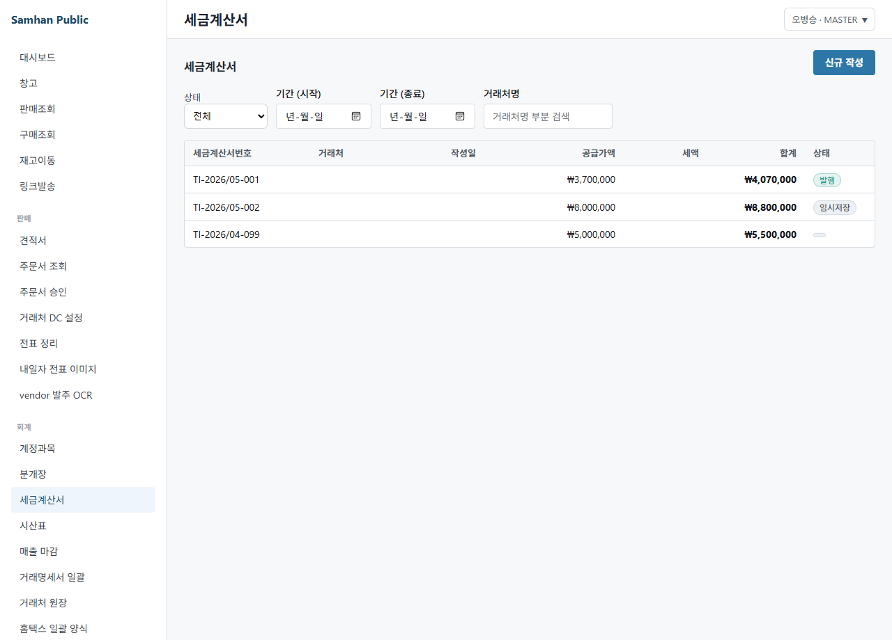
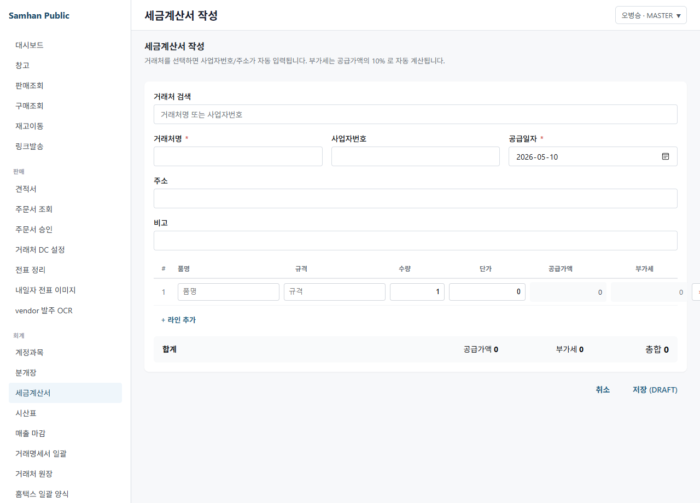
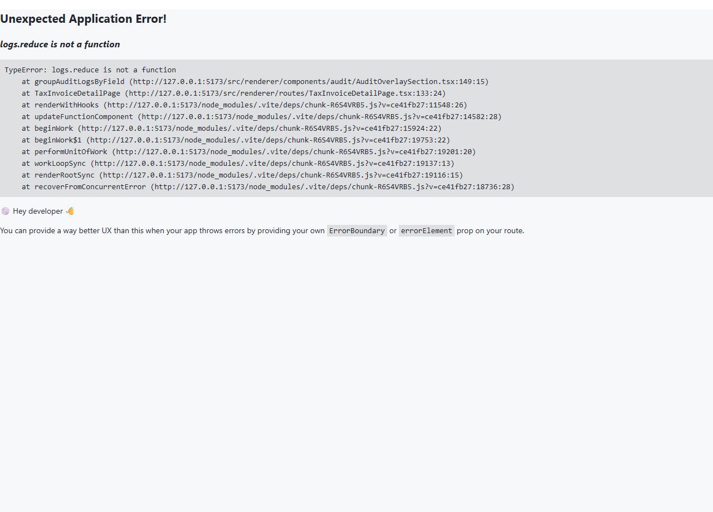
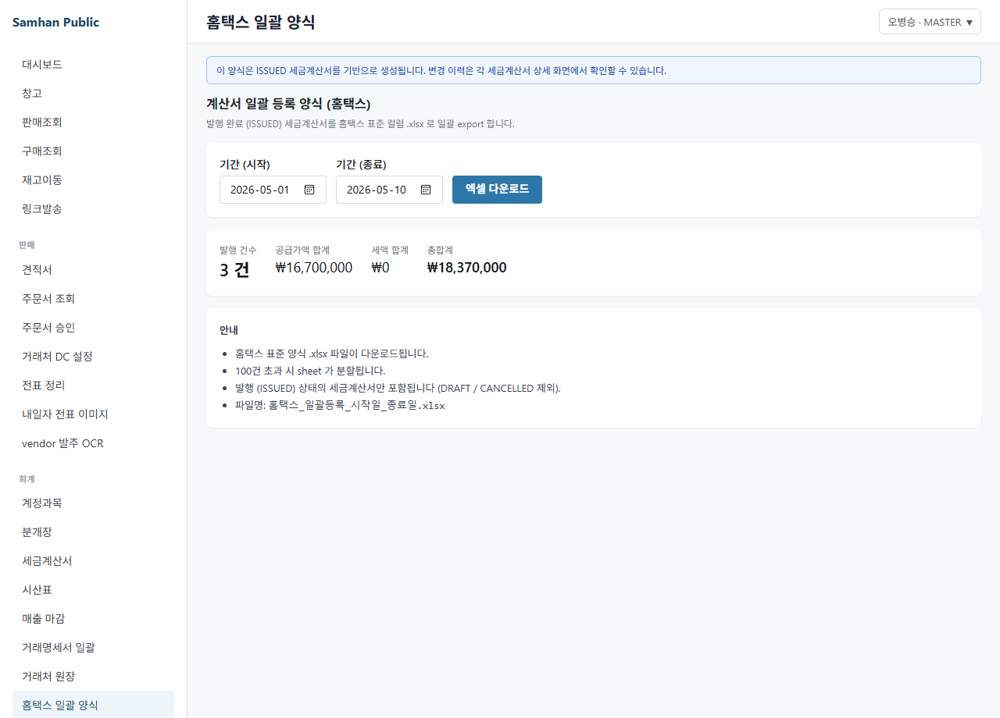

# 03. 세금계산서 발행

> **Stage 안내**: Stage 3 ⚠️ — Phase 12 step-6 본 PR 에서 7-section 패턴으로 재작성. P0-4 미구현. Phase 11-2주 출시 예정.

---

## 1. 구현 상태

| 항목 | 상태 | 비고 |
| --- | --- | --- |
| 세금계산서 발행 (Backend) | ⛔ 미구현 (P0-4) | Phase 11-2주 |
| 세금계산서 인쇄 양식 | ⛔ 미구현 (P0-4) | Phase 11-2주 |
| 전자세금계산서 NTS 연계 | ⛔ 미구현 (P0-4) | Phase 11+1개월 |
| NTS 홈택스 별도 발행 | ✅ 우회 | 사내 회계 우회 절차 |
| 발행 history 조회 (mock) | ⏳ | 본 PR 시점 mock list |

세금계산서는 부가가치세 신고용 거래 증빙입니다. 정식 시스템 발행이 미구현 상태이므로, NTS 홈택스 별도 발행으로 우회합니다.

---

## 2. 대상 독자

- 거래처에 세금계산서를 발행해야 하는 회계 직원 (ACCOUNTANT)
- 부가세 신고를 진행하는 외주 회계
- 발행 history 를 검토하는 영업 부장 (MANAGER)

---

## 3. 학습 내용

- 정식 세금계산서 기능 미구현 인지
- NTS 홈택스 별도 발행 우회 절차
- 발행 후 회계 분개 수동 등록 흐름
- Phase 11-2주 후 정식 출시 일정

---

## 4. 본문

### 4-1. 정식 발행 미구현 안내

P0-4 슬라이스로 Phase 11-2주에 출시 예정입니다. 본 화면이 출시되면 다음 기능이 제공됩니다.

- 슬립 → 세금계산서 자동 변환
- NTS 홈택스 API 연계 (전자세금계산서 자동 발행)
- 발행 history + 재발행 / 취소
- 인쇄 양식 (A4 표준)

### 4-2. 우회 — NTS 홈택스 별도 발행

#### 단계 1 — DELIVERED 슬립 확인

1. 회계 직원이 [01-영업 / 03. 슬립 발행](../01-영업/03-슬립-발행.md) 또는 슬립 list 진입
2. status = DELIVERED 슬립 list 조회
3. 거래처 / 합계 / 부가세 확인

#### 단계 2 — NTS 홈택스 발행

1. NTS 홈택스 (hometax.go.kr) 별도 로그인
2. 전자세금계산서 메뉴 진입
3. 거래처 정보 입력 (사업자번호 / 상호 / 주소 / 이메일)
4. 합계 / 부가세 입력
5. 공인인증서 서명 + 발행
6. 발행 PDF 보관

#### 단계 3 — 시스템 분개 등록

1. 좌측 사이드바 **[회계]** > **[분개]** > **[신규 등록]**
2. 적요: "세금계산서 발행 — SLIP-2026-XXXX"
3. 차변 / 대변 입력 (외상매출금 / 매출 / 부가세예수금)
4. 참조번호: NTS 발행번호
5. POSTED 처리

#### 단계 4 — 슬립 status INVOICED 수동 갱신

1. 회계 직원 + IT 관리자 협의
2. backend API 또는 IT 관리자 우회로 슬립 status: DELIVERED → INVOICED

### 4-3. Hometax export

backend 가 일부 export 기능을 제공할 수 있습니다. IT 관리자에게 확인.

### 4-4. Phase 11-2주 후 정식 본문 교체

P0-4 PR 머지 시 본 docs 는 정식 본문으로 교체됩니다.

---

## 5. 화면 미리보기

> 정식 발행 UI 미구현. 본 항목은 mock 화면 참고용.

### 5-1. 세금계산서 list (mock)

### 5-2. 세금계산서 폼 (mock)

### 5-3. 세금계산서 상세 (mock)

### 5-4. NTS 홈택스 export (참고)

---

## 6. FAQ

**Q1. NTS 홈택스 발행 시간이 부담됩니다.**
A. P0-4 출시 후 자동화. 임시로 거래처 그룹별 일괄 발행 (홈택스 자체 기능).

**Q2. 발행 후 취소는?**
A. NTS 홈택스 측 취소 + 시스템 분개 VOID 처리.

**Q3. 부가세 신고는 별도?**
A. 네. NTS 홈택스 별도 시스템에서 분기별 신고. P0-1 14건 중 #8 출시 시 통합.

**Q4. 종이 세금계산서도 발행 가능?**
A. 가능. NTS 홈택스에서 종이 발행 지원. 다만 전자세금계산서가 표준.

**Q5. 정식 출시는 언제?**
A. P0-4 슬라이스로 Phase 11-2주 후 출시 예정.

---

## 7. 관련 매뉴얼

- [01. 분개 입력](01-분개-입력.md)
- [02. 보고서](02-보고서.md)
- [04. 월말 마감](04-월말-마감.md)
- [01-영업 / 03. 슬립 발행](../01-영업/03-슬립-발행.md)
- [02-창고 / 04. 매출 마감](../02-창고/04-매출-마감.md)
