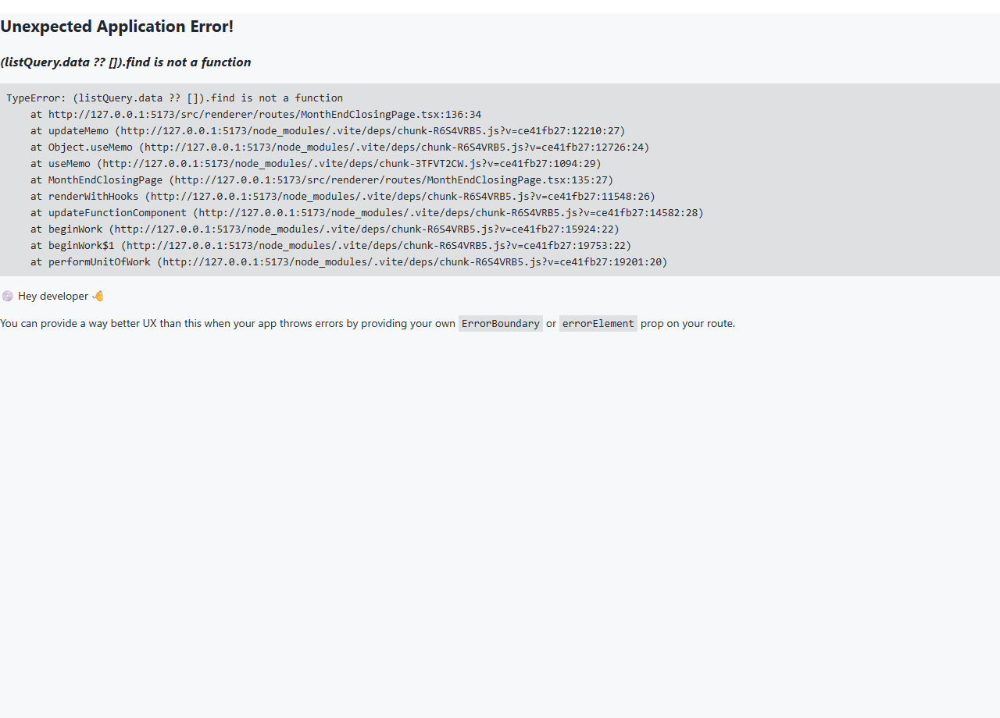

# 04. 월말 마감

> **Stage 안내**: Stage 3 ⚠️ — Phase 12 step-6 본 PR 에서 7-section 패턴으로 재작성. P2-3 미구현. Phase 11+1개월 후 출시 예정.

---

## 1. 구현 상태

| 항목 | 상태 | 비고 |
| --- | --- | --- |
| 월말 마감 lock | ⛔ 미구현 (P2-3) | Phase 11+1개월 |
| 매출 마감 자동 집계 | ⛔ 미구현 (P2-4) | [02-창고 / 04. 매출 마감](../02-창고/04-매출-마감.md) 안내 |
| 분개 lock 수동 | ✅ 우회 | IT 관리자 + 회계 협의 |
| 시산표 잔액 확정 | ✅ 운영 | [02. 보고서](02-보고서.md) |

월말 마감은 한 달의 모든 회계 거래를 확정하고 다음 달 분개를 시작하기 전 단계입니다. 정식 마감 lock 기능이 미구현 상태이므로, 회계 + IT 관리자 합동 우회로 처리합니다.

---

## 2. 대상 독자

- 월말 마감을 진행하는 회계 직원 (ACCOUNTANT)
- 마감 후 데이터를 확정하는 외주 회계
- 마감 lock 처리를 보조하는 IT 관리자 (MASTER)

---

## 3. 학습 내용

- 월말 마감 절차 (체크리스트)
- 정식 마감 lock 미구현 우회
- 마감 후 분개 변경 금지 정책
- Phase 11+1개월 후 정식 출시 일정

---

## 4. 본문

### 4-1. 월말 마감 체크리스트

매월 말일 또는 익월 5영업일 내 처리.

| # | 항목 | 책임자 | 우회 |
| --- | --- | --- | --- |
| 1 | DELIVERED 슬립 모두 INVOICED 전환 | 회계 | NTS 홈택스 + 분개 ([03. 세금계산서](03-세금계산서.md)) |
| 2 | 거래처별 매출 합계 확정 | 영업 + 회계 | [02-창고 / 04. 매출 마감](../02-창고/04-매출-마감.md) |
| 3 | 미수금 / 미지급금 잔액 확인 | 회계 | 거래처원장 ([02. 보고서](02-보고서.md)) |
| 4 | 재고 평가 | 재고 + 회계 | 재고 잔액 시산표 |
| 5 | 시산표 검증 (차변=대변) | 회계 | 시산표 ([02. 보고서](02-보고서.md)) |
| 6 | 분개 POSTED 처리 (DRAFT 0건) | 회계 | 분개 list 필터 |
| 7 | 마감 lock | IT 관리자 | backend 수동 |

### 4-2. 우회 — 분개 lock 수동

정식 마감 lock UI 가 없으므로 임시 정책.

#### 단계 1 — 회계 직원 사전 검증

1. 시산표 조회 → 차변 = 대변 확인
2. DRAFT 분개 list 조회 → 0건 확인
3. 미입력 자동 분개 (slip-service 측) 확인

#### 단계 2 — IT 관리자 마감 lock

1. 회계 직원이 IT 관리자에게 마감 요청
2. IT 관리자가 backend DB 또는 API 로 해당 월 분개 lock flag 설정
3. 이후 신규 분개 등록 시 거부 (해당 월)

#### 단계 3 — 마감 안내

1. 회계 부장 / 대표에게 시산표 사본 전달
2. 사내 메신저 / 이메일로 마감 완료 안내

### 4-3. 마감 후 변경 발생 시

원칙: 마감 후 변경 금지. 외부 감사 / 외주 회계 협의 후 처리.

- 변경 사유 문서화
- IT 관리자에게 lock 임시 해제 요청
- 변경 분개 등록 + 사유 적요
- 즉시 lock 재설정

### 4-4. Phase 11+1개월 후 정식 본문 교체

P2-3 PR 머지 시 본 docs 는 정식 본문으로 교체됩니다. 정식 화면 제공 예정.

- 월말 마감 wizard (체크리스트 자동 검증)
- 마감 lock UI (회계 부장 권한)
- 마감 history + 임시 해제 요청

---

## 5. 화면 미리보기

> 정식 월말 마감 UI 미구현. 본 항목은 mock 화면 참고용.

### 5-1. 월말 마감 (참고용 — 창고 흐름)

### 5-2. 시산표 (월말 검증)

---

## 6. FAQ

**Q1. 마감 후 분개 변경이 가능한가요?**
A. 정책상 금지. 외부 감사 / 외주 회계 협의 후 IT 관리자 우회만 가능.

**Q2. 마감 시한은?**
A. 익월 5영업일 내 권고. 외부 감사 일정에 따라 조정.

**Q3. 마감 lock 후 신규 분개 시 어떻게 되나요?**
A. backend 에서 거부. 회계 직원에게 에러 메시지 표시.

**Q4. 결산일은 언제?**
A. 12월 31일 (연말 결산). 한국 일반기업회계기준 상 회계연도 = 1/1 ~ 12/31.

**Q5. 정식 출시는 언제?**
A. P2-3 슬라이스로 Phase 11+1개월 후 출시 예정.

---

## 7. 관련 매뉴얼

- [01. 분개 입력](01-분개-입력.md)
- [02. 보고서](02-보고서.md)
- [03. 세금계산서](03-세금계산서.md)
- [02-창고 / 04. 매출 마감](../02-창고/04-매출-마감.md)
- [02-창고 / 05. 재고 실사](../02-창고/05-재고-실사.md)
- [07-부록 / 02. 용어집](../07-부록/02-용어집.md)
