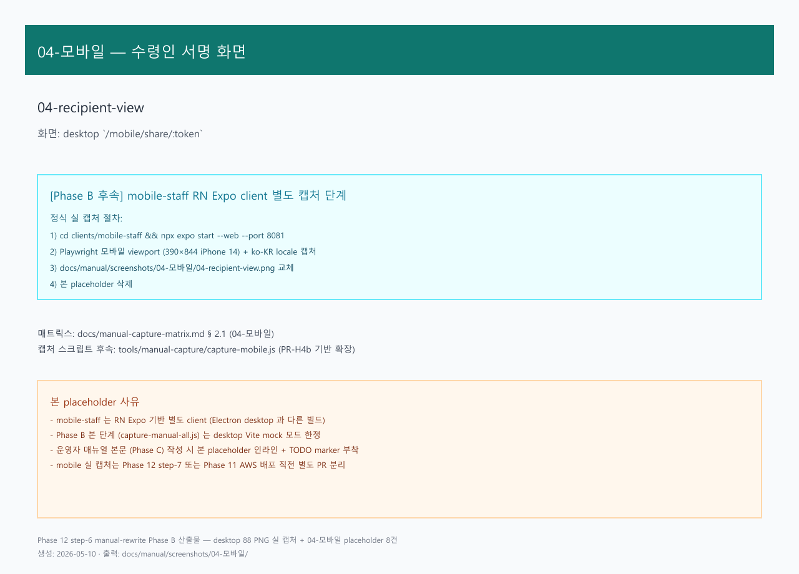

# 02. 전자 서명 받기

> **Stage 안내**: Stage 3 ✅ — Phase 12 step-6 본 PR 에서 7-section 패턴으로 재작성.

---

## 1. 구현 상태

| 항목 | 상태 | 비고 |
| --- | --- | --- |
| Backend 서명 수신 | ✅ 운영 | slip-service `/public/batches/.../signature` (LINK) + arologis-service `/driver-app/.../sign` (APP) |
| signature_source 컬럼 | ✅ 운영 | V10 |
| 동시성 인덱스 | ✅ 운영 | V11 |
| 50KB PNG hash 가드 | ✅ 운영 | 변조 방지 |
| DELIVERED 자동 전이 | ✅ 운영 | 서명 수신 시 |
| Mobile 서명 화면 | ✅ 운영 | DriverSignature |

(주)삼한공조시스템 전자 서명은 배송 완료 시 받는 사람이 모바일 화면에 손가락으로 서명을 그려 수신합니다.

---

## 2. 대상 독자

- 배송 도착 후 서명 수신하는 배송 기사 (DRIVER)
- 서명 도착 시 알림 받는 영업 부장 (MANAGER)
- 서명 PDF 보관하는 회계 직원 (ACCOUNTANT)

---

## 3. 학습 내용

- 도착 후 서명 수신 절차
- 받는 사람이 서명 못하는 경우 우회
- LINK / APP 두 가지 source 의 차이
- 서명 수신 후 자동 분개 + 회계 흐름

---

## 4. 본문

### 4-1. 도착 + 서명 진입

기사가 배송지에 도착 후.

1. mobile-staff 앱에서 해당 슬립 상세 진입
2. **[전자 서명]** 버튼 클릭
3. DriverSignature 화면 표시

### 4-2. 받는 사람 서명

1. 모바일 화면을 받는 사람에게 전달
2. 받는 사람 이름 입력 (필수)
3. 서명란에 손가락으로 서명 (그림)
4. **[저장]** 클릭

### 4-3. 서명 검증

backend 가 다음 검증.

- PNG 50KB 이내 (변조 방지)
- hash 가드 (재전송 방지)
- 동시성 인덱스 (중복 수신 방지)

### 4-4. DELIVERED 자동 전이

서명 수신 성공 시 자동으로.

- 슬립 status: SHIPPING → DELIVERED
- 자동 분개 발행 (accounting-service)
- 영업 부장 알림 (헤더 배지)

### 4-5. LINK source vs APP source

| Source | 진입 방법 | 사용 시점 |
| --- | --- | --- |
| **APP** | mobile-staff 앱 | 기사 본인 진행 (표준) |
| **LINK** | SMS/카톡 link | 기사 부재 / 받는 사람 직접 |

LINK 의 경우 받는 사람에게 SMS/카톡으로 서명 link 가 자동 발송됩니다 (slip-service `/public/batches/.../signature`).

### 4-6. 받는 사람 서명 거부 / 부재 시

#### 부재 시

1. 기사가 사유 입력 (자동 거부 / 부재 / 거주자 부재 등)
2. **[서명 보류]** 버튼 클릭
3. status 유지 (SHIPPING). 영업 부장에게 알림
4. 다음 배송일 재시도 또는 영업 부장 협의

#### 거부 시

1. 기사가 사유 입력 (제품 거부 / 단가 이의 등)
2. **[반품]** 버튼 클릭 (현재 미구현 안내 + 사진 첨부 P1 미구현)
3. 영업 부장에게 즉시 통화

### 4-7. Stage 4 실시간 협업

서명 수신 시 영업 부장 / 회계 / 창고 직원 desktop 화면에 1초 이내 자동 갱신 ([실시간 동기화](../08-실시간-협업/01-실시간-동기화.md)). 서명 PDF 보관은 [03-회계 / 02. 보고서](../03-회계/02-보고서.md) 의 거래처원장 참조.

---

## 5. 화면 미리보기

### 5-1. 기사 서명 화면

### 5-2. 받는 사람 view (LINK source)

---

## 6. FAQ

**Q1. 받는 사람 본인이 아닌데 서명해도 되나요?**
A. 받는 사람 이름란에 실 수령자 이름 입력 + 사유 메모. 영업 부장 / 회계 협의.

**Q2. 서명 파일 50KB 초과 시?**
A. backend 가 자동 압축. 너무 정밀한 서명은 단순화 권장.

**Q3. 서명 후 변경 가능한가요?**
A. 불가. DELIVERED 후 변경은 영업 부장 / 회계 협의 + IT 관리자 우회.

**Q4. 인터넷 끊긴 상태에서 서명?**
A. 앱이 일시 보관 + 재연결 시 자동 전송. 단, 서명 후 즉시 [저장] 권장.

**Q5. 받는 사람 화면에 한글 깨짐?**
A. 모바일 OS 글꼴 문제. 시스템 설정 > 글꼴에서 한국어 적용 확인.

**Q6. LINK source 는 누가 발송하나요?**
A. slip-service 가 자동 발송. 기사가 모바일에서 [서명 link 발송] 또는 영업 직원이 desktop 에서 발송.

---

## 7. 관련 매뉴얼

- [01. 기사 앱](01-기사-앱.md)
- [04. 사진 첨부](04-사진-첨부.md)
- [02-창고 / 02. 출고 처리](../02-창고/02-출고-처리.md)
- [01-영업 / 03. 슬립 발행](../01-영업/03-슬립-발행.md)
- [03-회계 / 01. 분개 입력](../03-회계/01-분개-입력.md)
- [08-실시간-협업 / 01. 실시간 동기화](../08-실시간-협업/01-실시간-동기화.md)
