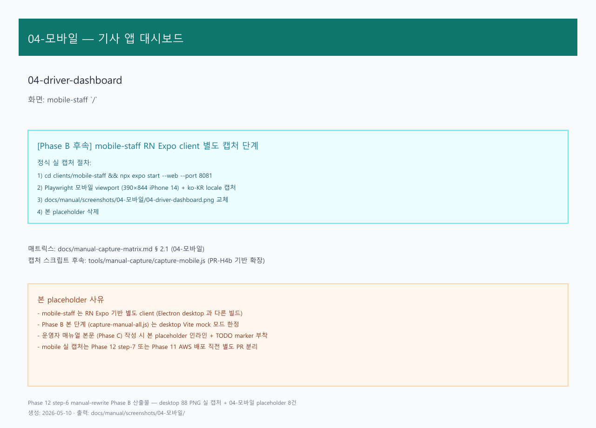
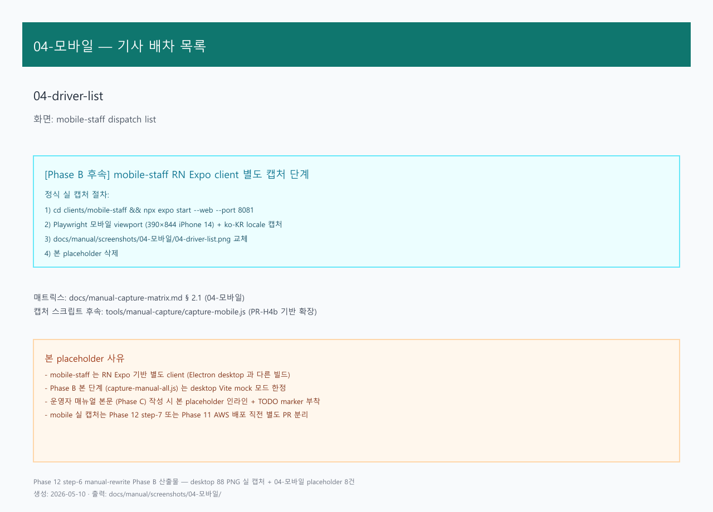
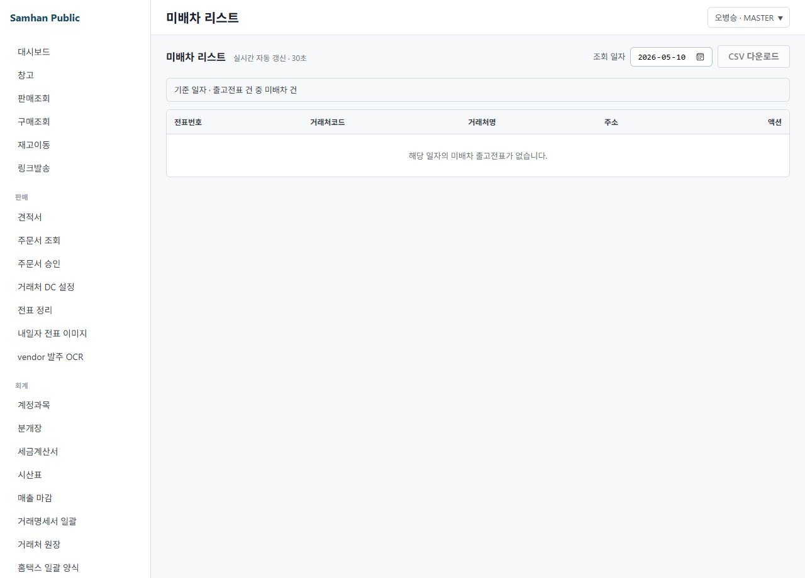

# 03. 기사 배정

> **Stage 안내**: Stage 3 ⚠️ — Phase 12 step-6 본 PR 에서 7-section 패턴으로 재작성. P1-5 admin UI 미구현. Phase 11+1개월 후 출시 예정.

---

## 1. 구현 상태

| 항목 | 상태 | 비고 |
| --- | --- | --- |
| Backend Driver 도메인 | ✅ 운영 | DriverSeeder 10명 |
| Backend DispatchSeeder 20건 | ✅ 운영 | 시드 데이터 |
| Backend autoMatch | ✅ 운영 | DriverMatcher |
| Backend assignDriverManual | ✅ 운영 | 수동 배정 |
| Backend DriverMatcher (Mock + Insung) | ✅ 운영 | 인성데이타 연계 |
| Frontend admin 배정 UI | ⛔ 미구현 (P1-5) | Phase 11+1개월 |

(주)삼한공조시스템 arologis 기사 배정은 배차에 적합한 기사를 자동/수동으로 매칭하는 기능입니다.

---

## 2. 대상 독자

- 기사를 배정하는 배차 담당 (DISPATCH)
- 인성데이타 vendor 와 협업하는 IT 관리자
- 본인 배차를 확인하는 배송 기사 (DRIVER)

---

## 3. 학습 내용

- 기사 list 구성 (10명 시드 + 추가)
- autoMatch (자동 배정) 흐름
- assignDriverManual (수동 배정) 흐름
- 인성데이타 vendor Insung 모드
- 정식 UI 미구현 우회

---

## 4. 본문

### 4-1. 기사 list

좌측 사이드바 **[배차]** > **[기사]** 클릭 (정식 UI 미구현 — P1-5 출시 시).

기사 정보 구성.

| 필드 | 설명 |
| --- | --- |
| 기사명 | 풀네임 |
| 휴대전화 | 010-0000-0000 |
| 운수사 | 인성데이타 vendor 또는 자체 |
| 차량 (1대 또는 다수) | 12가3456 |
| 운행 region | 서울 / 경기 / 인천 등 |
| 활성 여부 | 휴직 / 퇴사 표시 |

### 4-2. autoMatch (자동 배정)

backend `autoMatch` API 가 다음 기준으로 자동 매칭.

1. 운행 region 일치
2. 차종 / 적재 한도 일치
3. 시간대 가용 (다른 배차 진행 여부)
4. DriverMatcher (Mock + Insung) 호출
5. 결과: 1명 또는 다수 후보

#### 정식 UI 미구현 우회

1. 배차 담당이 IT 관리자에게 자동 배정 요청
2. IT 관리자가 `autoMatch` API 호출
3. 결과 회신 후 배차 담당이 수동 확정

### 4-3. assignDriverManual (수동 배정)

배차 담당이 직접 기사 선택.

1. 기사 list 에서 후보 기사 확인
2. backend `assignDriverManual` API (정식 UI 미구현)
3. 배차 status: PENDING → ASSIGNED
4. 기사 mobile-staff 푸시 알림 ([08-실시간-협업 / 08. 모바일 실시간 알림](../08-실시간-협업/08-모바일-실시간-알림.md))

#### 정식 UI 미구현 우회

1. 배차 담당이 IT 관리자에게 배정 요청 (배차 ID + 기사 ID)
2. IT 관리자가 backend API 호출
3. 결과 회신

### 4-4. 인성데이타 vendor Insung 모드

DriverMatcher Insung 모드.

- 인성데이타 퀵프로그램 API 호출
- 인성데이타 보유 차량/기사 풀에서 매칭
- 매칭 성공 시 인성데이타 측에도 동기화

### 4-5. Phase 11+1개월 후 정식 본문 교체

P1-5 PR 머지 시 본 docs 는 정식 본문으로 교체됩니다. 정식 화면 제공 예정.

- 드래그 자동 배정
- 기사 region / 차량 한도 시각화
- 배정 history + 거부 이력
- 인성데이타 vendor 동기화 status 표시

---

## 5. 화면 미리보기

### 5-1. 기사 dashboard

### 5-2. 기사 list

### 5-3. 미배정 배차

---

## 6. FAQ

**Q1. autoMatch 결과가 만족스럽지 않으면?**
A. assignDriverManual 로 수동 변경. 자동 결과는 추천일 뿐 강제 아님.

**Q2. 인성데이타 vendor 와 자체 운수사 동시 활용 가능?**
A. 네. DriverMatcher 가 양쪽 풀 모두 검토. 가용 우선 매칭.

**Q3. 기사 거부 시 자동 재배정?**
A. 정식 출시 후 가능. 현재는 배차 담당이 수동 재배정.

**Q4. 배정 시 기사 동의 없이 가능?**
A. backend assignDriverManual 은 강제 배정. 사후 기사 거부 시 [02. 수동 배차](02-수동-배차.md) 흐름 참조.

**Q5. 정식 UI 출시는 언제?**
A. P1-5 슬라이스로 Phase 11+1개월 후 출시 예정.

---

## 7. 관련 매뉴얼

- [01. 카카오톡 배차](01-카카오톡-배차.md)
- [02. 수동 배차](02-수동-배차.md)
- [04-모바일 / 01. 기사 앱](../04-모바일/01-기사-앱.md)
- [04-모바일 / 02. 전자 서명](../04-모바일/02-전자-서명.md)
- [08-실시간-협업 / 08. 모바일 실시간 알림](../08-실시간-협업/08-모바일-실시간-알림.md)
