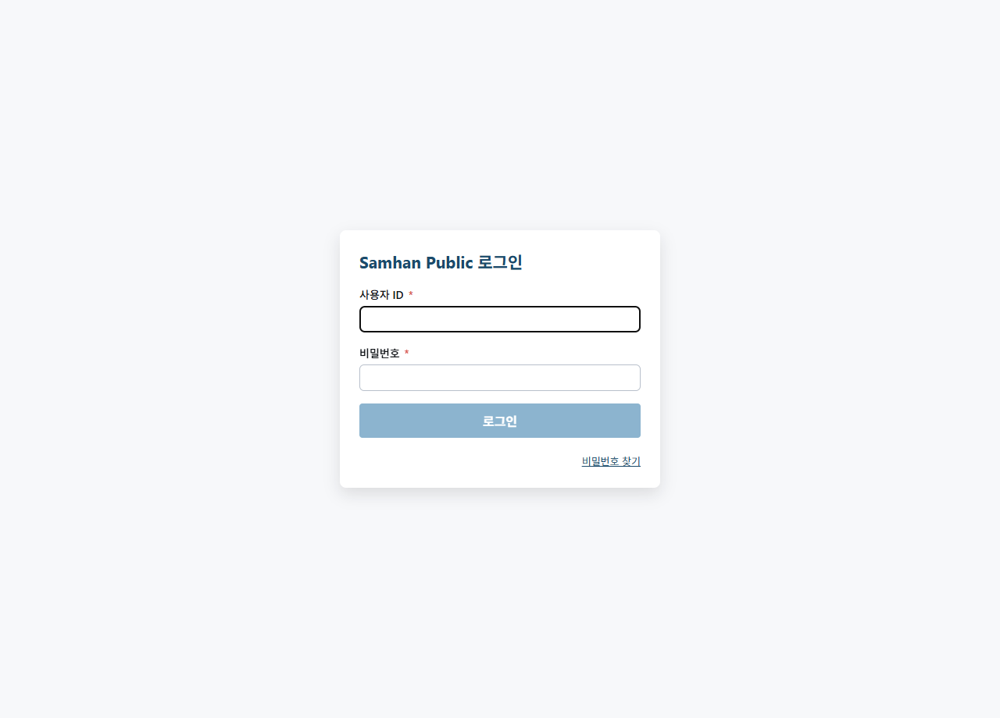
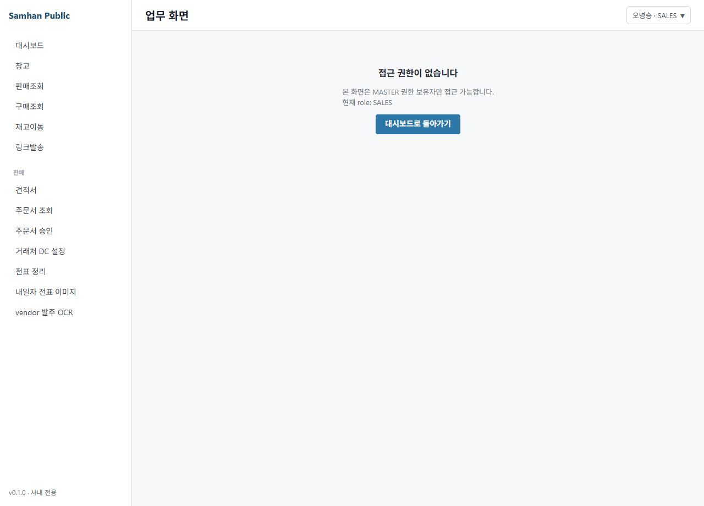

# 01. 로그인 실패 / 비밀번호 분실

> **Stage 안내**: Stage 3 ✅ — Phase 12 step-6 본 PR 에서 7-section 패턴으로 재작성. P0-2 비밀번호 재설정 미구현 안내 포함.

---

## 1. 구현 상태

| 항목 | 상태 | 비고 |
| --- | --- | --- |
| 로그인 인증 | ✅ 운영 | gateway `/auth/login` |
| 5회 실패 잠금 | ✅ 운영 | 보안 정책 |
| 셀프 비밀번호 재설정 | ⛔ 미구현 (P0-2) | IT 관리자 우회 |
| 사용자 / 권한 관리 UI | ⛔ 미구현 (P0-5) | IT 관리자 우회 |

(주)삼한공조시스템 로그인 실패 / 비밀번호 분실 시 대처 절차를 안내합니다.

---

## 2. 대상 독자

- 로그인 실패 / 잠긴 직원 (모든 ROLE)
- 비밀번호 분실 / 변경 필요 직원
- 잠금 해제 / 비밀번호 초기화 처리하는 IT 관리자 (MASTER)

---

## 3. 학습 내용

- 자주 발생하는 로그인 실패 원인
- 5회 실패 잠금 해제 절차
- 비밀번호 분실 시 IT 관리자 우회
- 보안 정책 인지

---

## 4. 본문

### 4-1. 자주 발생하는 원인

| 증상 | 원인 | 조치 |
| --- | --- | --- |
| "아이디 또는 비밀번호가 일치하지 않습니다" | ID 대소문자 / 한영 키 / Caps Lock | 재입력 (3회 이내) |
| 입력 후 무반응 | 네트워크 / 서버 다운 | 새로고침 → IT 관리자 |
| 5회 실패 후 잠김 | 잠금 정책 작동 | IT 관리자 잠금 해제 요청 |
| 첫 로그인 후 비밀번호 변경 화면 무반응 | 비밀번호 정책 미충족 | 영문+숫자+특수문자 8자 이상 |
| 모바일 로그인만 안 됨 | 앱 캐시 / 권한 | [04. 모바일 접속 오류](04-모바일-접속-오류.md) |

### 4-2. 5회 실패 잠금 해제

#### 단계 1 — 잠금 확인

5회 실패 후 다음 메시지 표시.

> "5회 연속 실패로 계정이 일시 잠겼습니다. IT 관리자에게 문의하세요."

#### 단계 2 — IT 관리자 요청

1. 본인 ID + 본인 부서 + 본인 휴대전화로 IT 관리자에게 사내 메신저 / 전화
2. IT 관리자가 backend 또는 DB 에서 잠금 해제

#### 단계 3 — 재로그인

1. 잠금 해제 후 ID + 비밀번호 재입력
2. 비밀번호 분실 시 §4-3 절차

### 4-3. 비밀번호 분실

셀프 재설정 미구현 (P0-2). IT 관리자 우회.

#### 단계 1 — IT 관리자 요청

1. 본인 ID + 본인 부서 + 본인 휴대전화로 IT 관리자에게 사내 메신저 / 전화
2. 본인 확인 후 IT 관리자가 비밀번호 초기화 (`samhan!2026`)

#### 단계 2 — 재로그인 + 비밀번호 변경

1. 초기 비밀번호 (`samhan!2026`) 로 로그인
2. 자동 표시되는 비밀번호 변경 화면에서 새 비밀번호 등록
3. 다음 로그인 시 새 비밀번호 사용

### 4-4. 비밀번호 정책

- 영문 대/소문자 + 숫자 + 특수문자 조합 8자 이상 권장
- 너무 단순 (`12345678`, `password`) 거부 가능
- 본인 ID, 휴대전화, 생년월일 포함 거부 권장
- 모니터에 메모 부착 절대 금지

### 4-5. Phase 11 후 셀프 재설정

P0-2 슬라이스로 Phase 11 후 출시 예정. 정식 출시 시 다음 기능.

- 본인 휴대전화 SMS 인증 → 셀프 초기화
- 이메일 인증 → 비밀번호 변경 link
- 보안 질문 (선택)

---

## 5. 화면 미리보기

### 5-1. 로그인 실패 메시지

### 5-2. 권한 거부 (MASTER 만 표시)

### 5-3. 권한 거부

---

## 6. FAQ

**Q1. 본인이 직접 비밀번호를 변경할 수 있나요?**
A. 첫 로그인 시 자동 변경 화면. 일반 변경은 IT 관리자 우회 (P0-2 미구현).

**Q2. 잠금 해제까지 시간이?**
A. IT 관리자 응답 시간에 따라. 평일 업무 시간 내 30분 이내 권고.

**Q3. 비밀번호가 만료되나요?**
A. 만료 정책 미구현. 회사 보안 정책상 6개월 ~ 1년 자율 변경 권장.

**Q4. 모바일 로그인은 ID 만 다른가요?**
A. 동일 ID/PW. mobile-staff 앱 / desktop 동일 인증.

**Q5. 다른 사람 ID 로 로그인 가능?**
A. 절대 금지. 보안 정책 위반.

**Q6. 5회 실패 후 즉시 다시 시도?**
A. 잠금 정책 작동. IT 관리자 우회 필수.

---

## 7. 관련 매뉴얼

- [00-시작하기 / 01. 로그인](../00-시작하기/01-로그인.md)
- [00-시작하기 / 03. 역할별 권한](../00-시작하기/03-역할별-권한.md)
- [02. 화면 표시 안 됨](02-화면-표시-안됨.md)
- [04. 모바일 접속 오류](04-모바일-접속-오류.md)
- [05. 기타 트러블슈팅](05-기타.md)
- [07-부록 / 01. FAQ](../07-부록/01-FAQ.md)
