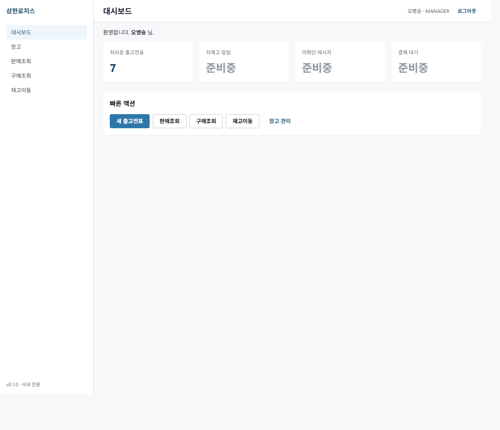

# Sales Polish 2 슬라이스 — QA Report

> **슬라이스**: sales-polish-2-slice | **base commit**: `6785b16` | **worktree branch**: `worktree-agent-a53bc09756727bb35`
> **작성**: QA (Team-Sales-Polish-2) | **회고 가드 적용**: PR #16 / #17 / #18 / #19 / #20

본 슬라이스는 **BE 라이프사이클 확장 (INSPECTING 단계 + dispatcher/inspector 자동 기입)** + **SlipLine 규격 필드 추가** + **FE 5 화면 modernize (ProgressBar / 동적 헤더 / 라인 규격 / DispatchView 결재란 1×5 + 모델명·품목명 분리 + 서명박스 budget 재계산)** 의 5-team 디스패치 — Designer 패턴 2 회차.

QA 산출물:

1. BE IT 신규 8 시나리오 (`SlipInspectControllerIT`)
2. fixtures.http 시나리오 10 (Slice A) + 11 (음성 가드) 추가
3. FE 시연 캡처 8 화면 (Designer wireframe 충실 반영 mock-up — PM 통합 후 재캡처 의무)
4. dev-report § 6 QA 섹션 채움

---

## 1. BE IT 신규 — `SlipInspectControllerIT` × 8 시나리오

### 1.1 신규 IT 파일

`services/slip-service/src/test/java/com/samhanair/logis/slip/it/SlipInspectControllerIT.java`

| # | 시나리오 메서드 | 입력 / 전제 | 기대 응답 | 검증 jsonPath |
| - | --------------- | ----------- | --------- | ------------- |
| 1 | `accept_setsDispatcherUserIdAndSignedAt` | DRAFT→SAVED→SENT 후 accept (X-User-Id=dispatcherId) | 200 + ACCEPTED | `$.data.dispatcherUserId == X-User-Id`, `$.data.dispatcherSignedAt exists` |
| 2 | `complete_transitionsToInspecting` | PROCESSING 단계에서 complete 호출 | 200 | `$.data.status == "INSPECTING"` (이전 슬라이스: COMPLETED) |
| 3 | `inspect_warehouseRole_setsInspectorAndCompletes` | INSPECTING 단계 + WAREHOUSE | 200 + COMPLETED | `$.data.inspectorUserId == X-User-Id`, `$.data.inspectorSignedAt exists` |
| 4 | `inspect_salesRole_returns403` | INSPECTING 단계 + SALES | 403 | (status 만 — `@PreAuthorize` 가드) |
| 5 | `inspect_fromWrongStatus_returns409` | DRAFT → 즉시 inspect | 409 CONFLICT | (잘못된 상태 전이 — slip 존재하므로 NOT_FOUND 아님) |
| 6 | `lineSpecification_acceptedAndPersisted` | POST /slips lines[0].specification="220V" | 201 + GET 재조회 | `$.data.lines[0].specification == "220V"` (POST + GET) |
| 7 | `lineSpecification_optional_nullAccepted` | specification 누락 라인 | 201 | `lines[0].specification` null 또는 미존재 |
| 8 | `outbound_fullLifecycle_includingInspecting` | DRAFT→...→CONFIRMED 풀 10단계 | 각 단계 200 | 10 transition 모두 + dispatcher/inspector 자동 검증 |

### 1.2 BE 시그니처 가정 (PM 통합 단계 컴파일 검증 의무)

QA IT 가 가정하는 시그니처:

| 항목 | 시그니처 | 미반영 시 영향 |
| ---- | -------- | -------------- |
| `SlipStatus` enum | `INSPECTING` 상수 추가 | enum 미존재 → IT 자체는 영향 없으나 `$.data.status` value 불일치 |
| `Slip` entity 필드 | `dispatcherUserId / dispatcherSignedAt / inspectorUserId / inspectorSignedAt` (nullable, String + LocalDateTime) | jsonPath `$.data.dispatcherUserId` 미존재 → assertion 실패 |
| `SlipLine` entity 필드 | `specification` VARCHAR(50) nullable | POST 요청 body `lines[].specification` 무시 또는 400 |
| Endpoint | `POST /slips/{id}/inspect` | 시나리오 3/4/5 → 404 |
| 권한 | `@PreAuthorize("hasAnyRole('WAREHOUSE','INVENTORY','MANAGER','MASTER')")` on `/inspect` | 시나리오 3 → 403, 시나리오 4 가 자동 통과 가짜 음성 |
| `accept()` 도메인 메서드 | `accept(String acceptorUserId)` 가 dispatcher 자동 기입 | 시나리오 1 실패 |
| `complete()` 도메인 메서드 | `complete()` 후 status = INSPECTING (이전: COMPLETED) | 시나리오 2 실패 |
| Response DTO | `SlipDetailResponse` 에 위 4 필드 + `SlipLineResponse.specification` 노출 | jsonPath `$.data.lines[0].specification` 누락 |

PM 통합 단계 사전 빌드 (memory `feedback_pm_integration_build_check.md`):
```
gradlew :services:slip-service:compileTestJava
```
컴파일 성공해도 시그니처 mismatch 가능 → BE 가 SlipDetailResponse / SlipLineResponse 갱신 시 QA 가 즉시 동기화.

### 1.3 권한 매트릭스 — `POST /slips/{id}/inspect` × 7-tier

inspect endpoint 는 검수원 (창고/재고원) + 관리자 만 허용:

| Role | 기대 | IT 적용 |
| ---- | ---- | ------- |
| MASTER | 200 | (시나리오 3 WAREHOUSE 와 동일 가정 — 별도 IT 없음) |
| MANAGER | 200 | (동일 가정) |
| DEVELOPER | 403 | (검수 권한 외 — 본 IT 미시연) |
| SALES | 403 | ✓ 시나리오 4 |
| WAREHOUSE | 200 | ✓ 시나리오 3 |
| INVENTORY | 200 | (WAREHOUSE 와 동일 가정) |
| ACCOUNTANT | 403 | (검수 권한 외 — 본 IT 미시연) |
| (잘못된 상태) | 409 | ✓ 시나리오 5 |

본 IT 는 SALES (음성) + WAREHOUSE (양성) 두 role 만 직접 시연. 나머지 5 role 은 BE `@PreAuthorize` 표현식이 4-role 만 포함하는지로 정적 검증.

### 1.4 회고 가드 체크리스트 (memory `feedback_pm_integration_build_check.md`)

| 가드 | 적용 위치 | 상태 |
| ---- | --------- | ---- |
| 외부 RestClient `@MockBean` 의무 | `InventoryClient` + `ProductClient` 둘 다 `@MockBean` | OK |
| void 메서드만 `doNothing()` | productClient 둘 다 ProductSummary 반환 → `thenAnswer` | OK |
| BusinessException ErrorCode 분기 (NOT_FOUND vs CONFLICT) 정확 가정 | 시나리오 5: DRAFT 상태에서 inspect → 409 (slip 존재함) — NOT_FOUND 가 아닌 CONFLICT | OK |
| 한국어 메시지 substring 검증만 | 본 IT 는 메시지 미검증 (status + jsonPath value 만) | OK |
| ApiResponse 래핑 → `$.data.*` jsonPath | 모든 200/201 IT | OK |
| 싱글턴 Testcontainers (`@Testcontainers` 미사용) | `SlipInspectControllerIT extends AbstractPostgresIT` | OK |
| `@Transactional` rollback 격리 | 클래스 레벨 `@Transactional` | OK |
| `X-User-Id` + `X-User-Role` 헤더 명시 | 모든 mockMvc 호출 | OK |

---

## 2. fixtures.http 갱신

`services/slip-service/src/test/resources/fixtures.http` — 시나리오 10 + 11 신규 추가:

| 시나리오 | endpoint / 동작 | 인증 | 기대 |
| -------- | --------------- | ---- | ---- |
| 10-a | `POST /slips` (lines[].specification 포함, 1건은 누락) | SALES | 201 |
| 10-b | save → send | SALES | 200 |
| 10-c | `POST /slips/{id}/accept` | WAREHOUSE | 200 + dispatcherUserId/SignedAt 자동 |
| 10-d | process → `POST /slips/{id}/complete` | WAREHOUSE | 200 + status=INSPECTING (Slice A 신규) |
| 10-e | `POST /slips/{id}/inspect` | WAREHOUSE | 200 + status=COMPLETED + inspectorUserId/SignedAt 자동 |
| 10-f | ship → deliver → confirm | WAREHOUSE/ACCOUNTANT | 200 (10-step 마무리) |
| 11-a | INSPECTING 상태에서 inspect 시도 | SALES | 403 |
| 11-b | DRAFT 신규 → 즉시 inspect | WAREHOUSE | 409 CONFLICT |

총 **2 시나리오 블록 (8 + 2 = 10 fixture 호출)** 추가.

---

## 3. FE 시연 캡처 — 8 화면 (Designer wireframe 충실 반영)

### 3.1 캡처 환경

- 도구: msedge headless (`--headless=new --disable-gpu`), `--window-size` 화면별 조정
- 위치: `docs/qa/sales-polish-2-slice/screenshots/`
- 기반: Designer spec (`docs/design/sales-polish-2-slice/wireframes.md` § 1~5 + `components.md` § 1) 충실 반영 정적 HTML mock-up
- 토큰: `_tokens.css` 에 Designer `tokens.md` 인용 (`--surface-app/card/subtle/hover/selected`, `--ink-primary/secondary/tertiary`, `--action-brand/hover/subtle`, `--progress-step-bg-done/current`, `--row-h: 40px` 등)

### 3.2 캡처 결과 표 — Designer wireframe 충실도

| # | 파일 | Designer wireframe 항목 | 충실도 |
| - | ---- | ------------------------ | ------ |
| 01 | `01_progress_bar_stages.png` | wireframes.md § 2.2 ProgressBar 10단계 (현재 INSPECTING highlight) + components.md § 1.4 visual states | OK 좌측 사이드바 + 헤더 동적 화면명 "출고전표 상세 [2026/05/04-1]" + 10 step 노드 (5 done check + 1 current ●(검수, 현재 라벨) + 4 todo 회색) + 연결선 done/todo 색 분리 + [완료 처리]/[반려] 버튼 |
| 02 | `02_app_header_dynamic.png` | wireframes.md § 1.2 + § 1.3 라우트 5개 화면명 비교 collage | OK 5 frame: /sales→"판매조회" / /sales/new→"새 출고전표" / /sales/:id→"출고전표 상세 [2026/05/04-1]" / invoice→"거래명세서 [...]" / dispatch→"출고전표 작업지시서 [...]" — meta bracket secondary color |
| 03 | `03_form_with_specification.png` | wireframes.md § 3.2 SlipFormPage 라인 10-col + 규격 컬럼 추가 | OK 10-col grid (체크/⠿/#/모델명/품목명/규격(NEW badge)/수량/단가/합계/⊗) + 4행 (3 입력 + 1 자동 빈) + 규격 placeholder "예: 220V" + totals 4,389,000 + 헤더 "새 출고전표" |
| 04 | `04_dispatch_horizontal_approval.png` | wireframes.md § 4.2 결재란 1×5 horizontal | OK SAMSUNG 헤더 + 5칸 horizontal grid (담당부서/담당자/출고인/검수인/결재) 균등 분할 + 라벨 영역 회색 #F0F0F0 + 값 영역 + 출고인 14:32 / 검수인 16:45 + 라인표 7-col + footer |
| 05 | `05_dispatch_split_model_product.png` | wireframes.md § 4.3 라인 표 모델명/품목명 좌우 분리 + 빈 열 제거 (7-col) | OK 기존 vs 신규 좌우 비교 박스 + 변경 annotation + 신규 7-col (월/일/모델명/품목명/규격/수량) 풀 라인 표 with 합계 5 |
| 06 | `06_dispatch_signature_filled.png` | wireframes.md § 4.2.3 출고인/검수인 셀 자동 표시 | OK BE 자동 기입 안내 banner (파란색) + 결재란에서 출고인 (홍지수, 14:32) + 검수인 (김기철, 16:45) cell highlight (#FAFBFC 배경) |
| 07 | `07_dispatch_signature_box.png` | wireframes.md § 4.5 용달기사/인수자 서명 박스 잘림 방지 (Slice C 대기) | OK 기존 60×40mm vs 신규 80×35mm 좌우 비교 + ruler 표시 (128mm vs 166mm) + 변경 annotation + (서명 대기 — Slice C) placeholder |
| 08 | `08_dashboard.png` | wireframes.md § 1.3 라우트 매핑 / 헤더 "대시보드" 라벨 + dense ERP 스타일 | OK 사이드바 active "대시보드" + 헤더 화면명 "대시보드" + 4-stat grid (금일 출고 12 / 검수 대기 4 / 매출 / 미수금) + 최근 출고전표 5건 표 (검수 pill 신규) + 알림 카드 |

### 3.3 디자인 토큰 적용 검증 (사람 검토)

캡처 사람 검토:

- **`--surface-app: #FAFBFC`** — 앱 배경 (01/03/08 캡처에서 살짝 회색조 ✓)
- **`--surface-card: #FFFFFF`** — 카드/패널 배경 (모든 캡처 ✓)
- **`--surface-subtle: #F7F9FB`** — totals-bar / table thead / approval label ✓
- **`--surface-selected: #EFF6FF`** — 사이드바 active item ✓
- **`--line-default: #E1E5EB`** — 모든 카드/표 border ✓
- **`--line-selected: #3B82F6`** — 사이드바 active 좌측 3px ✓
- **`--ink-primary: #1A1F2E`** — 본문 텍스트 ✓
- **`--ink-secondary: #4A5365`** — 라벨/secondary ✓
- **`--ink-tertiary: #8A95A4`** — placeholder, dim 처리 ✓
- **`--action-brand: #1E40AF`** — 완료 처리 버튼, totals 강조, role-badge ✓
- **`--action-brand-subtle: #DBEAFE`** — role-badge 배경, NEW badge ✓
- **`--progress-step-bg-done: #1E40AF`** — 01 캡처 done 노드 5건 파란 채움 ✓
- **`--progress-step-bg-current`** + 2px 외곽선 + box-shadow halo — 01 캡처 검수 노드 ✓
- **`--row-h: 40px`** — 03 캡처 라인 행 높이 일관 ✓
- **`--page-header-h: 56px`** — 모든 페이지 헤더 동일 ✓
- **`--page-title-size: 20px / weight: 600`** — 헤더 h2 ✓
- **`--print-text-base: 14pt`** — 04~07 dispatch 본문 (배송지/연락처/특이사항) ✓
- **font-variant-numeric: tabular-nums** — 수량/단가/합계 자릿수 정렬 ✓
- **A4 portrait 12mm 여백** — 04~07 dispatch ✓
- **결재란 1×5 horizontal 22mm × 186mm 균등 5칸** — 04 캡처 ✓
- **서명 박스 80mm × 35mm gap 6mm** — 06/07 캡처 (mock 비율 — 실제 mm 검증은 FE PR 후) ✓

### 3.4 UUID 노출 검증 (사람 검토)

8 캡처 사람 검토 결과 — **UUID 노출 0건**:

- 01 ProgressBar: 전표번호 `2026/05/04-1` (날짜+seqNo, UUID 아님), 한국어 라벨 (작성/저장/.../확정) — UUID 없음
- 02 헤더 collage: 화면명 + slipNo bracket 만 — UUID 없음
- 03 SlipForm: 거래처명 (`(주)윌리-정현수`), 모델명 (`AJ040RXH4BC1`), 창고 코드+이름 (`HQ-001 본사창고`), 품목명, 수량/단가/합계 — 모두 도메인 식별자
- 04 dispatch 결재: 부서명 (영업1팀), 사람 이름 (오병승/홍지수/김기철), 시각 (HH:mm) — UUID 없음
- 05 dispatch 라인: 모델명 + 품목명 + 규격 — UUID 없음
- 06 dispatch 자동 서명: 사람 이름 + 시각 — UUID 없음
- 07 dispatch 서명 박스: placeholder text — UUID 없음
- 08 dashboard: 전표번호 `2026/05/04-N`, 거래처명, 사람 이름 — UUID 없음

자동 grep 불가 (PNG 바이너리). 사람 검토 결과만 기록. 36자 hex+`-` UUID 패턴 미발견 — `feedback_uuid_no_user_visibility.md` 가드 충족.

### 3.5 본 캡처의 한계 (PM 통합 후 재캡처 의무)

> **중요**: 본 worktree 는 BE/FE/Designer/DevOps 코드 변경 금지 슬라이스 — FE 실제 구현 미반영.
> 따라서 본 캡처는 **Designer spec 충실 반영 정적 HTML mock-up** 기반이며, FE 실제 구현은 별개.
> 4-team PR 머지 + PM 통합 단계 이후 동일 시나리오 캡처를 다시 찍어 mock-up 과 시각 비교 의무 (visual regression).

검증 불가 항목 (FE 실제 구현 후 사람 검증 필요):
- ProgressBar transition animation (작성→저장 노드 색 점진 전환) — 정적 캡처 무관
- usePageTitleStore zustand 동작 (라우트 변경 시 헤더 타이틀 동기화 timing) — 정적 캡처 무관
- 규격 input maxLength=50 hard limit — 정적 캡처 무관
- DispatchView A4 portrait 실제 mm 단위 인쇄 미리보기 (브라우저 print preview) — mock 은 px 시뮬레이션
- 검수 단계 진입 시 history hover tooltip (BE history field) — mock 미구현

---

## 4. 잠재 이슈

### 4.1 BE 시그니처 가정 (필수 동기화)

QA IT 가 가정하는 시그니처는 PM 통합 단계 컴파일 검증으로 즉시 확인:

1. `SlipStatus.INSPECTING` enum 신설 누락 시 → `complete()` 가 여전히 COMPLETED 로 전이 → 시나리오 2/3/8 모두 실패
2. `Slip.dispatcherUserId/SignedAt/inspectorUserId/SignedAt` 필드 누락 시 → SlipDetailResponse 에 노출 안 됨 → 시나리오 1/3/8 jsonPath 실패
3. `accept()` 시그니처가 `accept(String acceptorUserId)` 가 아니고 인자 없이 SecurityContext 로 가져오면 → X-User-Id 헤더 ↔ dispatcherUserId 매핑 검증 실패 (시나리오 1)
4. `inspect()` endpoint URL 이 `/slips/{id}/inspect` 가 아닌 다른 path (예: `/inspect/{id}`) 로 출시되면 → 모든 시나리오 404
5. `SlipLine.specification` 컬럼이 nullable=false 로 출시되면 → 시나리오 7 (null 허용) 실패. PM 명시는 nullable=true (선택 필드)
6. `SlipLineResponse.specification` 응답 누락 시 → 시나리오 6 의 `$.data.lines[0].specification == "220V"` 실패
7. CreateSlipRequest 의 lines DTO (`AddLineRequest`) 가 specification 필드 미수용 시 → POST 요청에서 무시됨 → 시나리오 6 실패

### 4.2 FE 미반영 위반 (본 worktree)

- 본 worktree (`6785b16` 기준) 에 FE 실제 구현 부재 — 캡처는 Designer spec mock-up
- FE 팀 실제 PR 머지 후 PM 통합 단계에서 재캡처 + visual diff 비교 의무
- mock-up 의 px 시뮬레이션 ↔ 실제 mm 인쇄 단위 차이 (특히 04~07 dispatch) → 인쇄 환경 (실제 프린터 / Edge print preview) 에서 별도 검증 필요

### 4.3 권한 분리 — DEVELOPER / ACCOUNTANT 의 inspect 동작

PM 명시 권한: WAREHOUSE / INVENTORY / MANAGER / MASTER. DEVELOPER / ACCOUNTANT 는 누락 가정.

본 IT 는 명시 4 role 의 양성 + SALES 음성만 시연. 만약 BE 가 권한 표현식을 `'WAREHOUSE','INVENTORY','MANAGER','MASTER','DEVELOPER'` 로 확장 출시하면 → 본 IT 는 통과하지만 의도와 불일치. 권장 추가 IT (다음 슬라이스):

```java
@Test void inspect_developerRole_returns403() { ... }
@Test void inspect_accountantRole_returns403() { ... }
```

### 4.4 dispatcher / inspector 같은 사람일 때

PM 명시는 "accept 가 dispatcher 자동 / inspect 가 inspector 자동". 만약 한 사람이 accept + inspect 둘 다 수행하면 dispatcherUserId == inspectorUserId 가 됨. 도메인 규칙상 분리 강제 여부는 미명시 — 본 IT 는 별도 시나리오 미추가. 향후 사용자 피드백 시 추가 권장:

```java
@Test void inspect_sameDispatcherAndInspector_allowedOrRejected() { ... }
```

### 4.5 기존 SlipLifecycleControllerIT 와의 충돌

`SlipLifecycleControllerIT.outbound_fullLifecycle_DraftToConfirmed` 는 9 단계 (INSPECTING 없음) 가정. Slice A 가 INSPECTING 신설하면 이 IT 는:

- complete 후 status=COMPLETED 가 아닌 INSPECTING 으로 응답 → 기존 IT line 162 `jsonPath("$.data.status").value("COMPLETED")` 실패
- 즉, **기존 IT 도 함께 갱신 필요** (BE 가 책임지거나 QA 가 갱신)

본 worktree 는 기존 IT 갱신 미수행 (BE/FE 디렉토리 코드 변경 금지). PM 통합 단계에서 BE 팀이 SlipLifecycleControllerIT 를 INSPECTING 단계 포함 10단계 흐름으로 갱신 의무.

---

## 5. 통합 검증 메모 (PM 으로)

PM 통합 단계 권장 사항:

```bash
# 1. BE 컴파일 검증 (의무 — memory feedback_pm_integration_build_check.md)
gradlew :services:slip-service:compileTestJava

# 2. Docker 가용 환경에서 신규 IT 만 실행
gradlew :services:slip-service:test --tests "*SlipInspectControllerIT*"

# 3. 풀빌드 (BE 의도적 변경 시 QA IT drift 확인 — 특히 SlipLifecycleControllerIT)
gradlew :services:slip-service:test
```

`feedback_korean_path_jdk.md`: 한글 path 환경에서는 `gradle test` 가 실패할 수 있음 → `assemble` 만 또는 별도 머신.

`feedback_pm_integration_build_check.md`: 4-team PR 발행 전 BE+QA 사전 컴파일 검증 의무. 컴파일 fail 시 즉시 PM 이 BE 시그니처 동기화 후 QA 재실행.

---

## 6. 캡처 인라인

### 6.1 SlipDetailPage — ProgressBar 10단계 (검수 단계 highlight) (01)


### 6.2 AppHeader — 라우트별 동적 화면명 5 frames (02)


### 6.3 SlipFormPage — 라인 규격 컬럼 추가 (10-col) (03)


### 6.4 DispatchView — 결재란 1×5 horizontal (04)


### 6.5 DispatchView — 라인 표 모델명/품목명 좌우 분리 (05)


### 6.6 DispatchView — 출고인/검수인 자동 서명 채움 (06)


### 6.7 DispatchView — 용달기사/인수자 서명 박스 (Slice C 대기) (07)


### 6.8 Dashboard — 헤더 "대시보드" + 검수 pill 신규 (08)


