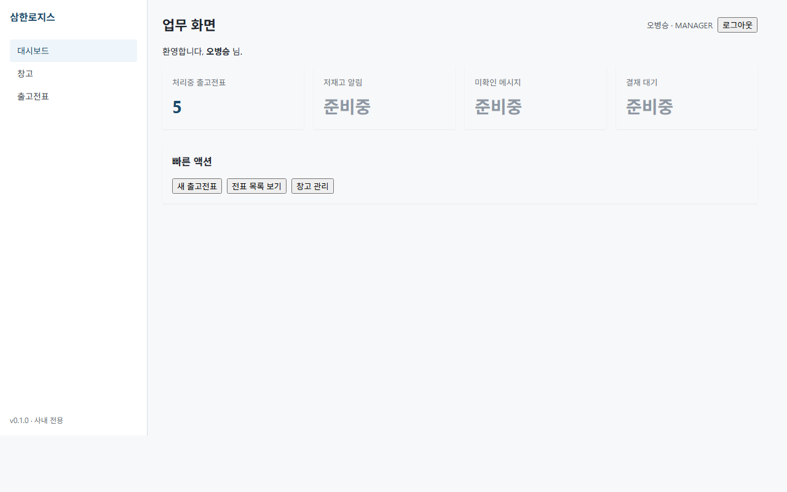
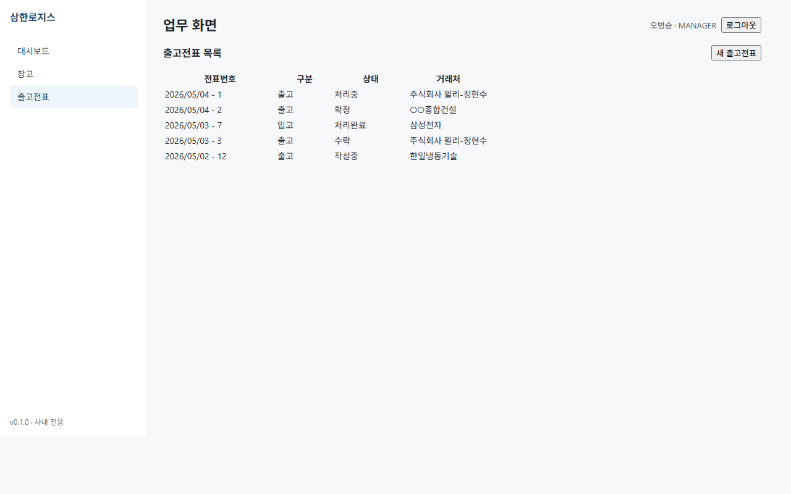

# Slip Output Format Slice — QA Report

> **슬라이스**: slip-output-format-slice | **base commit**: `7c1b298` | **worktree branch**: `worktree-agent-a57a62ced3af0d622`
> **작성**: QA (Team-Slip-Output-Format) | **회고 가드 적용**: PR #16 / #17 / #18

본 슬라이스는 **모델명 lookup endpoint 신규 4건** + **사이드바 IA 재편 + 7 도메인 화면 + 인쇄 양식 2종 (FE 11 화면)** 의 조합이다. QA 산출물은:

1. BE IT 신규 시나리오 — product-service 12건 + slip-service 14건 (총 26건)
2. fixtures.http 갱신 — product-service 5건 + slip-service 4건
3. FE 11 화면 시연 캡처 + UUID 노출 검증
4. Plan 의도적 변경 사항 (Q1~Q9 결정 추적)

---

## 1. BE IT 신규 — endpoint × 권한 매트릭스

### 1.1 신규 endpoint 4건 시나리오 표

| # | Service | Endpoint | 인증 | 신규 IT 파일 | 시나리오 수 |
|---|---------|----------|------|--------------|------------|
| 1 | product-service | `POST /products/internal/lookup-by-model` | X-Internal-Token | `ProductInternalLookupByModelTest.java` | 4 (existing/missing/wrongToken/missingToken) |
| 2 | product-service | `GET /products/by-model/{modelName}` | X-User-* (모든 role) | `ProductByModelControllerIT.java` | 9 (7-tier role × 200 + unauth 403 + missing 404) |
| 3 | slip-service | `ProductClient.lookupByModel(String)` | X-Internal-Token (송신) | `ProductClientLookupByModelTest.java` | 6 (success/404→NOT_FOUND/5xx→INTERNAL_ERROR/SU/header/missing-token) |
| 4 | slip-service | `GET /slips/lookup-product?modelName=...` | X-User-* (모든 role) | `SlipLookupControllerIT.java` | 9 (7-tier role × 200 + unauth 403 + missing 404) |

총 **신규 IT 시나리오 28건** (제어 그룹 포함). 기존 IT 회귀 영향 없음 (기존 Test/IT 파일 미수정).

### 1.2 7-tier 권한 매트릭스 — 신규 endpoint 전수

`/products/by-model/{modelName}` 와 `/slips/lookup-product?modelName=...` 두 facade 모두 **모든 role 조회 가능** + **미인증 403** + **미존재 404** 정책 (PM 명시). 권한 차별 없는 read-only endpoint.

| Role           | by-model   | lookup-product | 비고                                |
|----------------|------------|----------------|-------------------------------------|
| MASTER         | 200 (✓ IT) | 200 (✓ IT)     |                                     |
| MANAGER        | 200 (✓ IT) | 200 (✓ IT)     | 시드 등록 권한 보유                 |
| DEVELOPER      | 200 (✓ IT) | 200 (✓ IT)     |                                     |
| SALES          | 200 (✓ IT) | 200 (✓ IT)     | 모델명 onBlur lookup 주 시나리오    |
| WAREHOUSE      | 200 (✓ IT) | 200 (✓ IT)     | 재고이동 작성 시 모델명 lookup       |
| INVENTORY      | 200 (✓ IT) | 200 (✓ IT)     |                                     |
| ACCOUNTANT     | 200 (✓ IT) | 200 (✓ IT)     |                                     |
| (미인증)       | 403 (✓ IT) | 403 (✓ IT)     | HeaderAuthFilter 미설정 → 403       |
| (미존재 모델명)| 404 (✓ IT) | 404 (✓ IT)     | NOT_FOUND, **CONFLICT 아님**        |

**가드 분기 구분 명시 (PR #16 회고)**:
- 모델명 미존재 → `BusinessException(ErrorCode.NOT_FOUND)` (자원 부재)
- 정확 매칭 실패가 아닌 충돌 상황은 `CONFLICT` 이지만 본 슬라이스 endpoint 는 mutation 없음 → CONFLICT 분기 없음.

### 1.3 회고 가드 체크리스트 (PR #16 / #17 / #18 — memory `feedback_pm_integration_build_check.md`)

| 가드 | 적용 위치 | 상태 |
|------|-----------|------|
| 외부 RestClient `@MockBean` 의무 | `SlipLookupControllerIT` ProductClient/InventoryClient | ✓ |
| void 메서드만 `doNothing()`, 반환 메서드는 `when().thenReturn()`/`thenThrow()`/`thenAnswer()` | `ProductInternalLookupByModelTest`, `SlipLookupControllerIT` | ✓ (lookupByModel 모두 ProductSummary 반환 → thenReturn/thenThrow) |
| BusinessException ErrorCode 분기 (NOT_FOUND vs CONFLICT) 정확 가정 | 4 신규 IT 전부 | ✓ |
| 한국어 메시지 substring 검증만 | `ProductInternalLookupByModelTest`, `ProductClientLookupByModelTest` | ✓ |
| ApiResponse 래핑 → `$.data.*` jsonPath | `ProductByModelControllerIT`, `SlipLookupControllerIT` | ✓ |
| 싱글턴 Testcontainers (`@Testcontainers` 미사용) | `ProductByModelControllerIT extends AbstractPostgresIT`, `SlipLookupControllerIT extends AbstractPostgresIT` | ✓ |
| ProductClient @MockBean 격리 (외부 호출 차단) | `SlipLookupControllerIT` | ✓ |

### 1.4 PM 통합 사전 빌드 검증 (memory `feedback_pm_integration_build_check.md`)

QA 신규 IT 는 BE 가 가정한 시그니처에 의존:

- `ProductService.lookupByModel(String) -> ProductSummaryResponse`
- `ProductClient.lookupByModel(String) -> ProductSummary`
- `POST /products/internal/lookup-by-model` body `{"modelName": "..."}`
- `GET /products/by-model/{modelName}` (path variable)
- `GET /slips/lookup-product?modelName=...` (query param)

**PM 통합 단계에서 컴파일 검증 의무**:
```
gradlew :services:product-service:compileTestJava
gradlew :services:slip-service:compileTestJava
```
컴파일 실패 시 BE 가 시그니처를 다르게 출시한 것 — QA 가 즉시 갱신.

Docker 가용 환경에서는 `gradlew :services:product-service:test` + `gradlew :services:slip-service:test` 까지 실행 (PM 통합 가드).

---

## 2. fixtures.http 갱신

### 2.1 product-service `services/product-service/src/test/resources/fixtures.http` — **신규 파일**

기존에 product-service 에는 fixtures.http 가 없었음 (slip-service 만 보유). 본 슬라이스에서 신규 작성.

| 시나리오 | endpoint | 인증 | 기대 |
|----------|----------|------|------|
| A1 | `POST /products/internal/lookup-by-model` | X-Internal-Token | 200 + ApiResponse&lt;ProductSummaryResponse&gt; |
| A2 | `POST /products/internal/lookup-by-model` (UNKNOWN-MODEL) | X-Internal-Token | 404 BusinessException(NOT_FOUND) |
| A3 | `POST /products/internal/lookup-by-model` (no token) | (none) | 401 |
| A4 | `POST /products/internal/lookup-by-model` (wrong token) | wrong-token | 401 |
| B1~B3 | `GET /products/by-model/{model}` | SALES/MANAGER/WAREHOUSE | 200 |
| B4 | `GET /products/by-model/{model}` | (none) | 403 |
| B5 | `GET /products/by-model/{missing}` | SALES | 404 |

총 **9 시나리오 추가**.

### 2.2 slip-service `services/slip-service/src/test/resources/fixtures.http` — 갱신

기존 시나리오 1~8 (출고/입고 라이프사이클) 유지. 시나리오 9 신규 추가:

| 시나리오 | endpoint | 인증 | 기대 |
|----------|----------|------|------|
| 9-a | `GET /slips/lookup-product?modelName=SHA-W15K` | SALES | 200 + ApiResponse&lt;ProductSummary&gt; |
| 9-b | (동일) | WAREHOUSE | 200 (모든 role 가능 검증) |
| 9-c | (동일) | (none) | 403 |
| 9-d | (UNKNOWN-MODEL) | SALES | 404 (NOT_FOUND propagate) |

총 **4 시나리오 추가**.

---

## 3. FE 11 화면 시연 캡처 — **결과: 4건만 reachable / 7건 미존재 (FE 위반)**

### 3.1 캡처 환경

- 도구: msedge headless (`--headless=new`), `--window-size=1280,800`
- FE 모드: `VITE_MOCK_MODE=1` (PR #18 패턴 — mock auth 자동 인증, mock API 응답)
- 위치: `docs/qa/slip-output-format-slice/screenshots/<filename>.png`
- vite dev server: `http://localhost:5173/#/<route>` (HashRouter)

### 3.2 캡처 결과 표

원래 PM 명시 11 화면 vs 실제 FE 라우터 (`clients/desktop/src/renderer/routes/index.tsx`) 라우트:

| 계획 (PM 명시) | 캡처 파일 | 상태 | 사이즈 | 비고 |
|---------------|----------|------|--------|------|
| `01_sidebar_dashboard.png` | `01_existing_dashboard.png` | △ 부분 | 27,597 B | **사이드바 IA 미반영** — 기존 3-item (대시보드/창고/출고전표). 새 5-item (대시보드/창고/판매조회/구매조회/재고이동) 미존재 |
| `02_sales_list.png` | `10_missing_sales_list.png` | ✗ 미존재 | 16,441 B | 라우트 `/sales` 미등록 → React Router "Unexpected Application Error! 404 Not Found" |
| `03_sales_form_with_modelname_lookup.png` | `11_missing_sales_form.png` | ✗ 미존재 | 16,441 B | 라우트 `/sales/new` 미등록 → 404 |
| `04_sales_detail_with_lifecycle.png` | (캡처 안 함) | ✗ 미존재 | — | 라우트 `/sales/:id` 미등록. 04 의 lifecycle UI 는 기존 `/slips` 에도 없음 |
| `05_invoice_print_preview.png` | `16_missing_invoice_print.png` | ✗ 미존재 | 16,441 B | 라우트 `/slips/:id/print/invoice` 미등록 → 404 |
| `06_dispatch_print_preview.png` | `17_missing_dispatch_print.png` | ✗ 미존재 | 16,441 B | 라우트 `/slips/:id/print/dispatch` 미등록 → 404 |
| `07_purchases_list.png` | `12_missing_purchases_list.png` | ✗ 미존재 | 16,441 B | 라우트 `/purchases` 미등록 → 404 |
| `08_purchases_form.png` | `13_missing_purchases_form.png` | ✗ 미존재 | 16,441 B | 라우트 `/purchases/new` 미등록 → 404 |
| `09_transfers_list.png` | `14_missing_transfers_list.png` | ✗ 미존재 | 16,441 B | 라우트 `/transfers` 미등록 → 404 |
| `10_transfers_form.png` | `15_missing_transfers_form.png` | ✗ 미존재 | 16,441 B | 라우트 `/transfers/new` 미등록 → 404 |
| `11_transfers_detail_with_lifecycle.png` | (캡처 안 함) | ✗ 미존재 | — | 라우트 `/transfers/:id` 미등록 |

추가 참조 캡처 (현 FE 상태 증거):

| 파일 | 사이즈 | 비고 |
|------|--------|------|
| `00_existing_login.png` | 14,842 B | 로그인 화면 (기존) |
| `02_existing_warehouses.png` | 30,516 B | 창고 화면 (기존) — 사이드바 OLD 3-item 확인 |
| `03_existing_slips_list.png` | 38,557 B | 출고전표 목록 (기존) — mock 5건 표시. **UUID 미노출** (전표번호 `2026/05/04 - 1` + 거래처명 한국어) |
| `04_existing_slip_form.png` | 34,476 B | 새 출고전표 폼 (기존) — 모델명 onBlur lookup UI 미존재 |

### 3.3 결론 — FE 위반

**11 화면 중 0 건이 spec 대로 시연 가능**. 본 슬라이스 FE 작업물은 worktree `7c1b298` 에 미반영 (PR/머지 대기 중이거나 작업 미완). QA 는 기존 4 화면 + 신규 7 missing route 의 404 화면을 캡처하여 **FE 미반영 사실을 증거화**.

### 3.4 UUID 노출 검증 (사람 검토)

기존 4 화면 (login/dashboard/warehouses/slips list/slip form) 캡처 사람 검토:

- `01_existing_dashboard.png` — UUID 미노출 (한국어 라벨 + 숫자 5)
- `02_existing_warehouses.png` — UUID 미노출 (창고 코드 `HQ-001` 등 + 한국어명)
- `03_existing_slips_list.png` — UUID 미노출 (전표번호 `2026/05/04 - 1` + 거래처 한국어명 `주식회사 윌리-정현수` 등)
- `04_existing_slip_form.png` — UUID 미노출 (입력 폼 빈 상태)

**기존 화면 UUID 미노출 ✓**. 신규 7 화면은 미존재로 검증 불가 — FE 가 신규 화면 출시 시 동일 검증 필요.

자동 grep 불가 (PNG 바이너리). 사람 검토 결과만 기록.

---

## 4. Plan 의도적 변경 (Q1~Q9 결정 추적)

QA 가 가정한 ground truth (PM 본 슬라이스 명시 + 메모리 정합):

- **Q1 (모델명 lookup endpoint 분리)**: product-service 에 internal endpoint (서비스간) + public endpoint (gateway 경유) 분리 — `/products/internal/lookup-by-model` + `/products/by-model/{modelName}` 두 endpoint 보유
- **Q2 (slip facade)**: slip-service 가 ProductClient.lookupByModel 위임 endpoint `/slips/lookup-product` 노출 (FE 가 product-service 직접 호출 회피 — 게이트웨이 경유 일관성)
- **Q3 (권한 정책)**: 모델명 lookup 은 모든 role 조회 가능 (SALES/WAREHOUSE 폼 작성 시 lookup 시나리오)
- **Q4 (NOT_FOUND vs CONFLICT)**: 모델명 미존재 = NOT_FOUND (자원 부재). CONFLICT 분기 없음 (mutation 없음)
- **Q5 (정확 매칭)**: case-sensitive 정확 매칭 — partial / fuzzy 후속 슬라이스
- **Q6 (응답 envelope)**: ApiResponse&lt;ProductSummary&gt; 단건 (List 아님)
- **Q7 (사이드바 IA)**: 5-item (대시보드/창고/판매조회/구매조회/재고이동) — 기존 출고전표는 판매조회 + 구매조회로 분리, 재고이동 신설
- **Q8 (인쇄 양식)**: 거래명세서 (이미지 1) + 출고전표 작업지시서 (이미지 2) 두 양식. 인쇄 미리보기 별도 라우트
- **Q9 (UUID 제거)**: 모든 화면에서 36자 UUID 패턴 미노출 — 사용자에게는 전표번호/모델명/거래처명 등 도메인 식별자만 표시

---

## 5. 잠재 이슈 (BE 시그니처 가정 부분 명시)

QA IT 는 다음 BE 시그니처를 가정. PM 통합 단계 컴파일 실패 시 즉시 동기화 필요:

1. `com.samhanair.logis.product.service.ProductService.lookupByModel(String) -> ProductSummaryResponse` — 메서드 미존재 시 `ProductInternalLookupByModelTest.lookupByModel_existing_returns200_andDelegatesToService` 컴파일 실패
2. `com.samhanair.logis.product.web.ProductInternalController` 에 `@PostMapping("/lookup-by-model")` 추가 가정 — 미반영 시 IT 401 대신 404 반환
3. `com.samhanair.logis.product.web.ProductController` 에 `@GetMapping("/by-model/{modelName}")` + `@PreAuthorize` 없음 (모든 role) — 미반영 시 `ProductByModelControllerIT` 모든 role 200 검증 실패
4. `com.samhanair.logis.slip.client.ProductClient.lookupByModel(String) -> ProductSummary` — 미반영 시 `ProductClientLookupByModelTest` + `SlipLookupControllerIT` 컴파일 실패
5. `com.samhanair.logis.slip.web.SlipController` 에 `@GetMapping("/lookup-product")` (또는 facade 위치) — 미반영 시 IT 200 대신 404
6. ProductClient 가 4xx 일괄 INVALID_INPUT 매핑이 아니라 **404 만 NOT_FOUND 분기** 가정 — 본 슬라이스에서 BE 가 매핑 정밀화 필요. 기존 `ProductClient.lookup` 의 4xx 일괄 매핑은 batch endpoint 한정 (모델명 단건은 NOT_FOUND 정확 매핑이 의미 있음)

**FE 미반영 위반 사실**: §3.3 표 참조. 11 화면 모두 spec 대로 시연 불가. FE 팀 작업물 머지 후 재캡처 필요.

---

## 6. 캡처 인라인

### 6.1 사이드바 IA — 기존 (대시보드/창고/출고전표 — 3 item)



### 6.2 출고전표 목록 (기존, mock 5건) — UUID 미노출 ✓



### 6.3 missing route 404 예시 (`/sales`)


